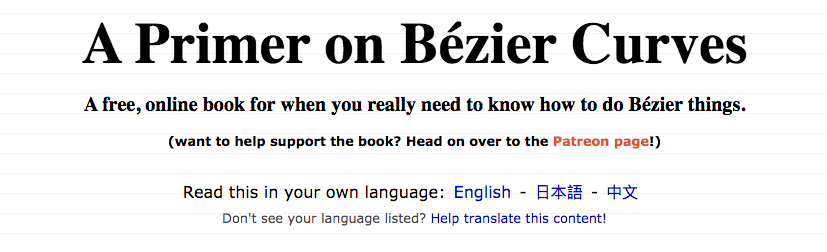
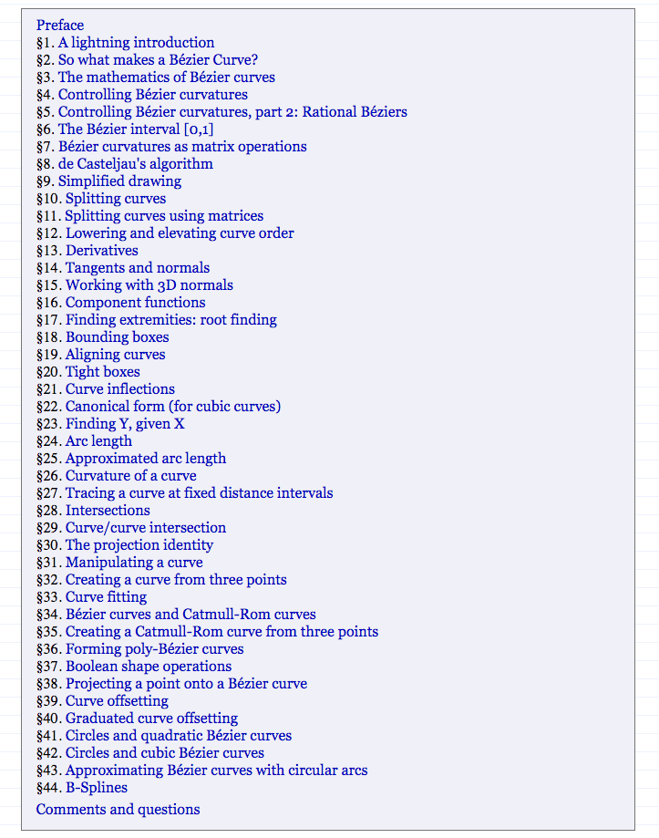
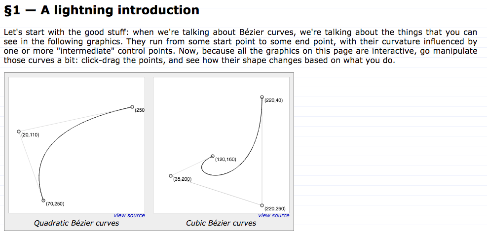
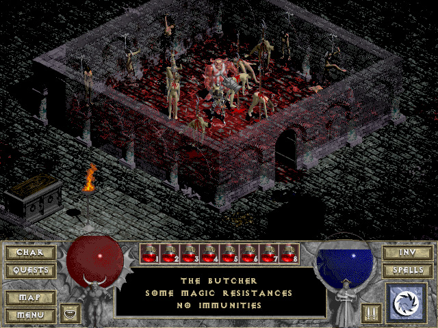
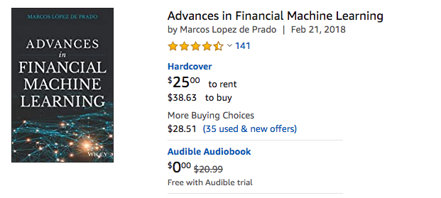

## 【是不是很酷】开源资源分享 | 第 1 期

可能很多同学都知道，【是不是很酷】有一个免费的知识星球。这个知识星球基本是日更的频率。每天我看到有意思的内容，来不及写成长文，或者不适合写成长文，就用短分享的方式，放到这个免费的星球中。

时间过得真快，这个知识星球已经运营了有近半年时间，积累了 100 多条精华内容，2000 多个用户了。

 

在这个知识星球里，有一个子栏目，叫 **#资源分享**。分享我在网上看到的一些优秀的资料。以英文资料为主。

这些资料，有的时候，是我突然了解到了一本好书，于是推荐给大家。放心，我是不会推荐给大家诸如《算法导论》《算法4》这样的人尽皆知的书籍的。那样就太不酷了。

有些资料，可能只是网上的一篇帖子，但我觉得内容很有意思，于是推荐给大家。依然是，我坚信，我推荐的内容，至少从我的标准看，都很酷。

再有一些资料，就是一些开源书籍或者开源资料。说实话，在这个年代，很多开源资料的质量，比出版社出版发行的图书质量都要好很多。加上作者可以随时更新，勘误其中的内容，使得这些资料可以一直保持“时间的优势”。

 

现在，这个子栏目下的内容也越来越多。我决定每隔一段时间，整理一下其中的内容，汇总到公众号中，分享给更多的人。

每一期汇总，我会选择 5 个内容。

 

**这一期内容如下：**

---

### 1. 贝塞尔曲线详解

贝塞尔曲线在一般图形学教科书中，只有一章甚至是半章的内容。但这份资料近乎用一本书的幅度，总共 44 个章节，非常详细地对贝塞尔曲线进行了专门介绍。

而且，官方网站中包含有“中文”的选项。不过我测试了一下，并不是所有的内容都已经完整翻译成了中文，只有 约 1/4 的部分支持中文。

更难得的是，借助互联网的优势，资料中很多附图，都是可以交互的，帮助学习者理解其中的概念。比如，在以下页面截图中，所有贝塞尔曲线的控制点，都是可以拖拽更改的哦：）

**网址：[https://pomax.github.io/bezierinfo/](https://pomax.github.io/bezierinfo/)**

 

### 2. Diablo 1 的随机迷宫生成机制

不知道有多少人玩过 diablo 1，1996年的游戏，暴雪的看家 ip 之一，近乎可以说是奠定了暴雪在游戏界地位的作品，也近乎可以说是开创了欧美 ARPG 这个游戏类型的先河。

很骄傲的说，我从 diablo 1 的 beta 版就开始玩儿了。说实话，我觉得一代比二代好玩；至于三代，完全和前两代不是一个游戏。

说岔了，此处省略 10 万字...

就在去年，diablo1 的源码被完整地逆向工程了出来。成为了无数游戏开发者可以挖掘的宝藏。

下面这篇文章，完整深入地分析了 diablo1 的随机迷宫生成机制。

**网址：[https://www.boristhebrave.com/2019/07/14/dungeon-generation-in-diablo-1/](https://www.boristhebrave.com/2019/07/14/dungeon-generation-in-diablo-1/)**

 

### 3. 超级马里奥里的优化

红白机时代，一张游戏卡的容量，大概是 1mb 或以下；内存是 2kb。但是渲染的精度大概是256*240 像素，也就是，每一屏的大小大概是 180 kb。

当然，稍微有些压缩知识基础，或者图形渲染功底的同学会知道，计算一个屏的图像大小，意义不大。但整体上，红白机游戏可以在 2kb 的内存限制下完成游戏的渲染+逻辑，从现在的视角看，还是很了不起的。

那个年代的程序猿，都不仅仅是逻辑的编写者，更是逻辑的艺术家，要将优化发挥到极致。

这篇文章中，描述了大名鼎鼎的超级马里奥游戏中，一些实现细节和优化技巧。

**网址：[https://www.freecodecamp.org/news/where-do-all-the-bytes-come-from-f51586690fd0/#.fxlrfohvy](https://www.freecodecamp.org/news/where-do-all-the-bytes-come-from-f51586690fd0/#.fxlrfohvy)**

 

### 4. 机器学习在金融领域应用

对机器学习在金融领域的应用（偏量化）感兴趣的同学，推荐一本这个领域现阶段公认的“圣经”。在各个宽客相关的讨论社区，你会看到很多人推荐这本书。

据我所知，这本书暂时还没有中文版。我简单翻了一下，虽然比起其他同领域的书籍，对理论的强调下降了一大截，但整体，还是理论性蛮强的。不是特别适合入门。

**美国亚马逊链接：[https://www.amazon.com/Advances-Financial-Machine-Learning-Marcos/dp/1119482089/ref=sr_1_1?crid=34VB0TAWK5SLJ&keywords=advances+in+financial+machine+learning&qid=1574985176&sprefix=advances+%2Caps%2C202&sr=8-1](https://www.amazon.com/Advances-Financial-Machine-Learning-Marcos/dp/1119482089/ref=sr_1_1?crid=34VB0TAWK5SLJ&keywords=advances+in+financial+machine+learning&qid=1574985176&sprefix=advances+%2Caps%2C202&sr=8-1)**

 

### 5. 逆向工程权威指南

一本在业界非常有名的逆向工程的图书，英文名叫：Reverse Engineering for Beginners。直译就是：逆向工程入门。

这本书在 2017 年由人民邮电出版社出版发行过中文版，叫《逆向工程权威指南》，分上下两册。有意思的是，从这本书的官网可以免费下载到这两本中文版的样书扫描版。

不过这本书似乎更新很快。目测作者有一点更新，就随时发布到网上。英文原版的最新版本，是 2019 年 11 月 26 日做出的。大家可以直接在官网上下载到最新版的 pdf 版本，免费的。

有需要的童鞋可以直接去官网自取。感谢互联网。

**官方网址：[https://beginners.re](https://beginners.re)**

 

---

今天的分享就这么多，我们下一期再见！

至于下一期是什么时候？答案是不定。

什么时候，有了我认为足够多、足够好的新资料分享给大家的时候，什么时候下一期就来啦。我不想为了赶日期而凑内容，这是我做事情的哲学。因此，我写过一篇文章，叫：[《慢增长》](https://mp.weixin.qq.com/s?__biz=MzU4NTIxODYwMQ==&mid=2247484452&idx=1&sn=40d971c16938e91e8e22777e04520574&chksm=fd8cab62cafb22747829f86dc280598a15a9750cb5974ab0bd44effade5f9926c1a7075dba3e&token=2073644645&lang=zh_CN#rd)

不过，这些短内容分享，我会第一时间发表到【是不是很酷】免费的知识星球上。如果感兴趣的同学，不要错过。

 

**大家加油！**