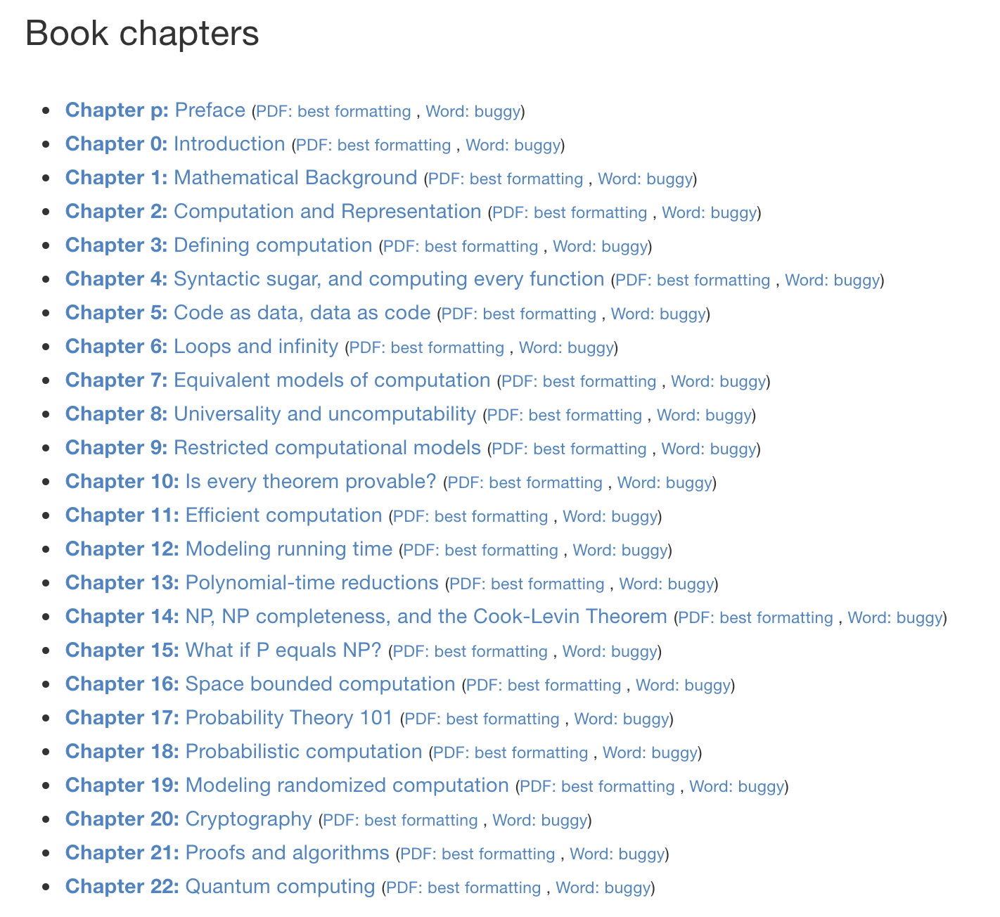
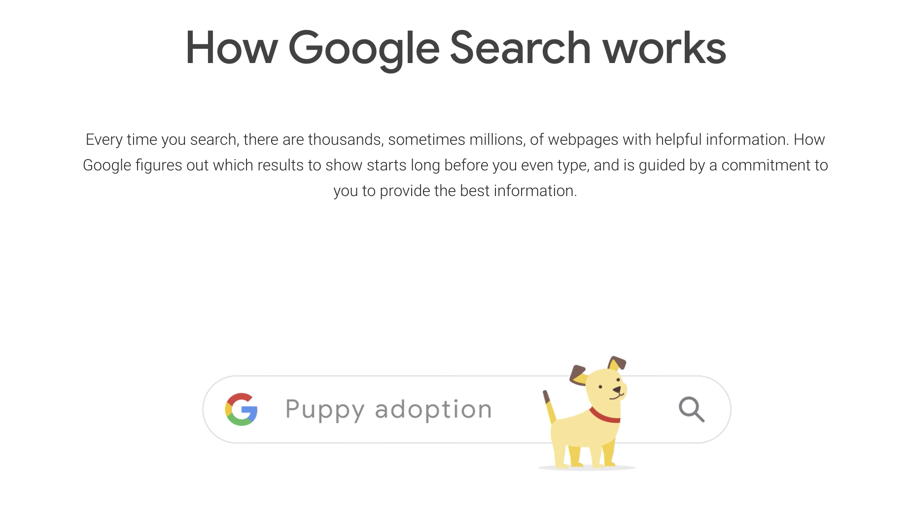
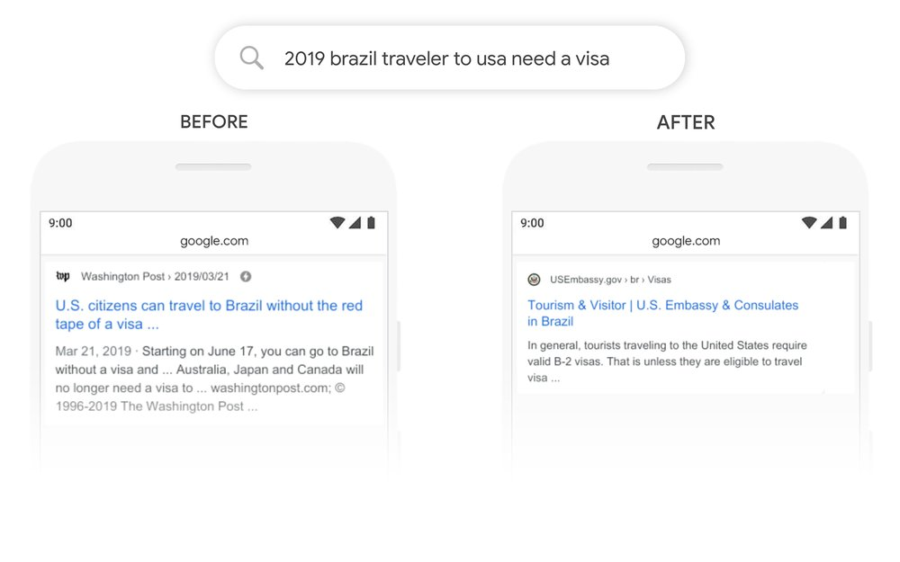

## 【是不是很酷】开源资源 分享 | 第 2 期

【是不是很酷】开源资源分享第 2 期来啦。

如果不了解这个栏目的同学，可以参考 [【是不是很酷】开源资源 分享 | 第 1 期](../001/) 文章中，对这个栏目的介绍。

**这一期内容如下：**

 

---

### 1. 斯坦福大学 CS 007

这个网址中包含斯坦福大学 CS 007 课程的全部课件（2019 年最新版）

斯坦福大学 CS 007 是什么课呢？答案是：**工程师的个人财务。**

PERSONAL FINANCE FOR ENGINEERS

**网址：[https://cs007.blog](https://cs007.blog)**

 

### 2. 理论计算机科学

哈佛大学本科生的《理论计算机科学导论》的教材。

“理论计算机科学”这门课程，在我国大多数学府并不会专门讲授。至少我读书的年代是如此。

实际上，“理论计算机科学”是一个和“离散科学”类似的，很难被严格定义的学科。在计算过程中涉及到的所有理论问题，都可以装到“理论计算机科学”的篮子里。

在我国，“理论计算机科学”中涉及的很多内容，都会和算法一起讲授。但也正因如此，大家在学习的时候，会更偏向学习算法的具体逻辑，而忽略计算过程中的理论之美。

这本书整体覆盖的内容，从定义到底什么是计算开始，一步一步延展到代码和数据的关系；可计算型；理论的可证明性；复杂度分析；P 和 NP；概率计算；随机计算；密码理论；乃至量子计算。

**网址：[https://introtcs.org/public/index.html](https://introtcs.org/public/index.html)**

 

### 3. 计算机科学哲学

上面介绍的“理论计算机科学”还和算法这个在计算机科学中非常重要的分支关系密切。但是，这个资料的内容——计算机科学哲学，相对而言就抽象很多。因为它在探讨哲学问题。

其实，这本书在试图写得简单易懂。但是，相信大多数计算机专业的同学没有专业的哲学基础，所以看起来还是会云里雾里，抓不住重点。至少我读起来的感受是这样的。不过，很多段落读起来也是很有意思的。

书籍中选用了很多漫画，也是很有意思的设计。比如：

整本书的目录结构，采用了很多“哲学式提问”的设计，大多都是“什么是 X”的格式。

比如，“什么是哲学？”“什么是计算机科学？”“什么是计算机？”“什么是科学？”“什么是工程？”“什么是算法？”“什么是过程？”“什么是实现？”；

以及诸如“程序是不是理论？”“程序和这个世界的关系”，等等等等。

**网址：[https://cse.buffalo.edu/~rapaport/Papers/phics.pdf](https://cse.buffalo.edu/~rapaport/Papers/phics.pdf)**

 

### 4. Google 搜索引擎的原理

Google 官方有一个页面，叫做 How Google Search Works，尝试用非技术语言去阐述搜索引擎的基本机制和工作原理。

当然，根据这个阐述去深挖，能挖出很多更专业的内容。

我认为所有的技术人员和产品经理，都值得看一看。 

**网址：[https://www.google.com/search/howsearchworks/?fg=1](https://www.google.com/search/howsearchworks/?fg=1)**

 

### 5. BERT 到底有什么威力？

去年，自然语言处理领域的一个大新闻，就是 Google 的 AI 团队发布了 BERT 模型。

BERT 模型在机器阅读理解顶级水平测试 SQuAD 1.1 中，两个衡量指标均全面超越人类；并且还在 11 种不同的 NLP 测试中创出最佳成绩。这一切，让 BERT 成为近期自然语言处理领域最重要的进展。

关于 BERT 的论文，有兴趣的同学可以搜索一下。

在今年，Google 的官方 AI 博客中，发布了一篇文章，介绍了将 BERT 模型引入到 Google 搜索引擎中，为 Google 搜索引擎带来了怎样的变化。用这篇文章，来理解 BERT 这个模型的意义，比上文所描述的什么“在顶级水平测试中，两个衡量指标均全面超越人类”，要直观具体地多。

比如下图，在用实际的搜索结果对比，来说明 BERT 的优势：

如果对模型的具体实现和原理不感兴趣，但是想“科普性质地了解”一下 BERT 模型威力的同学，不要错过这篇文章。

**官方网址：[https://www.blog.google/products/search/search-language-understanding-bert/](https://www.blog.google/products/search/search-language-understanding-bert/)**

 

---

今天的分享就这么多，我们下一期再见。

至于下一期是什么时候？答案是不定。

什么时候，有了我认为足够多、足够好的新资料分享给大家的时候，什么时候下一期就来啦。我不想为了赶日期而凑内容，这是我做事情的哲学。因此，我写过一篇文章，叫：[《慢增长》](https://mp.weixin.qq.com/s?__biz=MzU4NTIxODYwMQ==&mid=2247484452&idx=1&sn=40d971c16938e91e8e22777e04520574&chksm=fd8cab62cafb22747829f86dc280598a15a9750cb5974ab0bd44effade5f9926c1a7075dba3e&token=2073644645&lang=zh_CN#rd)

不过，这些短内容分享，我会第一时间发表到【是不是很酷】免费的知识星球上。如果感兴趣的同学，不要错过。

 

**大家加油！**