## 【是不是很酷】开源资源 分享 | 第 3 期

【是不是很酷】开源资源分享第 3 期来啦。

如果不了解这个栏目的同学，可以参考 [【是不是很酷】开源资源 分享 | 第 1 期](../001/) 文章中，对这个栏目的介绍。

**这一期内容如下：**

 

---

### 1. 用 Python 让繁琐工作自动化

一本挺有名的 python 书的网络版。名字叫 Automate the Boring Stuff with Python。这本书是有中文版的，中文版叫《Python 编程快速上手——让繁琐工作自动化》。不过，这本书现在有了第二版，中文版还是基于第 1 版的内容。

让我惊讶的是，这本书的最新版，完全可以在网上免费阅读，不过只有英文版。

这本书的第一版在亚马逊上好评如潮。

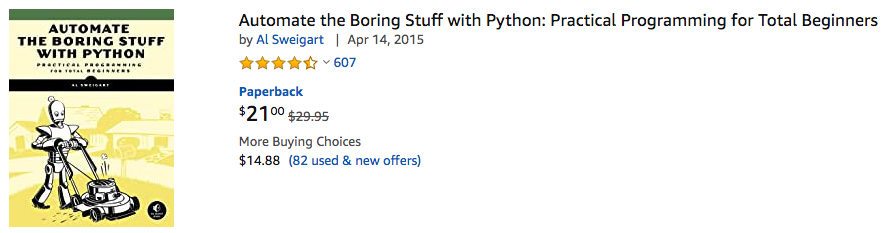

就在去年 11 月份，这本书推出了第二版，现在亚马逊上的评论还比较少，但整体是满分。

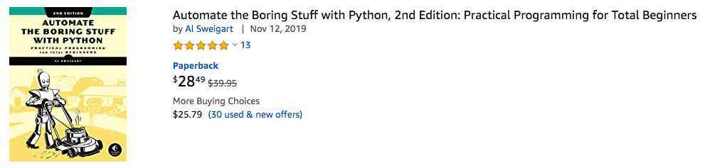

这本书的目标受众是 python 初学者。前面几章还在讲 python 基本语法，后面突然就和大多数 python 书划分开了界限，开始讲使用 python 具体处理实际工作生活中能够解决的问题。比如自动化的表单验证；电脑文件整理；爬虫；处理 excel，pdf，csv 等格式的文件；自动发送邮件；简单的图片处理；自动控制鼠标或者键盘，等等等等。

另外，在这个网站下，还有链接，可以免费在线阅读这个作者的其他几本书。

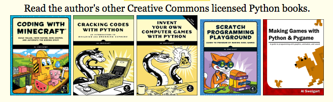

感谢互联网。

**网址：[https://automatetheboringstuff.com/2e/](https://automatetheboringstuff.com/2e/)**

 

### 2. 自底向上的计算机科学

一本国外的电子书：Computer Science from the Bottom Up。如果翻译过来的话，就是《自底向上的计算机科学》。

整本书的内容横跨组成原理，操作系统和编译。全书一共九章的内容，具体如下：

1. General Unix and Advanced C

2. Binary and Number Representation

3. Computer Architecture

4. The Operating System 

5. The Process

6. Virtual Memory

7. The Toolchain

8. Behind the Process

9. Dynamic Linking

所有内容都可以在网上直接浏览。也能免费下载 pdf 版本和 epub 版本的电子版。

同时，书中涉及的所有代码，也都可以通过 github 相应的代码仓访问。

感谢互联网。

**网址：[https://www.bottomupcs.com/index.xhtml](https://www.bottomupcs.com/index.xhtml)**

 

### 3. 随机过程基础

一本关于随机过程的“小书”。

准确的说，这不是一本书，而是一份讲义，来自德克萨斯大学，只有 100 多页。但整体内容的编纂方式非常完整，是一本可以直接阅读学习的材料，而不仅仅是一份 PPT 而已。大家可以简单看一下其目录。

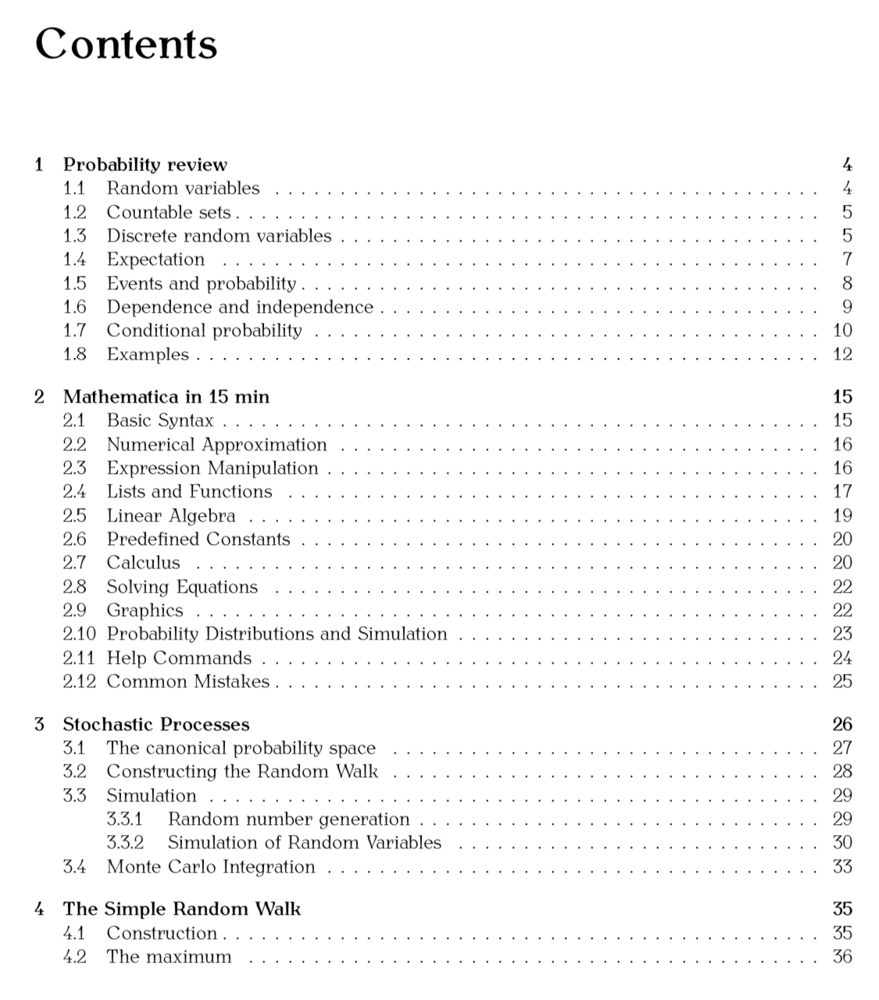

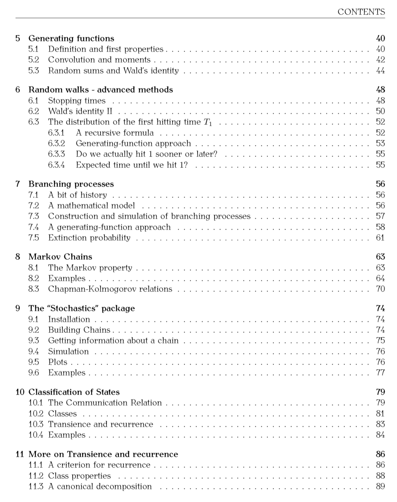

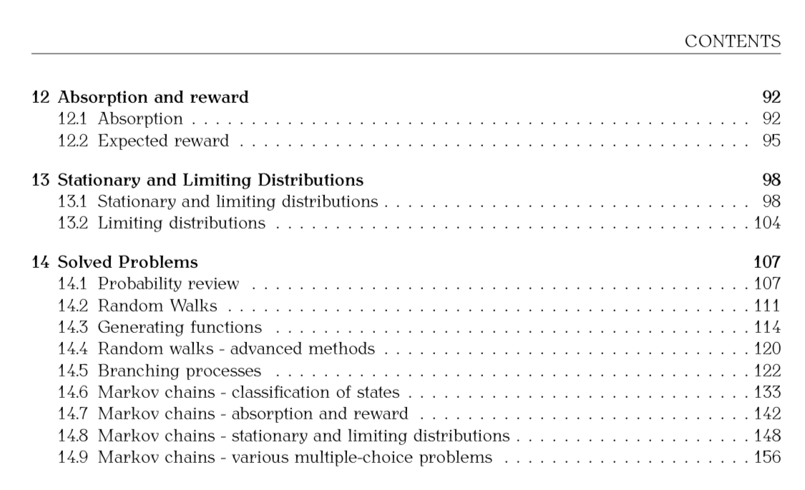

比较难得的是，这本介绍随机过程的材料，不仅仅停留在理论阶段，其中也包含大量的编程实践内容。不过，这份材料使用的语言是 matlab。

**网址：[https://web.ma.utexas.edu/users/gordanz/notes/introduction_to_stochastic_processes.pdf](https://web.ma.utexas.edu/users/gordanz/notes/introduction_to_stochastic_processes.pdf)**

 

### 4. 斯坦福大学 CS 144

斯坦福大学 CS144 课程 2019 年秋季的所有课件。

CS144 是 Introduction to Computer Networking，翻译过来，就是计算机网络基础。

包括 10 周课程的所有讲义，以及 7 个网络实验的所有资料。

关于这 7 个网络实验，都很基础，可以参考下图。

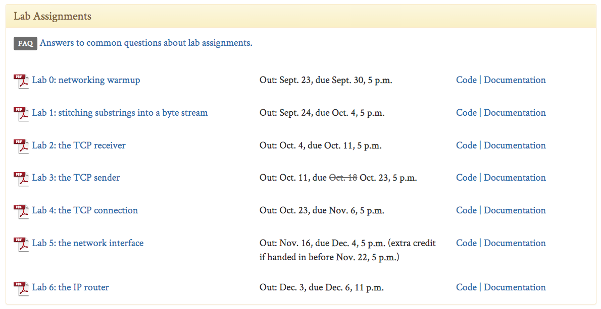

**网址：[https://cs144.github.io/](https://cs144.github.io/)**

 

### 5. Layout 101

一个只有 6 页的 PPT，讲布局的基本要素。被称为 Layout 101。

因为内容太少了，只有六页，就直接都贴上来吧：）

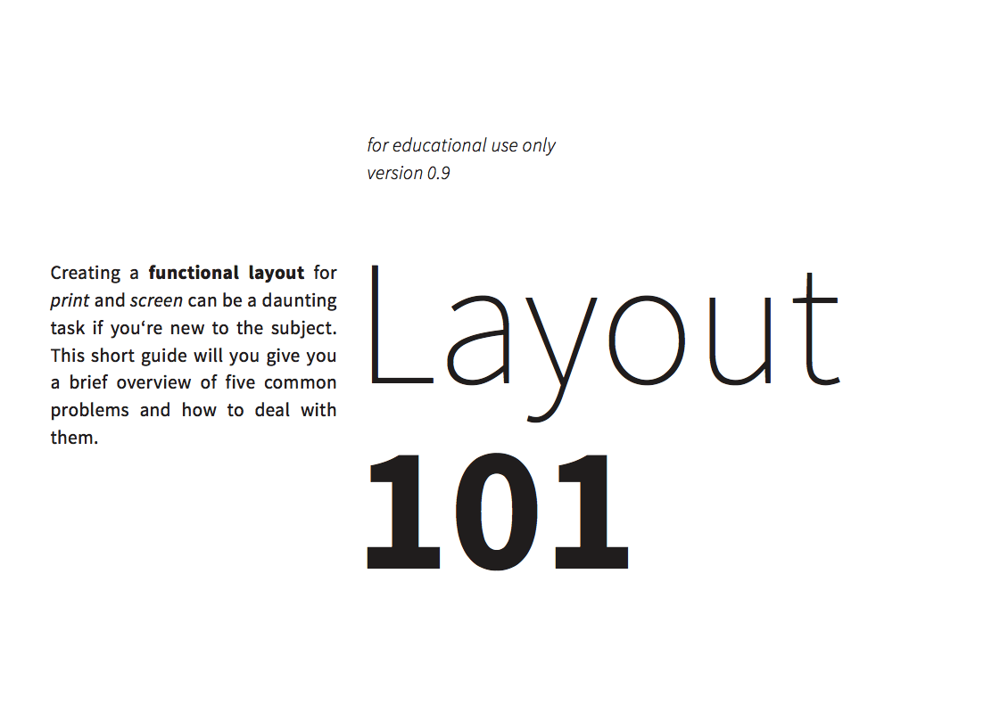

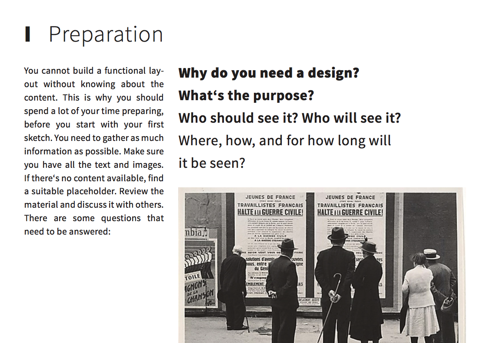

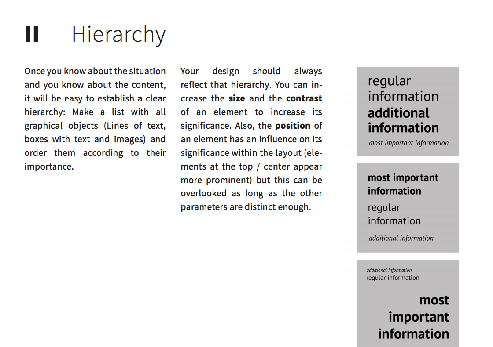

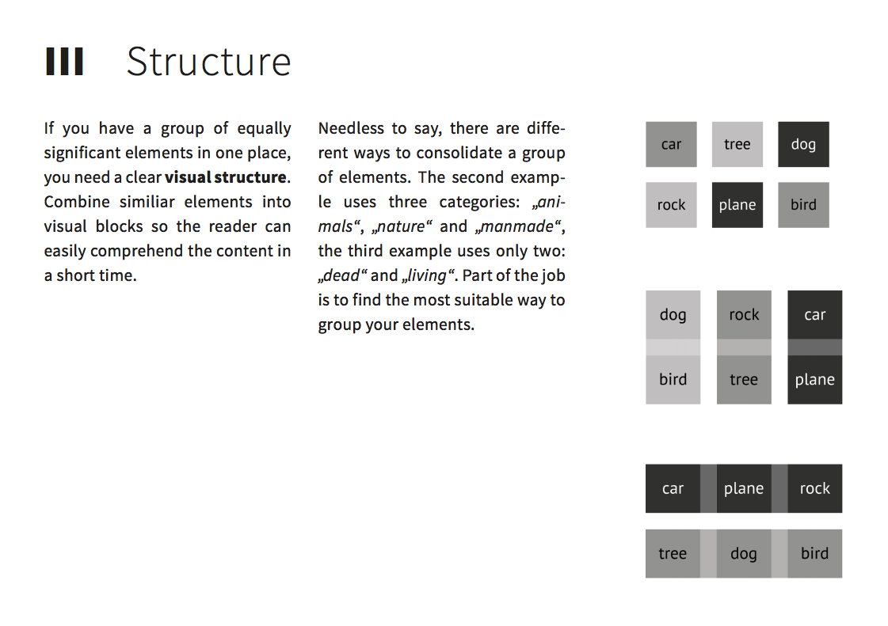

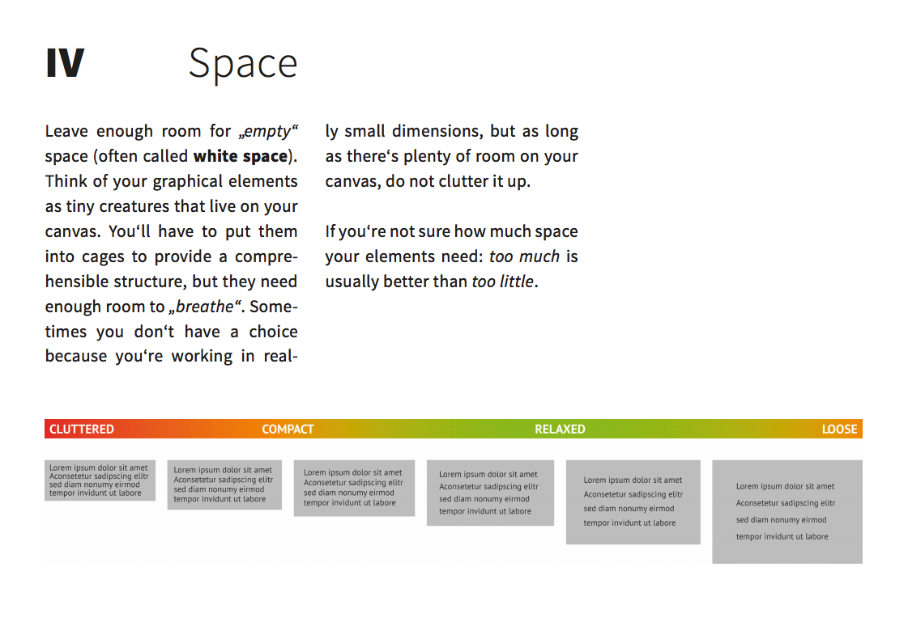

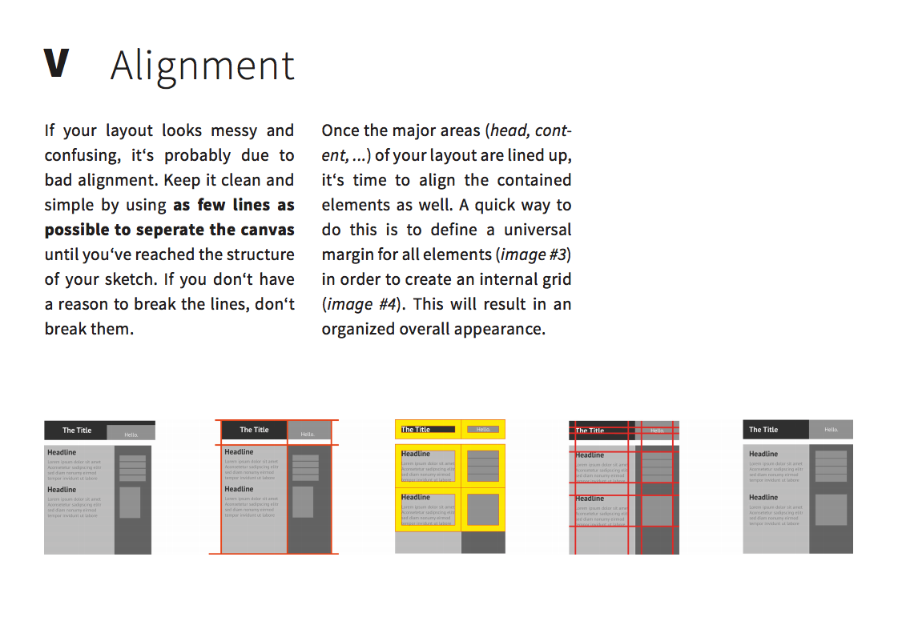

**官方网址：[https://docs.google.com/file/d/0B0gPtgNVonXPT1NsWGpKZWZKV1U/edit](https://docs.google.com/file/d/0B0gPtgNVonXPT1NsWGpKZWZKV1U/edit)**

 

---

今天的分享就这么多，我们下一期再见。

关于这个**【是不是很酷】开源资源分享**栏目，我在 github 上创建了一个代码仓，整理了这些开源分享的内容，方便大家查找，同时，也是这些内容的一个备份。

大家可以直接点击 readme 上的链接，访问相应的资源。当然，每个资源我配上的简单介绍，大家也可以通过点击每一期的文章链接获得。

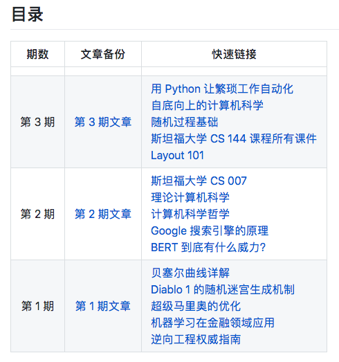

**网址：[https://github.com/liuyubobobo/cool-open-sharings](https://github.com/liuyubobobo/cool-open-sharings)**

 

**大家加油！**