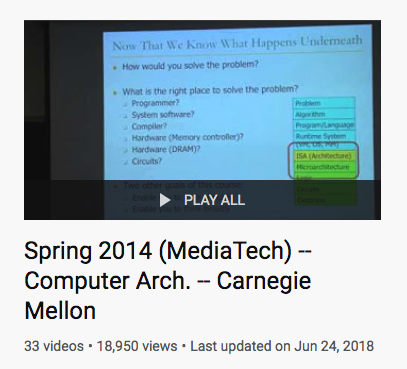

## 【是不是很酷】开源资源 分享 | 第 4 期

【是不是很酷】开源资源分享第 4 期来啦。

如果不了解这个栏目的同学，可以参考 [【是不是很酷】开源资源 分享 | 第 1 期](../001/) 文章中，对这个栏目的介绍。

**这一期内容如下：**

 

---

### 1. VVVVVV 游戏开源

不知道有没有人了解 VVVVVV 这个游戏。这是 2010 年的一个独立游戏，最初是使用 flash 制作的，然后又用 C++ 移植到了桌面端，上架到 steam 上。

游戏画面很简陋，但是从当时的角度看，是一个很有创意的动作解谜游戏。

这款游戏在 steam 上获得了近乎全部好评的成绩。售价 5 美元。不仅如此，作者还把这款“简单”的游戏移植到了 Switch, PS 4 等主机平台上。据统计，这个游戏的销售量是百万份级别的。鉴于这只是一个个人制作的游戏，这个成绩绝对是很成功的。

今年 1 月 11 日，这个游戏上架已经十年了。作者开源了游戏的全部代码。

**网址：[https://github.com/TerryCavanagh/vvvvvv](https://github.com/TerryCavanagh/vvvvvv)**

 

### 2. 学术种子站

一个垂直领域的种子站。只收集和学术相关的内容。可以下载的资源包括：数据集，论文和公开课。

这个站点最初是提供公开数据集下载的，慢慢拓展到了论文和公开课领域。现在全站已经有 53.75 TB 的内容了。

**网址：[http://academictorrents.com](http://academictorrents.com)**

 

### 3. 应用密码学进阶教程

一本互联网教程：A Graduate Course in Applied Cryptography。翻译过来就是：给研究生的应用密码学课程。2020 年 1 月 4 日刚刚更新到最新的 0.5 版本。可以直接在官网上下载 PDF 版本。

因为是给研究生看的，所以可能不适合初学。目录如下：

如果对密码学入门教程感兴趣的同学，可以在网上简单搜索一下，应该有很多公开课或者是文字教程资源。说实话，我认为在网上难找的，是进阶的学习资料。

**网址：[https://toc.cryptobook.us/](https://toc.cryptobook.us/)**

 

### 4. 如何高效阅读论文

一篇关于【如何阅读论文】的论文，其实只有两页，非常好读。

简单来说，就是 **自顶向下，从糙到精**。

其实，不仅仅是论文，在我看来，大多数教材，技术资料，技术文档等，也可以这么读，并且在大多数时候，应该这么读。

大多数人，如果没有这样的阅读习惯（技巧），其实我估计，核心原因是阅读的任务量不够大。

如果研究生期间有过多次被要求一周读 30 篇文章还要写出一篇综述的经历，自然而然会开始向这个方法靠拢。

**网址：[https://blizzard.cs.uwaterloo.ca/keshav/home/Papers/data/07/paper-reading.pdf](https://blizzard.cs.uwaterloo.ca/keshav/home/Papers/data/07/paper-reading.pdf)**

 

### 5. CMU 的计算机体系结构课程

清华的一位学霸小姐姐在上周看了 [【开源分享第三期】](../003/) 以后，向我推荐了这个来自卡耐基梅隆大学的计算机体系结构课程。

这套课程的全部内容，都可以在 Youtube 上看到完整视频。基本上等于置身于卡耐基梅隆的课堂了。大概 50 个小时。最后的更新时间在 2018 年 6 月 24 日。

其实，这个年代，这种公开课越来越多，尤其对于理工科的同学来说。单纯从学习知识的角度，去名校已经越来越不是必须了。

感谢互联网。

**官方网址：[http://course.ece.cmu.edu/~ece447/s14/doku.php?id=start](http://course.ece.cmu.edu/~ece447/s14/doku.php?id=start)**

 

---

今天的分享就这么多，我们下一期再见。

关于这个 **【是不是很酷】开源资源分享** 栏目，我在 github 上创建了一个代码仓，整理了这些开源分享的内容，方便大家查找，同时，也是这些内容的一个备份。

大家可以直接点击 readme 上的链接，访问相应的资源。也可以通过点击每一期的文章链接，获得每一期内容的文字介绍。

**网址：[https://github.com/liuyubobobo/cool-open-sharings](https://github.com/liuyubobobo/cool-open-sharings)**

 

如果大家有好的其他开源资源，可以在这个代码仓下提 issue，也可以在我的**免费知识星球**中直接分享给大家。我的这些短内容分享，也是第一时间发表到**【是不是很酷】免费的知识星球**上的。如果感兴趣的同学，不要错过。

 

**大家加油！**