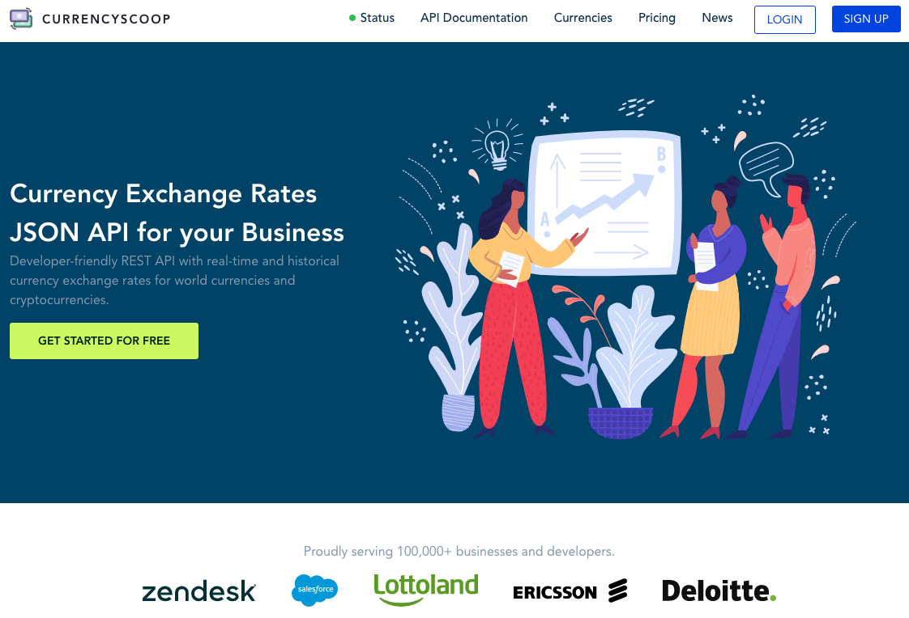
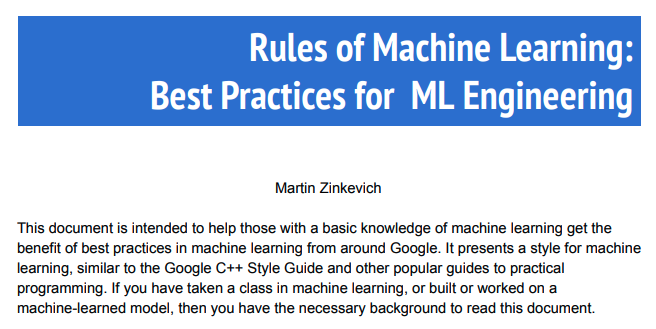
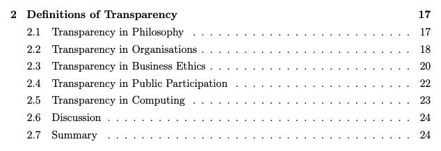
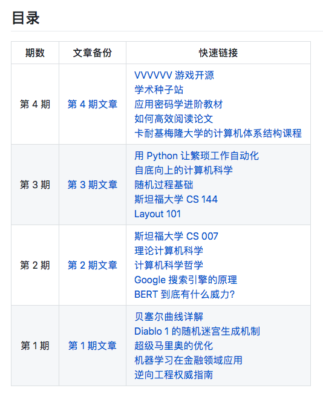

## 【是不是很酷】开源资源 分享 | 第 5 期

【是不是很酷】开源资源分享第 5 期来啦。

如果不了解这个栏目的同学，可以参考 [【是不是很酷】开源资源 分享 | 第 1 期](../001/) 文章中，对这个栏目的介绍。

简单来说，**在【是不是很酷】的开源分享中，你将看到在其他地方很难见到的资源分享。相信一定能带给你更加广阔的计算机科学视野：）**

**这一期内容如下：**

 

---

### 1. 不到 1000 行的 2D 游戏引擎

这是 github 上的一个项目，使用 C 语言，整体不到 1000 行。

由于代码量很少（相较于一个游戏引擎来说），所以这个游戏引擎具有巨大的局限性——只能处理俯视视角下的 2D 游戏的基本功能。

说实话，从游戏制作工具的角度，这个项目没有什么价值，不会有人使用这个游戏引擎做游戏的。

但是，从学习研究的角度，是一个很好的入门级别的项目。

**网址：[https://github.com/ryanpcmcquen/basque](https://github.com/ryanpcmcquen/basque)**

 

### 2. 表格识别综述

这是一篇文章，非常好地介绍了 ocr 领域中一个极其细分的分支：表格识别。

简单来说，表格识别要做的事情，就是把图片中的表格信息提取出来，放到可以编辑的csv等表格格式文件中。可以参考如下 gif 所示。

注意，这**不是**一本书，也**不是**一篇教学文章，教你一步一步实现一个表格识别的程序。

**这是一篇综述**，提供了很多表格识别算法的整体技术介绍，以及相对应的论文链接。比如 TableNet，DeepDeSRT，Graph Neural Networks，CGANs and Genetic Algorithms 等。

读研究生的同学都应该了解，找到一个领域的好的综述是多么的难，同时也是多么的重要。这篇文章在我看来，就是表格识别这一极其细分领域的一篇很棒的综述。

同时，这篇文章还附有一份“传统方式”解决这个问题的教程，包含具体的代码。

**网址：[https://nanonets.com/blog/table-extraction-deep-learning/](https://nanonets.com/blog/table-extraction-deep-learning/)**

 

### 3. 汇率转换就能创业

CurrencyScoop，只做汇率转换这一件事儿：将汇率转换包装成 JSON API，供开发者使用。

这么简单的一个 idea，这么一个看似平常的功能，CurrencyScoop 已经做到了在全球有 10 多万的客户。

和大多数 API 创业一样，CurrencyScoop 可以免费用，但每月超过一定的请求就需要收费。收费金额可以是每月 10 刀，每月 99 刀，最贵可达到 599 刀一个月。

就算你不使用这个功能，在我看来，这也是有意进行技术创业的同学值得借鉴的模式。

**网址：[https://currencyscoop.com/](https://currencyscoop.com/)**

 

### 4. 机器学习实践经验

这是一个只有 24 页的 PDF，叙述了来自 Google 的机器学习实践经验。

注意，这份资料介绍的**不是**机器学习算法的原理，或者某个机器学习框架的使用。

这份资料介绍的是：当你掌握了机器学习算法，已经学习了如何使用某个机器学习框架以后，具体在使用机器学习处理某个真实的问题时，需要注意的原则。

大家可以把这份资料理解成是机器学习领域的“编程语言书写规范”或者“程序设计准则”。

整份资料包含 43 个基本原则，包含管道建设，效能分析，训练数据集的偏斜处理，复杂模型的处理和优化等等主题。

**网址：[http://martin.zinkevich.org/rules_of_ml/rules_of_ml.pdf](http://martin.zinkevich.org/rules_of_ml/rules_of_ml.pdf)**

 

### 5. 计算机专业的“透明性”

这其实是一篇博士毕业论文，专门论述计算机专业中“透明性”这个概念。

通常国内的教学，透明性会在计算机系统结构中详细介绍。同时，在编程语言，软件工程，网络，等等领域，都会涉及。

但是把“透明性”作为一个主题专门深入讲解阐述，我第一次看见。

论文最有意思的在前半部分，尤其是第二章，从不同领域的角度看待“透明性”这一概念，很受启发。

**网址：[https://www.cs.auckland.ac.nz/research/groups/ssg/homepages/yu-cheng/ytu001_PhDThesis.pdf](https://www.cs.auckland.ac.nz/research/groups/ssg/homepages/yu-cheng/ytu001_PhDThesis.pdf)**

 

---

今天的分享就这么多，我们下一期再见。

关于这个**【是不是很酷】开源资源**分享栏目，我在 github 上创建了一个代码仓，整理了这些开源分享的内容，方便大家查找，同时，也是这些内容的一个备份。大家可以点击【阅读原文】访问。

大家可以在这个代码仓中，直接点击 readme 上的链接，访问相应的资源。也可以通过点击每一期的文章链接，获得每一期内容的文字介绍。

**网址：[https://github.com/liuyubobobo/cool-open-sharings](https://github.com/liuyubobobo/cool-open-sharings)**

 

如果大家有好的其他开源资源，可以在这个代码仓下提 issue，也可以在我的**免费知识星球**中直接分享给大家。

我的这些短内容分享，也是第一时间发表到**【是不是很酷】免费的知识星球**上的。如果感兴趣的同学，不要错过。

 

**大家加油！**