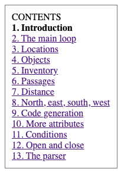
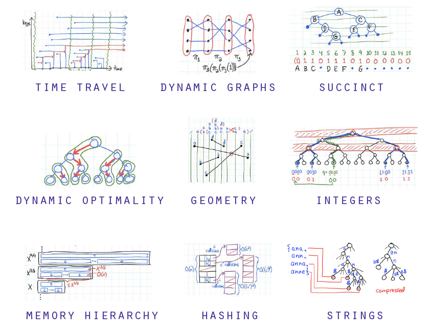
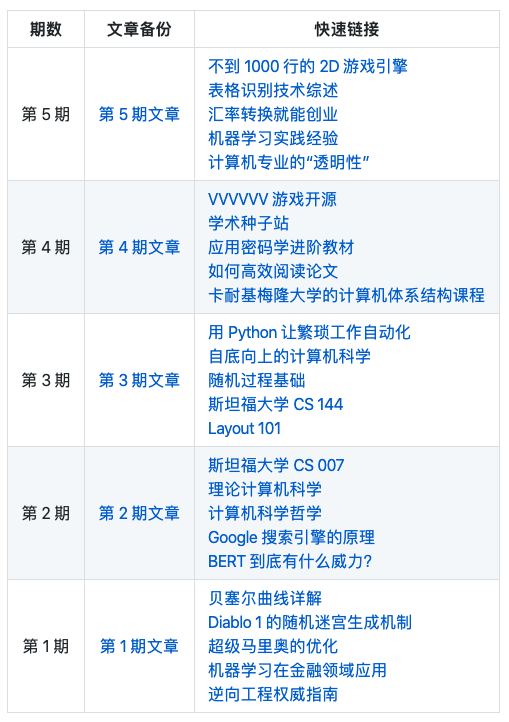

## 【是不是很酷】开源资源 分享 | 第 6 期

【是不是很酷】开源资源分享第 6 期来啦。

如果不了解这个栏目的同学，可以参考 [【是不是很酷】开源资源 分享 | 第 1 期](../001/) 文章中，对这个栏目的介绍。

简单来说，**在【是不是很酷】的开源分享中，你将看到在其他地方很难见到的资源分享。相信一定能带给你更加广阔的计算机科学视野：）**

**这一期内容如下：**

 

---

### 1. 使用 C 语言做一个文字冒险游戏

不知道有没有人玩儿过老式的文字冒险游戏。就是在没有图形化的年代，在命令行上靠文字打 RPG。

这个教程教你如何使用 C 语言实现一个文字冒险游戏。其实用到的技术一点儿都不难。但麻雀虽小，五脏俱全。从游戏主循环，到移动，道具，不同的地点，全都有。

整个内容总共包含 13 部分。

掌握精髓以后，大家完全可以自己尝试添加技能，同伴，不同的敌人，任务，等等等等，想象空间还是很大的。

强烈建议各个大学大一学习 C 语言以后的课设，是这样一个文字冒险游戏，而不是什么学生管理系统。

**网址：[http://home.hccnet.nl/r.helderman/adventures/htpataic01.html](http://home.hccnet.nl/r.helderman/adventures/htpataic01.html)**

 

### 2. 可解释性机器学习

机器学习算法的可解释性，是现在机器学习界急需处理的一个重点问题。

但尽管如此，很少有资料专门从这个角度来阐述机器学习算法。而这本电子书，在我看来，是非常少有的，探索机器学习模型的可解释性的一个材料。

更可贵的是，我认为这份材料并不高深，是非常好的这方面的入门级材料。

**网址：[https://christophm.github.io/interpretable-ml-book/](https://christophm.github.io/interpretable-ml-book/)**

 

### 3. MIT 高级数据结构

MIT 6.851 课程。课程名称简单粗暴：Advanced Data Structures，翻译过来就是：高级数据结构。

我简单看了一下目录，和我的《玩转数据结构》近乎零重合，是真真正正的高级数据结构。并且，很多数据结构有着更加现实的实际应用意义。

课程页面包含每一讲的视频，相应的讲义，对应的习题集以及参考答案。

**MIT 高级数据课程网址：[https://courses.csail.mit.edu/6.851/fall17/](https://courses.csail.mit.edu/6.851/fall17/)**

要想学习这个课，建议先学习我的《玩转数据结构》，打个好基础。

毕竟，我的《玩转数据结构》，可能是市面上可以找到的最好的数据结构基础视频教程：）

 

### 4. 160 个数据科学面试题

这篇文章总结了 160 个数据科学相关的面试问题。

所有问题都按照主题进行了归类。同时，作者还设计了简单，中等，困难三个难度级别，给每个题目的难度进行了划分。

不过，所有的问题都没有答案。在我看来，这些问题其实更像是一本书的目录，以概念性为主。

有需要的同学可以参考：）

**网址：[https://hackernoon.com/160-data-science-interview-questions-415s3y2a](https://hackernoon.com/160-data-science-interview-questions-415s3y2a)**

 

### 5. 在线听绘本故事

我之前我写过一篇文章，向大家介绍 [看美剧学英语的方法](https://mp.weixin.qq.com/s?__biz=MzU4NTIxODYwMQ==&tempkey=MTA1NV93dEFrTHUwWkczVjhRWDZFaWd3NGw0QTZiVEQtTVNqMnRQNWh2S2VmX3gtQU96V3Q2Nm05VXFMQnRPaXk5YmhtZW55VFMyc292SlFhZnpaSkNjYUhRWE5RVE9SaWJ3THpfcENacUh3Y2ZKajk5UUw2TnA1RmJTRDlmRXR2aWxIWElZNHlXTGJXZTMtaU9aOVBiMk1XWllpRWs1V2hFTkJDRmNMVG1Bfn4%3D&chksm=7d8cac5c4afb254ade6137d344314797aa40f810ffe2d33485afb3ef860ea7cbfefa0085ed14#rd)。

有很多童鞋问我，挂上字幕，还是看不懂，为什么？

我的回答是：如果挂上字幕大部分内容看不懂，说明这个美剧现阶段不适合你的英语水平。

怎么办？一个很简单的方式就是：降低材料难度。比如去找给小学生甚至幼儿园小朋友看的影片。

很多外国动画片都 ok。Youtube 上搜一搜有很多。但要注意，美国有很多成人向的动画片，用语也并不简单，最著名的就是《南方公园》。

在这里，给大家推荐一个网站：**storylineonline**

这个网站专门请美国的演艺届人员来朗读他们最爱的儿童绘本，包含 60 来本书，适合 4 年级以下儿童（10 岁以下）。不过很多视频是挂在 Youtube 上的，可能需要科学上网。

大家可以体验一下，在英语为母语的国家，6-10 岁小朋友看的书，也没那么简单。不过是一个很好的训练开始。

**网址：[https://www.storylineonline.net/](https://www.storylineonline.net/)**

 

---

今天的分享就这么多，我们下一期再见。

关于 **【是不是很酷】开源资源** 分享栏目，我在 github 上创建了一个代码仓，整理了这些开源分享的内容，方便大家查找，同时，也是这些内容的一个备份。

大家可以在这个代码仓中，直接点击 readme 上的链接，访问相应的资源。也可以通过点击每一期的文章链接，获得每一期内容的文字介绍。

**网址：[https://github.com/liuyubobobo/cool-open-sharings](https://github.com/liuyubobobo/cool-open-sharings)**

 

如果大家有好的其他开源资源，可以在这个代码仓下提 issue，也可以在我的**免费知识星球**中直接分享给大家。

我的这些短内容分享，也是第一时间发表到**【是不是很酷】免费的知识星球**上的。如果感兴趣的同学，不要错过。

 

**大家加油！：）**