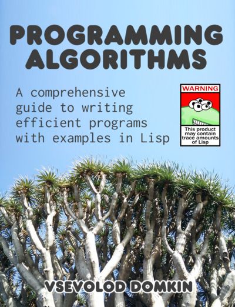
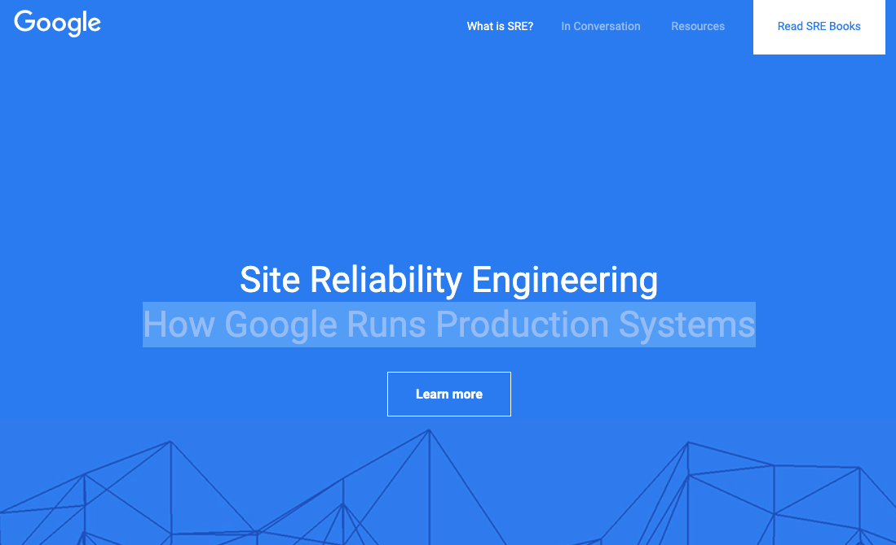
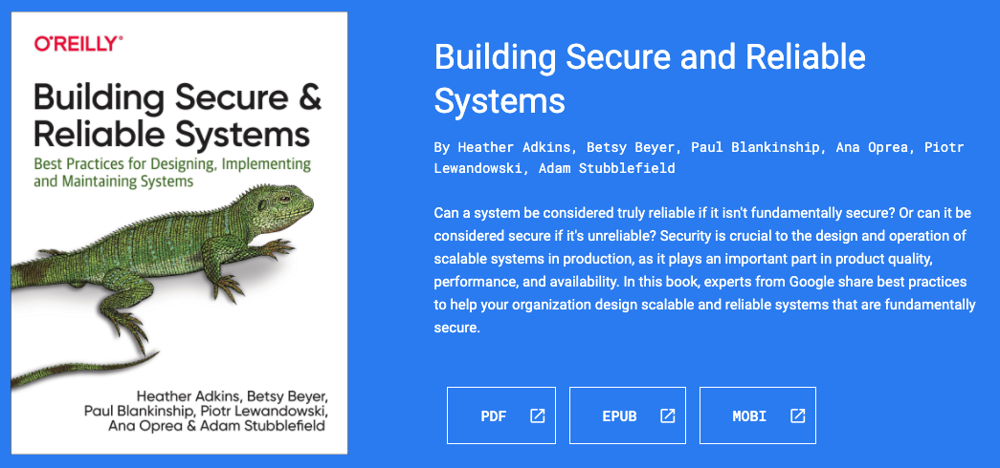
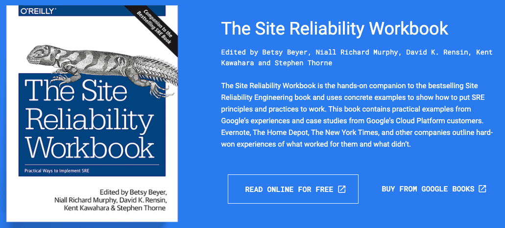
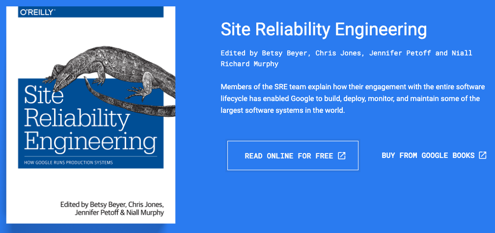
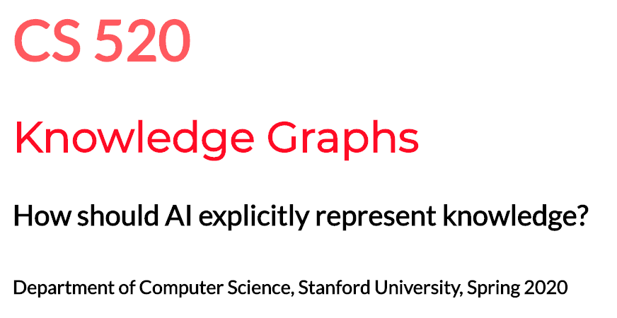
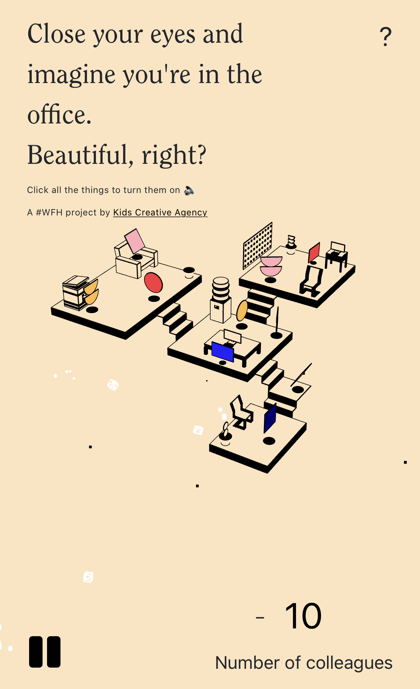
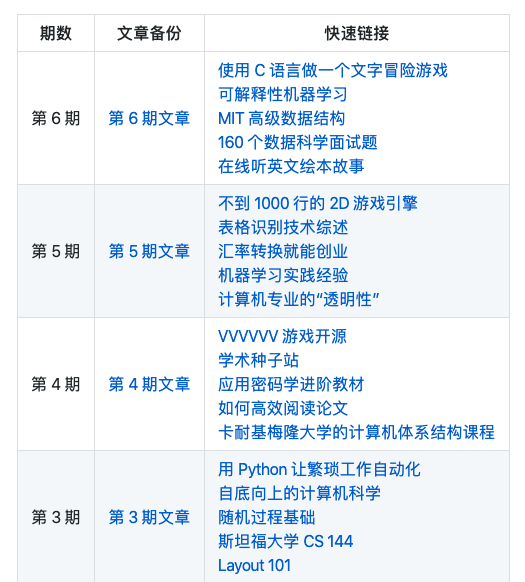

## 【是不是很酷】开源资源 分享 | 第 7 期

【是不是很酷】开源资源分享第 7 期来啦。

如果不了解这个栏目的同学，可以参考 [【是不是很酷】开源资源 分享 | 第 1 期](../001/) 文章中，对这个栏目的介绍。

简单来说，**在【是不是很酷】的开源分享中，你将看到在其他地方很难见到的资源分享。相信一定能带给你更加广阔的计算机科学视野：）**

**这一期内容如下：**

 

---

### 1. 基于 Lisp 的算法教程

这是一本基于 Lisp 语言的算法书。可以完全免费在线阅读。

虽然 Lisp 很小众，现代在实际生产环境中近乎没什么用。但是，如果对使用函数式编程实现各种算法感兴趣的同学，这是一份非常好的参考材料。我在 Amazon 上简单搜索了一下，这样全面地使用函数式语言实现算法的教程，近乎没有。

不要看整本书是可以在网上免费阅读的，但是涉及的内容非常完整，包括基本的排序，数组，链表，映射，LRU，LFU，哈希表，树结构，图结构，字符串算法，DP，近似算法，压缩算法，并行算法，等等主题。

**网址：[https://leanpub.com/progalgs/read#leanpub-auto-introduction](https://leanpub.com/progalgs/read#leanpub-auto-introduction)**

 

### 2. Google SRE

Google 有一个专门关于 SRE 团队的页面。

什么叫 SRE？就是 Site Reliability Engineering。顾名思义，就是要让 Google 的服务更稳定，更可靠。

在这个页面上，可以看到还有一个副标题：How Google Runs Production Systems（Google 是如何运行生产系统的。）

在这个页面下，有一个 Read SRE Books 的标签。其中，可以免费阅读三本和 SRE 相关的书籍，都是 O'Reilly 家出版的。

O'Reilly 在计算机行业应该算是家喻户晓的出版社了。其出版的图书的特点就是：封面全部使用动物，所以又被称为动物书。

感兴趣的同学，尤其是对系统设计，架构设计，可靠性和偏技术管理的同学，可以研究一下。

**网址：[https://landing.google.com/sre/#sre](https://landing.google.com/sre/#sre)**

 

### 3. 斯坦福 CS520：知识图谱

我的图论课上线的那会儿，就有同学问我，这课是讲知识图谱（Knowledge Graph）吗？

我说不是，我的课程讲的是离散数学里的那个图论，对应英文是 Graph Theory。而且，我的课程还不偏数学，以算法实现为主。

现在，因为疫情的关系，斯坦福大学的知识图谱课程：CS520 免费在网上开放啦。这可能是在网上唯一完整地介绍知识图谱领域的视频教程了。实际上，对知识图谱的系统介绍，书籍资料也并不多。

课程主页里每节课的视频内容都上传在了 YouTube 上。最后，告诉大家一个小秘密：**Youtube 实际上是海外最大的视频教学网站：）**

**网址：[https://web.stanford.edu/class/cs520/](https://web.stanford.edu/class/cs520/)**

 

### 4. 亚马逊 Future Engineer

因为新冠疫情，亚马逊的 Future Engineer 项目免费了一批课程。

Future Engineer，顾名思义，是培养未来的工程师。其中的课程，大多数是给 K12 的小朋友们开设的。

对计算机少儿教育感兴趣的童鞋，甚至正在创业，设计相关少儿编程课程，或者只想教自己家的娃入门编程的童鞋，都可以趁机看看国外是怎么做的：）

这里面有一个课程，看题目挺有意思，叫 Celebrity Song Remix，课程是让小朋友们可以使用代码，对获得格莱美大奖的流行金曲做混音效果，号称是通过音乐学代码。

有时间我要研究一下这是什么鬼 🤔🤔🤔

**网址：[https://www.amazonfutureengineer.com/free-courses](https://www.amazonfutureengineer.com/free-courses)**

 

### 5. 办公室噪音模拟器

有的时候，我真的觉得外国人闲得，特别出人意料。 

比如，现在因为疫情原因，很多大厂员工都在家办公了。于是，有人做出了一个“办公室背景噪音”模拟器，让大家怀念一下办公室工作的情形。

这个网站叫 I Miss Office，翻译过来就是：我怀念办公室。

在这个模拟器中，你可以选择周遭大概有多少人同时办公。然后，你就能听见隐约的空调或者打印机工作的声音，周遭人键盘鼠标敲击的声音，和不时地轻声讨论的声音。

在家办公的时候，戴上耳机，开着这个“办公室噪音模拟器”，宛如置身于办公室之中。

我不认为这种 idea 可以商业化。但不知道为什么，就是觉得：**很无聊，但很酷：）**

**网址：[https://imisstheoffice.eu](https://imisstheoffice.eu)**

 

---

今天的分享就这么多，我们下一期再见。

关于**【是不是很酷】开源资源分享**栏目，我在 github 上创建了一个代码仓，整理了这些开源分享的内容，方便大家查找，同时，也是这些内容的一个备份。

大家可以在这个代码仓中，直接点击 readme 上的链接，访问相应的资源。也可以通过点击每一期的文章链接，获得每一期内容的文字介绍。

**网址：[https://github.com/liuyubobobo/cool-open-sharings](https://github.com/liuyubobobo/cool-open-sharings)**

 

如果大家有好的其他开源资源，可以在这个代码仓下提 issue，也可以在我的**免费知识星球**中直接分享给大家。

我的这些短内容分享，也是第一时间发表到**【是不是很酷】免费的知识星球**上的。如果感兴趣的同学，不要错过。

 

**大家加油！：）**