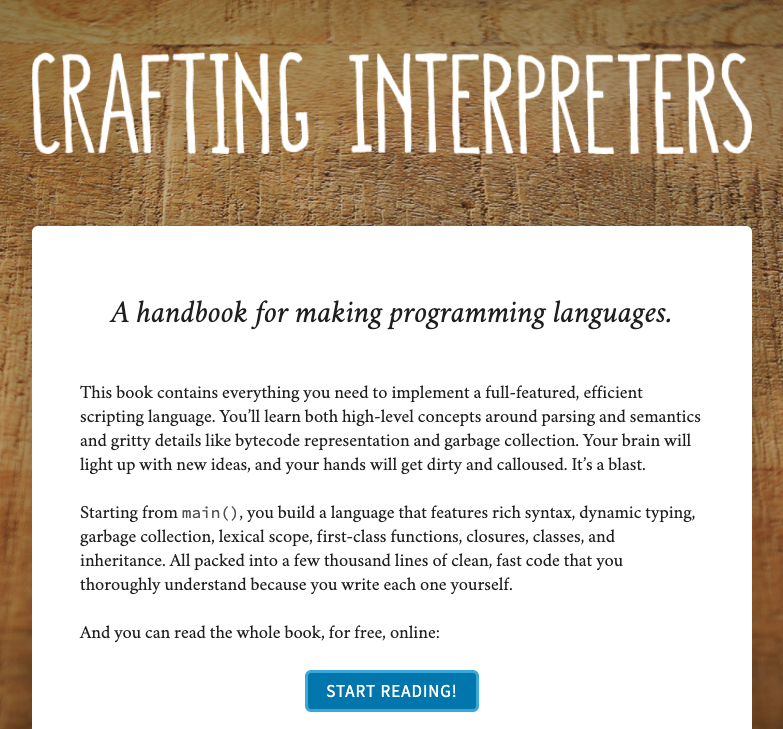
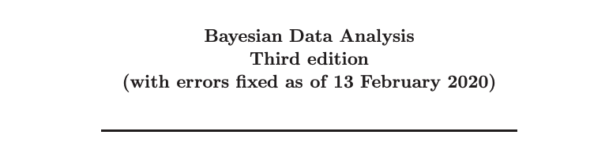
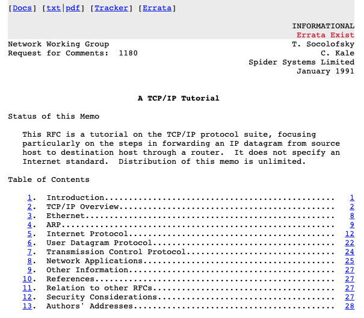
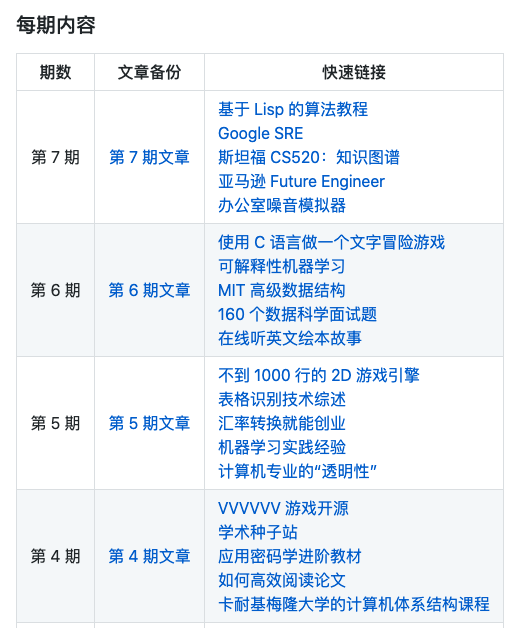

## 【是不是很酷】开源资源 分享 | 第 8 期

【是不是很酷】开源资源分享第 8 期来啦。

如果不了解这个栏目的同学，可以参考 [【是不是很酷】开源资源 分享 | 第 1 期](../001/) 文章中，对这个栏目的介绍。

简单来说，**在【是不是很酷】的开源分享中，你将看到在其他地方很难见到的资源分享。相信一定能带给你更加广阔的计算机科学视野：）**

**这一期内容如下：**

 

---

### 1. 重磅推荐！MIT EE 和 CS 公开课

因为疫情的影响，MIT 的电子工程与计算机科学专业，近乎开放了他们所有课程的线上版本！每门课程都包含视频，相应材料和作业。

说实话，我个人觉得，除了没有同学们的网上讨论和考试，这基本等于是在疫情期间亲自上 MIT 了。

课程覆盖面非常广，从本科到研究生课程；从入门到进阶；从众所周知的领域到极其小众的领域，都有！我简单浏览了一遍课程标题和一些课程介绍，觉得已经淘到很多宝贝了。

吐血推荐！

**网址：[https://ocw.mit.edu/courses/electrical-engineering-and-computer-science/](https://ocw.mit.edu/courses/electrical-engineering-and-computer-science/)**

 

### 2. 如何制作解析器

一本免费的电子书，介绍如何制作一个解析器。叫 Crafting Interpreters。

顺便说一嘴，其实，很多网上打着编译旗号的课程，本质就是做解析器而已。

当然，从学习的角度，想深入学习编译原理，先从做一个解析器出发，是没有毛病的：）

**网址：[http://craftinginterpreters.com/index.html](http://craftinginterpreters.com/index.html)**

 

### 3. 深入理解贝叶斯分析

这是一本专门介绍贝叶斯分析的免费电子书。最新的版本是在今年（2020年）2 月 13 日刚刚修订的。

全书共有 23 章，可谓是把贝叶斯方法介绍得相当透彻。很多在互联网上很难找到相关讨论的话题，在这本书上都有详细的介绍。

看整本书的目录，虽然似乎前几章很基础，但其实，整本书的定位并不基础，将贝叶斯挖掘得极其深入。

贝叶斯是一个可深可浅的模型。虽然大多数同学在初等概率课程上就学习过贝叶斯公式，但其实，我知道很多博士生，还依然在努力学习贝叶斯推断呢：） 

**网址：[https://users.aalto.fi/~ave/BDA3.pdf](https://users.aalto.fi/~ave/BDA3.pdf)**

 

### 4. 来自 1991 年的 TCP/IP 教程

这是一份来自 1991 年的 TCP/IP 教程。

说实话，在网上能找到的 90 年代的资料还是蛮少的。非扫描版的资料就更少了。不过鉴于 TCP/IP 是一个很重要的网络话题，所以到了 30 年后的今天，还是有很多新的资料蹦出来详细阐述。

跨越 30 年的时间，这些资料做一下对比，是很有意思的事情。

就算不做对比，也是挺好的一份历史收藏：）

**网址：[https://tools.ietf.org/html/rfc1180](https://tools.ietf.org/html/rfc1180)**

 

### 5. 如何说“不”

非常有意思的一个网站，叫 How to say no。

这个网站给出了 31 个邮件模版，可以对诸多不同的情景说 NO，比如社交活动邀请，约会，面试，会议，销售人员或者猎头，等等等等。

有“说不困难症”的童鞋，尤其是在英语环境，因为文化原因，怕自己说的“不”不够委婉的话，那就直接套模板吧！：）

**网址：[https://tools.ietf.org/html/rfc1180](https://tools.ietf.org/html/rfc1180)**

 

---

今天的分享就这么多，我们下一期再见。

关于**【是不是很酷】开源资源分享**栏目，我在 github 上创建了一个代码仓，整理了这些开源分享的内容，方便大家查找，同时，也是这些内容的一个备份。

大家可以在这个代码仓中，直接点击 readme 上的链接，访问相应的资源。也可以通过点击每一期的文章链接，获得每一期内容的文字介绍。

**网址：[https://github.com/liuyubobobo/cool-open-sharings](https://github.com/liuyubobobo/cool-open-sharings)**

 

如果大家有好的其他开源资源，可以在这个代码仓下提 issue，也可以在我的**免费知识星球**中直接分享给大家。

我的这些短内容分享，也是第一时间发表到**【是不是很酷】免费的知识星球**上的。如果感兴趣的同学，不要错过。

 

**大家加油！：）**