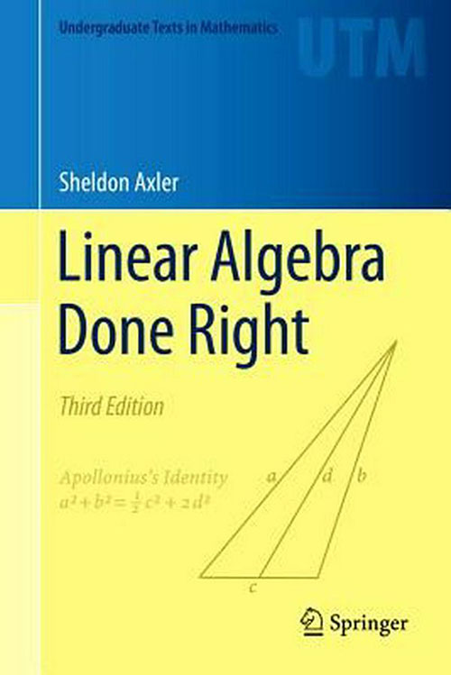
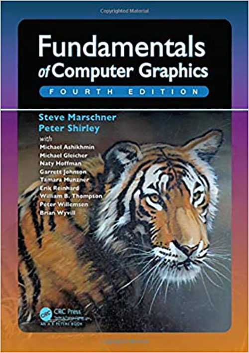
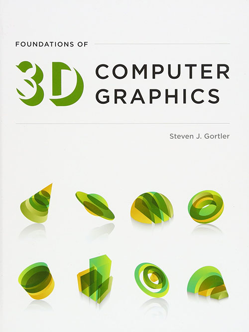
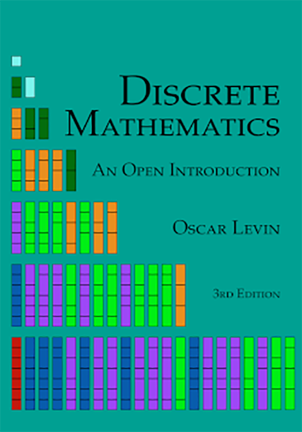
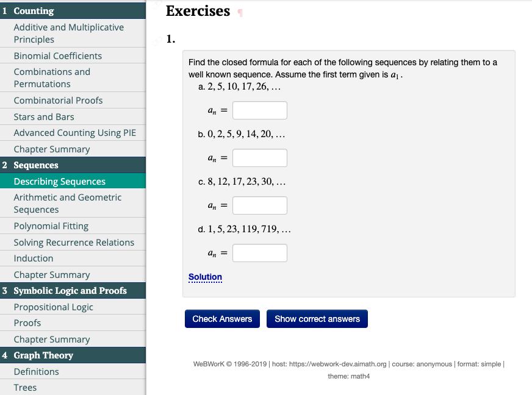
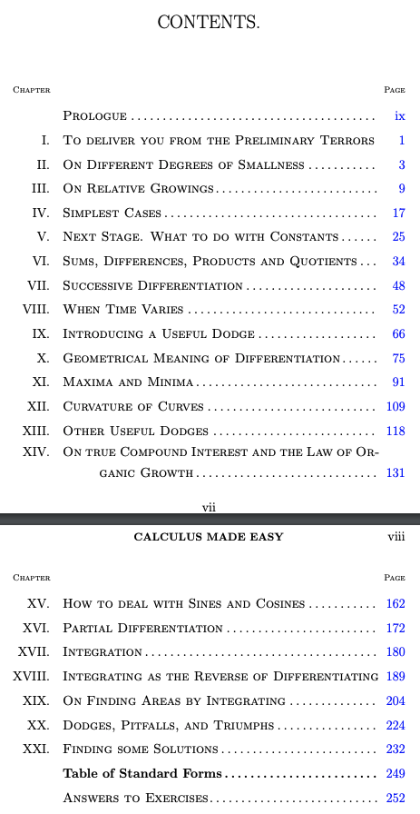
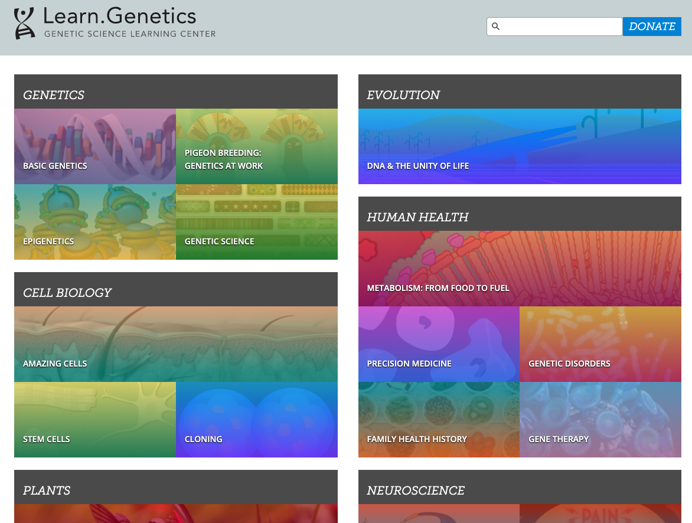
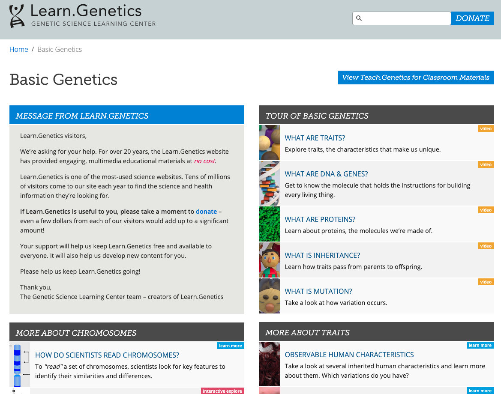
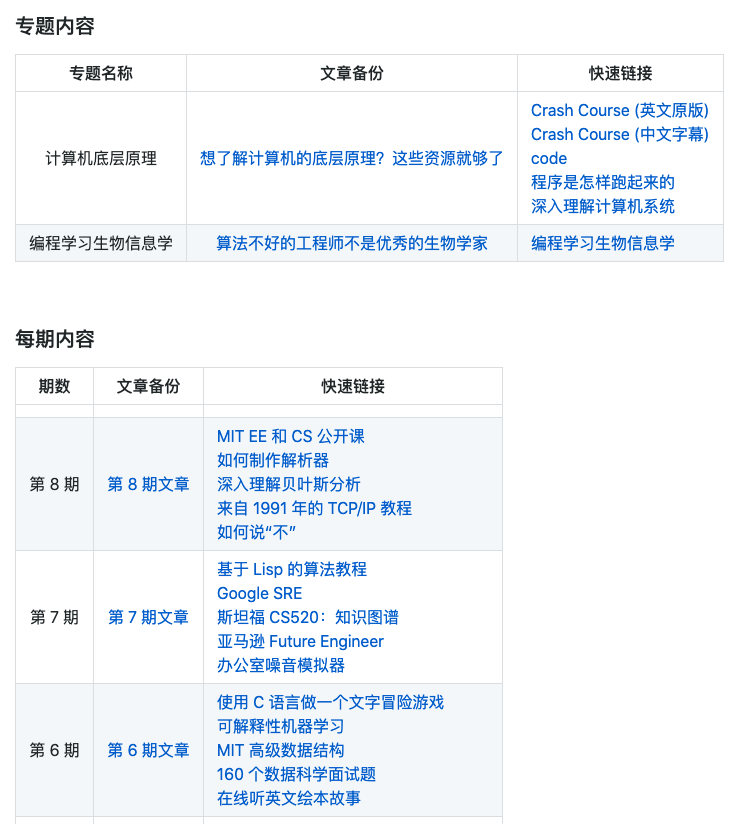

## 【是不是很酷】开源资源 分享 | 第 9 期

【是不是很酷】开源资源分享第 9 期来啦。

如果不了解这个栏目的同学，可以参考 [【是不是很酷】开源资源 分享 | 第 1 期](../001/) 文章中，对这个栏目的介绍。

简单来说，**在【是不是很酷】的开源分享中，你将看到在其他地方很难见到的资源分享。相信一定能带给你更加广阔的计算机科学视野：）**

**这一期内容如下：**

 

---

### 1. Springer 出版社免费正版图书下载

在这周我的公众号文章 [学习乘法不能帮助我们理解质能方程](https://mp.weixin.qq.com/s?__biz=MzU4NTIxODYwMQ==&mid=2247485578&idx=1&sn=42d090afdf14dcbbc806722fc3ffa268&chksm=fd8ca7cccafb2edaa2cb67e0bfcea6452180a9aa7c772da242b40b75ae5d3961af44f439424e&token=1890366782&lang=zh_CN#rd) 中，向同学们推荐了两本经典的线性代数课本。

在这篇文章下面，我的一名同学——现在在硅谷 Google 总部工作的大神，又推荐了另外一本线性代数教材，非常非常适合入门，叫**《Linear Algebra Done Right》**

这本书是美国出版社 Springer 旗下的图书。Springer 是美国一家著名的出版社，其标志，就是这个马头，相信很多同学都见过：

现在，疫情期间，这本《Linear Algebra Done Right》全书，可以在 Springer 的官方网站免费下载。

传送门：[https://link.springer.com/book/10.1007/978-3-319-11080-6](https://link.springer.com/book/10.1007/978-3-319-11080-6)

实际上，由于疫情的原因，Springer 出版社免费了一大波电子书。总共 1000 多本国外原版的正版技术书籍。原先都是收费的，现在都可以免费下载！

吐血推荐！有需要的同学不要错过。

**网址：[https://link.springer.com/search/page/1?facet-language=%22En%22&facet-content-type=%22Book%22&showAll=false](https://link.springer.com/search/page/1?facet-language=%22En%22&facet-content-type=%22Book%22&showAll=false)**

另外，毫不意外的，github 上有了可以批量下载 Springer 这次活动的所有免费图书的 Python 脚本。有兴趣的同学可以参考这里：[https://github.com/alexgand/springer_free_books](https://github.com/alexgand/springer_free_books)

 

### 2. 图形学入门教材推荐

注意，**这不是一个开源资料分享。是教材推荐。**

有同学询问我图形学的学习资料推荐。

美国高校最常用的本科图形学入门教材是这本**《Fundamentals ot Computer Graphics》**，最新版已经是第四版了。

其实，图形学作为一门相对古老的计算机学科，相关教材有很多，但如果你不想费心挑哪本书最适合你，这本书大概率不会错。

我在中文站点找了一下，似乎没有找到这本书的中文版。道理上这么经典的教材，中文应该引进了。不知道是不是我没有搜索到。

这本书主要讲解原理，虽然涉及 OpenGL 的使用和一些实例，但 OpenGL 编程不是重点。如果想结合实战学习的话，我建议再找一本 OpenGL 的书籍配合。

OpenGL 的书更多。通常**大家不要一上来就看 OpenGL 红宝书就好**。美国一些学校会使用这本书作为 OpenGL 的补充教材：**《Foundations of 3D Computer Graphics》**

这本书在亚马逊上的评分并不算高。但**很多书正是因为太简单，太浅显，所以评分不高。可这种书，恰恰是初学者需要的。**

这本书就是典型的，我的文章 [《高效学习的秘密》](https://mp.weixin.qq.com/s?__biz=MzU4NTIxODYwMQ==&mid=2247483836&idx=1&sn=90854aa76507281403e4dd9cd434a12b&chksm=fd8caefacafb27ec78f999fde4f1217c04c6e2ff28cf51fe511d8fa29d484d9281ff91de8c9c&token=1890366782&lang=zh_CN#rd) 中，说的那种“薄薄”的“傻”教材。

**这两本书暂时没有正版的开源下载。**

 

### 3. 离散数学基础

一本离散数学的公开电子书：**Discrete Mathematics, An Open Introduction, 3rd edition**

全书可以免费下载 pdf 版本，也可以免费在线浏览。在线浏览的话，对于一些章节练习，还可以进行交互式的解答。

这本书已经被全美 70 多所高校选为了离散数学的教材，或者推荐的补充阅读教材。

整本书的内容相对是比较简单，比较基础的。实际上，离散数学是一个巨大的篮子，很多领域都可以往离散数学里装。数论，群论，图论，集合论，组合数学，等等等等。

对于从没有接触过离散数学的同学，这本书是一个很好的入门，之后可以进一步阅读更高级的离散数学课本，也可以独立去学习离散数学的某一个子领域。

或许，这本书也是我的文章 [《高效学习的秘密》](https://mp.weixin.qq.com/s?__biz=MzU4NTIxODYwMQ==&mid=2247483836&idx=1&sn=90854aa76507281403e4dd9cd434a12b&chksm=fd8caefacafb27ec78f999fde4f1217c04c6e2ff28cf51fe511d8fa29d484d9281ff91de8c9c&token=1890366782&lang=zh_CN#rd) 中，说的那种“薄薄”的“傻”教材。

另外，这本书刚刚更新到最新的第三版。

**网址：[http://discrete.openmathbooks.org/dmoi3.html](http://discrete.openmathbooks.org/dmoi3.html)**

 

### 4. 100 年前的微积分课本

这是一本来自 100 年前的微积分课本。

这本书叫 **Calculus Made Easy**。第一版是 1910 出版的；1914 年推了第二版，也就是最新版。然后，2012 年，有人将这本 100 年前的教材电子化，搬上了互联网。

虽然是 100 年前的教材，但沉下心去看，可能你会觉得比现在的很多教材好。或许正是因为是 100 年前的教材，所以相比现代的教材，反而更简单。

整本书没有那么多复杂的定义和定理，以讲明白微积分到底是怎么回事儿，怎么计算为主。虽然有局限性，但是或许可以让很多人更快地抓住微积分的主干，更顺畅地入门微积分。

个人认为，是一本很好的微积分入门教材和参考。

即使不需要，也可以当做一份历史收藏：）

**网址：[http://www.gutenberg.org/files/33283/33283-pdf.pdf](http://www.gutenberg.org/files/33283/33283-pdf.pdf)**

 

### 5. 学习生物学

都说 21 世纪是生物学的世纪。但如果不是生物学专业的同学，想了解一些生物学的基础知识，应该从哪里入手呢？

之前，在我的公众号文章 [算法不好的工程师不是优秀的生物学家](https://mp.weixin.qq.com/s?__biz=MzU4NTIxODYwMQ==&mid=2247485503&idx=1&sn=03b9c026598f4c2c548480e5eed7a5a1&chksm=fd8ca779cafb2e6fe7a9f1c08258c9fe6aa6845e7270904f44c6324ec3ba10425e4b9f893fb1&token=1890366782&lang=zh_CN#rd) 中，向大家推荐了 **Rosalind**，一个基于生物信息学的算法编程网站。但是对于更加理论化，系统的生物学知识，Rosalind 并不是一个好的选择。

**Learn.Genetics** 是一个更加完整的，像课本一样的，可以学习生物学知识的网站。

这个网站虽然叫 Learn.Genetics，但绝不仅仅局限在遗传学。也包含细胞生物学，植物学，进化学，生态学，人体健康，神经科学，等等内容。

网站不仅仅包含文字内容，还包含视频内容。视频的制作也都很精良。虽然目测主要是针对初等教育（小学或者中学）的生物科学，但是，对于像我这样的外行，如果想系统入门式地了解生物学相关的知识，这个网站已经足够了。

最后，让我惊讶的是：这个网站已经有 20 年的历史了。

**网址：[https://learn.genetics.utah.edu/](https://learn.genetics.utah.edu/)**

 

---

今天的分享就这么多，我们下一期再见。

关于**【是不是很酷】开源资源分享**栏目，我在 github 上创建了一个代码仓，整理了这些开源分享的内容，方便大家查找，同时，也是这些内容的一个备份。

大家可以在这个代码仓中，直接点击 readme 上的链接，访问相应的资源。也可以通过点击每一期的文章链接，获得每一期内容的文字介绍。

**网址：[https://github.com/liuyubobobo/cool-open-sharings](https://github.com/liuyubobobo/cool-open-sharings)**

 

如果大家有好的其他开源资源，可以在这个代码仓下提 issue，也可以在我的**免费知识星球**中直接分享给大家。

我的这些短内容分享，也是第一时间发表到**【是不是很酷】免费的知识星球**上的。如果感兴趣的同学，不要错过。

 

**大家加油！：）**