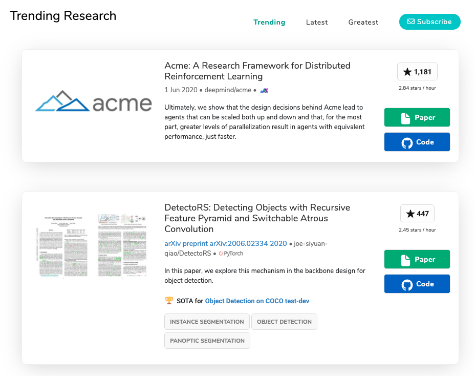
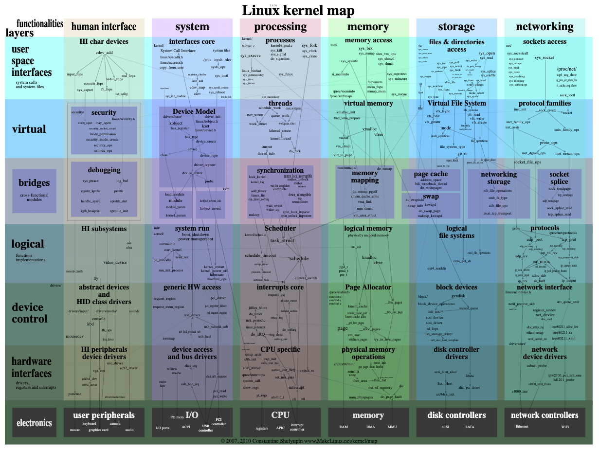
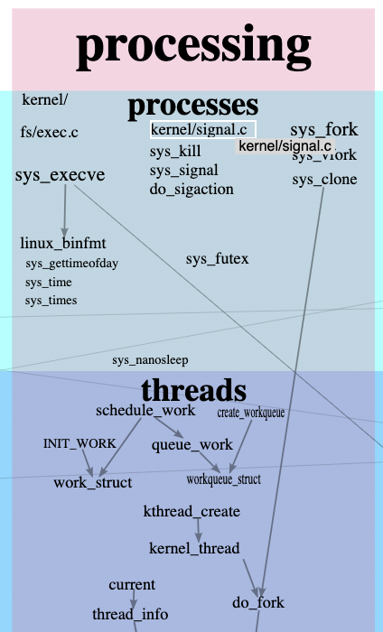
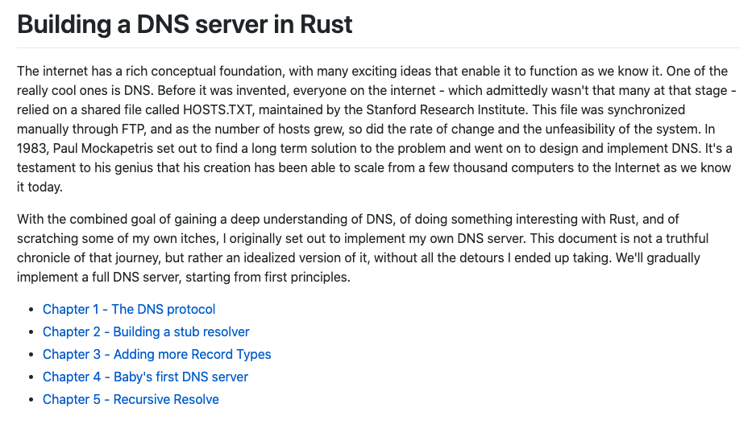
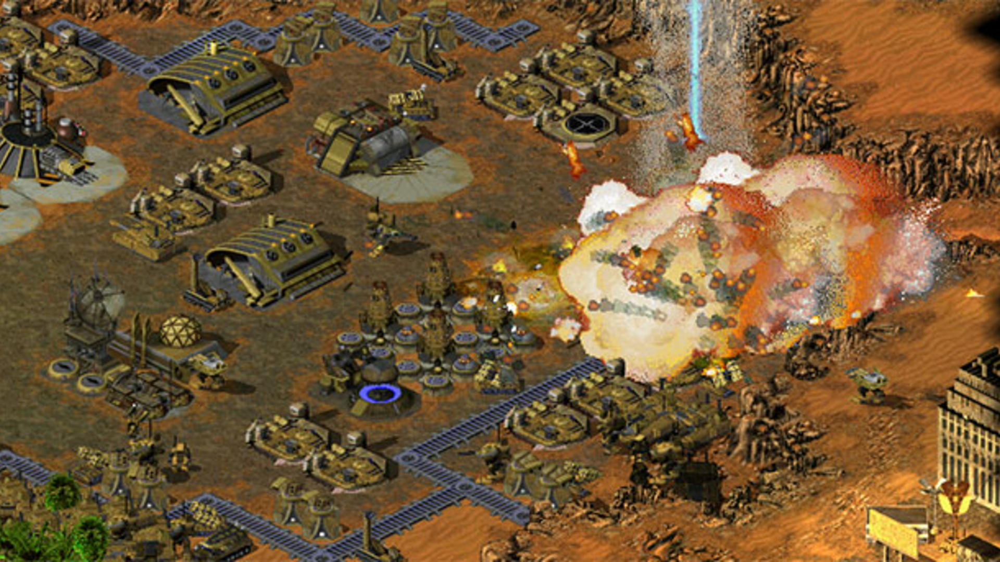
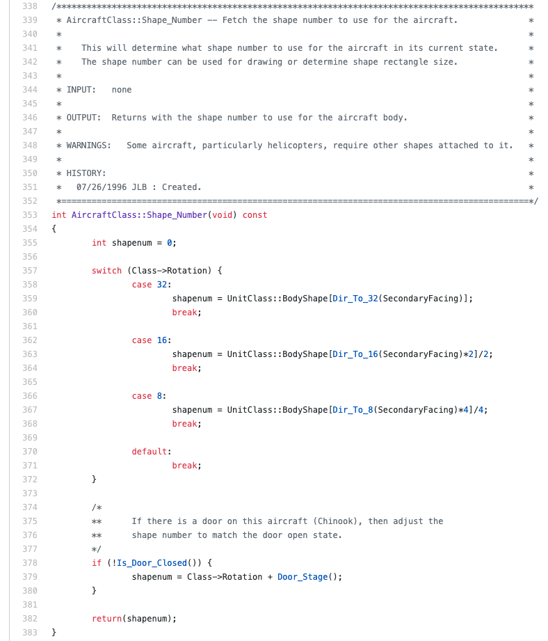

## 【是不是很酷】开源资源 分享 | 第 10 期

【是不是很酷】开源资源分享第 10 期来啦。

如果不了解这个栏目的同学，可以参考【是不是很酷】开源资源 分享 | 第 1 期文章中，对这个栏目的介绍。

简单来说，**在【是不是很酷】的开源分享中，你将看到在其他地方很难见到的资源分享。相信一定能带给你更加广阔的计算机科学视野：）**

这一期内容如下：

 

---

### 1. Papers with Code

这是一个机器学习领域的论文站。但是，这个网站最大的特点是，收录的论文都包含代码！

相信很多同学看论文都有这个困惑：论文的描述高屋建瓴，但是阅读者一头雾水，想了解具体实现细节却无从下手。

这个网站收录整理的论文让大家不仅可以看到论文，还可以直接去论文配套的 github 代码仓，查看作者提供的代码，甚至直接运行代码，实际看看论文的研究效果。

所以叫做 **Papers with Code**。

网站还分成 Trending（趋势榜）；Latest（最新入选）和 Greatest（最佳）三种排名。这些排名都是根据论文在 github 上的 star 数量决定的。

所以，大家也可以把这个站点看做是 github 上的机器学习论文源码的“垂直社区”，可以轻松找到在机器学习这一细分领域的最新内容，以及最近最受关注的内容：）

**网址：[https://paperswithcode.com/](https://paperswithcode.com/)**

 

### 2. Linux 内核源码地图

一份 Linux 内核源码的“地图”，层次极其清晰地展示出了 Linux 内核源码不同部分所包含的主要结构体或者函数方法。

每一部分的重要结构都是可以点击的，点击后，将自动跳转到 bootlin 上托管的 Linux 源码页面。

唯一的缺点是，这个站点没有针对移动端浏览做优化。因为整体地图非常大，使用桌面端浏览效果最好。

相信是一个非常好的 Linux 源码学习的辅助工具：）

**网址：[https://makelinux.github.io/kernel/map/](https://makelinux.github.io/kernel/map/)**

 

### 3. 创建一个 DNS 服务器

这是 github 上的一个项目，使用 rust 语言创建一个简易的 DNS 服务器。

注意：这并非是一份源码，而是一个教程。会带着你一点一点地完成各个模块。

不过我简单看了一下，估计作者的教学经验并不丰富，教程中的描述性语言并不多，以直接看代码为主。

鉴于从底层实现一个 DNS 服务器的资料并不多，相信这是一个很好的参考。

顺便一提，Rust 语言正在如火如荼地发展，对底层系统开发感兴趣的同学，或者现在的主力语言是 C/C++ 的同学，值得接触一下。

**网址：[https://github.com/EmilHernvall/dnsguide](https://github.com/EmilHernvall/dnsguide)**

 

### 4. 开发者别做设计

这个域名很有意思，叫 **nodesign.dev**

顾名思义，这个网站是给开发者使用的，让开发者免于做设计的工具网站。

 

什么叫让开发者免于做设计的工具？举个简单的例子：bootstrap。开发者不需要设计页面中各个组件的样式，直接调用就好了。

类似这样的工具，这个网站整理了一箩筐，从布局，到样式，从图标，到字体，从交互，到动画，应有尽有：）

**网址：[nodesign.dev](nodesign.dev)**

 

### 5. 泰伯利亚之日&红色警戒 开源

不知道有没有人玩儿过“C&C 泰伯利亚之日”和“红色警戒”。尤其是红警，应该 80 后 90 后都知道，在魔兽争霸火起来之前，在网吧玩儿 RTS 类游戏近乎主要就是红警。

鉴于红警太有名，以下截图是 C&C。

现在，这两个游戏开源了！

大家可以浏览一下游戏的源代码，写得极其规范，注释极其详细。

值得学习!

**网址：[https://github.com/electronicarts/CnC_Remastered_Collection/](https://github.com/electronicarts/CnC_Remastered_Collection/)**

 

---

今天的分享就这么多，我们下一期再见。

关于**【是不是很酷】开源资源分享**栏目，我在 github 上创建了一个代码仓，整理了这些开源分享的内容，方便大家查找，同时，也是这些内容的一个备份。

大家可以在这个代码仓中，直接点击 readme 上的链接，访问相应的资源。也可以通过点击每一期的文章链接，获得每一期内容的文字介绍。

**网址：[https://github.com/liuyubobobo/cool-open-sharings](https://github.com/liuyubobobo/cool-open-sharings)**

 

如果大家有好的其他开源资源，可以在这个代码仓下提 issue，也可以在我的**免费知识星球**中直接分享给大家。

我的这些短内容分享，也是第一时间发表到**【是不是很酷】免费的知识星球**上的。如果感兴趣的同学，不要错过。

 

**大家加油！：）**