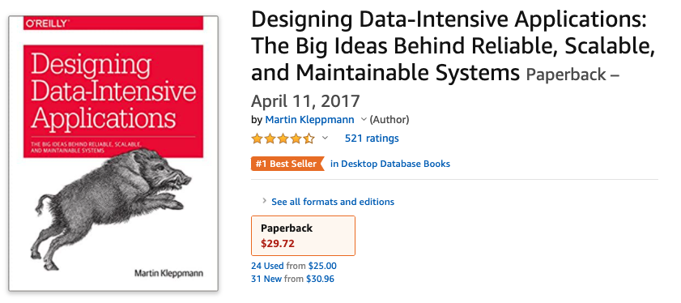
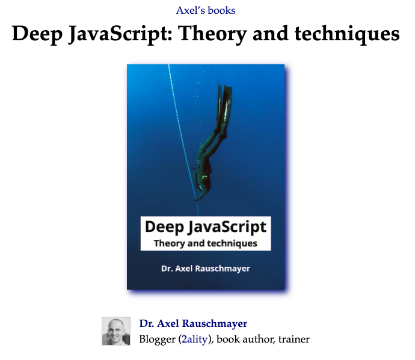
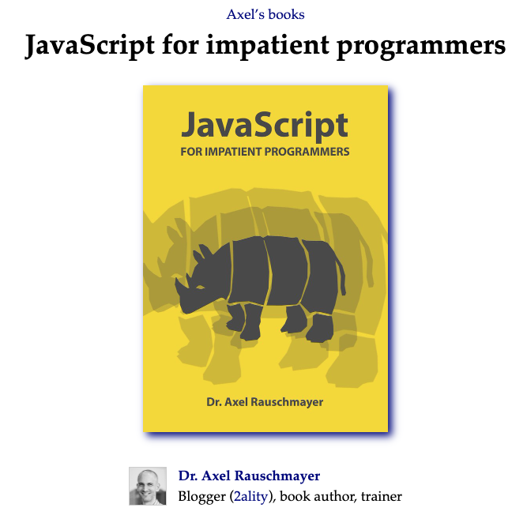
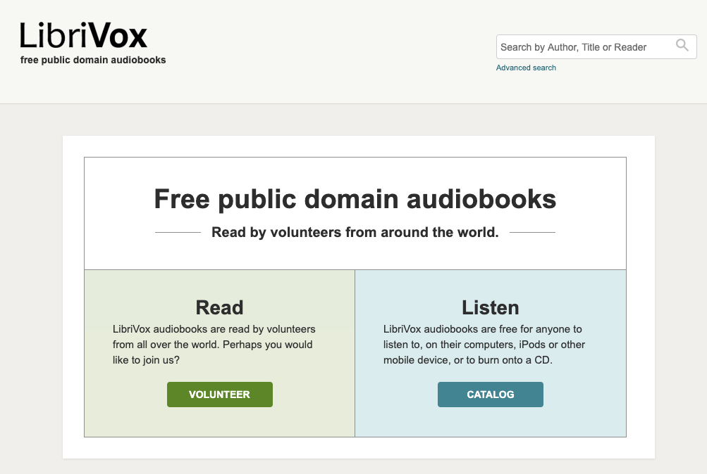
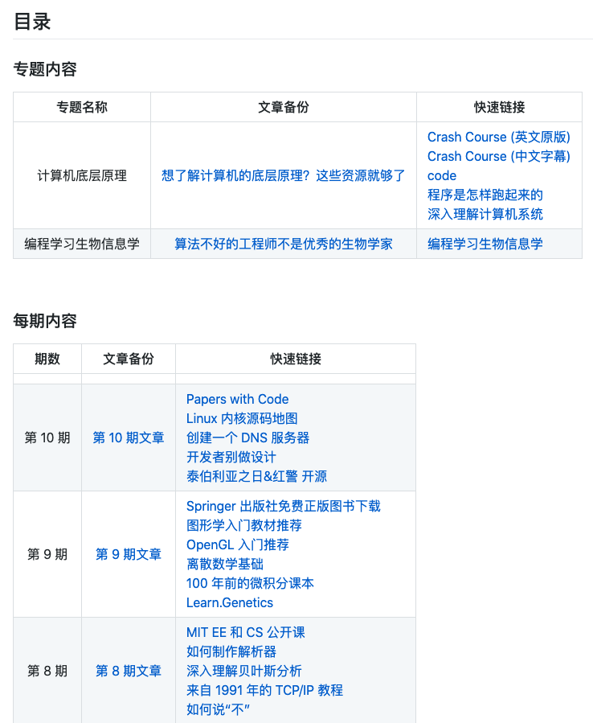

## 【是不是很酷】开源资源 分享 | 第 11 期

【是不是很酷】开源资源分享第 11 期来啦。

如果不了解这个栏目的同学，可以参考[【是不是很酷】开源资源 分享 | 第 1 期](../001/) 文章中，对这个栏目的介绍。

简单来说，**在【是不是很酷】的开源分享中，你将看到在其他地方很难见到的资源分享。相信一定能带给你更加广阔的计算机科学视野：）**

这一期内容如下：

 

---

### 1. CRUD 进阶必读

对于大多数后端工程师来说，如果你厌倦了每天的工作内容是 CRUD，想在技术方向上找到一个可以深入的突破点，却不知道从何入手，我推荐这本书。

这本书的原本名称叫做 Designing Data-Intensive Applications。在亚马逊上是桌面数据库领域的 Best Seller。521 个评价，结果近乎满分。

这本书本质是介绍分布式系统的，虽然可能并不适合学生，但是文字并不理论化。相信在后端方向做过几年，都会从中有很大的收获和启发。

这本书已经有中文版了。在豆瓣上，评分高达 9.7。

**网址：[https://www.amazon.com/Designing-Data-Intensive-Applications-Reliable-Maintainable/dp/1449373321/ref=sr_1_1?dchild=1&keywords=Designing+Data-Intensive+Applications&qid=1592872176&sr=8-1](https://www.amazon.com/Designing-Data-Intensive-Applications-Reliable-Maintainable/dp/1449373321/ref=sr_1_1?dchild=1&keywords=Designing+Data-Intensive+Applications&qid=1592872176&sr=8-1)**

 

### 2. 深入 Javascript

这是一本关于高级 js 语言编程的开源书籍。叫 Deep JavaScript: Theory and techniques。翻译过来就是：深度 Javascript，理论和技巧。

整本书可以直接在网络上免费阅读所有内容。

**网址：[https://exploringjs.com/deep-js/index.html](https://exploringjs.com/deep-js/index.html)**

 

另外，这个作者还写过一本 Javascript 的书，面向的是 JS 零基础的同学。叫 JavaScript for impatient programmers。翻译过来就是：给没有耐心的程序员介绍 JavaScript。

看名字就知道，这本书的特点就是：废话少，单刀直入，直奔主题。

不过因为 JS 基础方面优秀的资料并不少，所以这本书是不是适合你，就看你喜不喜欢这个风格了：）

**网址：[https://exploringjs.com/impatient-js/index.html](https://exploringjs.com/impatient-js/index.html)**

 

### 3. 学习 Shader

这是一本专门介绍 shader 的开源电子书。在网上可以浏览全部内容。

在我上学的年代，很多图形学实践的教程，shader 都是在最后几章匆匆介绍一下。

我想这是因为，一方面，使用 shader 确实是对于学习者来说，更加底层，并且更难驾驭的方式；另一方面，那个年代 GPU 没有那么发达，所以对 shader 的使用，至少在国内，还普遍关注不够。

因为这本书，我翻了翻最新的一些图形学实践方面的教材目录，发现很多都把 shader 提在比较靠前的位置了。

时代在变：）

最后，值得一提的是，这本书在官网上有完整的中文翻译。

**网址：[https://thebookofshaders.com/](https://thebookofshaders.com/)**

 

### 4. 多任务学习和元学习

之前公众号曾发表过一篇文章[《如果真的学习人工智能》](https://mp.weixin.qq.com/s?__biz=MzU4NTIxODYwMQ==&mid=2247485792&idx=1&sn=d60b5c9b1a505b96abb283a95871a9ae&chksm=fd8ca626cafb2f30494c235cb84ef7b2d251f6fc590457790135cd460fb43a574042d5b167dd&token=1421356215&lang=zh_CN#rd)，给出了一个相对比较完整的人工智能方向的学习路径。现在，我为这篇文章专门建立了一个代码仓，以不断完善和补充更多资源。代码仓链接：[https://github.com/liuyubobobo/ai-learning-roadmap](https://github.com/liuyubobobo/ai-learning-roadmap)

有同学问，这个路径的水平，已经达到了研究生的高度了吧？

实际上，这个学习路径上的所有内容，都是本科阶段就可以接触的。但我可以很负责地说，如果认真学，学透了，绝对秒杀大部分尤其是国内的研究生水平。

在这里也推荐一个真正的人工智能方向的研究生水平课程。斯坦福大学 CS 330: Deep Multi-Task and Meta Learning，主要关注多任务学习和元学习。

因为疫情原因，现在这个课程的所有课程视频，都可以直接在网上免费收看！

这种高级内容的材料其实在市面上挺难找的。从这个角度，这次疫情又降低了很多人的学习成本。

**网址：[https://cs330.stanford.edu](https://cs330.stanford.edu)**

 

### 5. 开源有声书库

LibriVox 是一个免费的公开有声书库，其中已经收录了 1 万多本有声图书了，基本都是志愿者朗读的。

不过因为是公开的开源有声书库，所以由于版权原因，包含的书大部分都比较老。但还是有很多老书很经典，常读常新。

比如最近因为美国的 BLM 抗议，本身在美国就已经很经典的 To kill a mockingbird（杀死一只知更鸟）和 Gone with the wind（飘，又译作乱世佳人）又火起来了。

**网址：[https://librivox.org/](https://librivox.org/)**

 

另外，曾经有一阵子，我挺喜欢对着有声书阅读原版书的。如果大家在 Youtube 上找找，也有很多人“志愿”读书，都是可以利用的资源。

这样学英语，其实和我以前说的看美剧学英语差不多。感兴趣的同学可以参考我的一篇老文：[看美剧学英语靠不靠谱？我说靠谱，方法都在这里了。](https://mp.weixin.qq.com/s?__biz=MzU4NTIxODYwMQ==&mid=2247484187&idx=1&sn=f38356faf39149b5c51047bc421f9a4b&chksm=fd8cac5dcafb254b1509c36d0e1bea480f83423ca17a6d93409a119c7373bc5f5d596a6a9b5c&token=375179576&lang=zh_CN#rd)

 

---

今天的分享就这么多，我们下一期再见。

关于**【是不是很酷】开源资源分享**栏目，我在 github 上创建了一个代码仓，整理了这些开源分享的内容，方便大家查找，同时，也是这些内容的一个备份。

大家可以在这个代码仓中，直接点击 readme 上的链接，访问相应的资源。也可以通过点击每一期的文章链接，获得每一期内容的文字介绍。

**网址：[https://github.com/liuyubobobo/cool-open-sharings](https://github.com/liuyubobobo/cool-open-sharings)**

 

如果大家有好的其他开源资源，可以在这个代码仓下提 issue，也可以在我的**免费知识星球**中直接分享给大家。

我的这些短内容分享，也是第一时间发表到**【是不是很酷】免费的知识星球**上的。如果感兴趣的同学，不要错过。

 

**大家加油！：）**