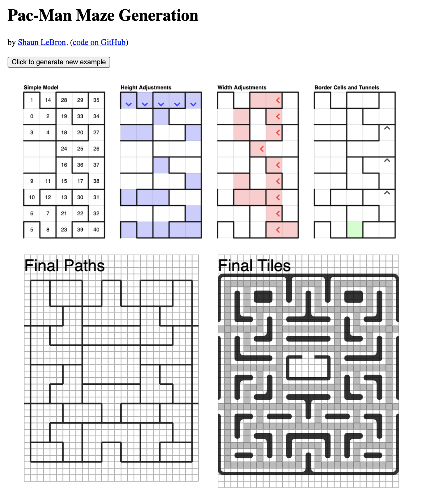
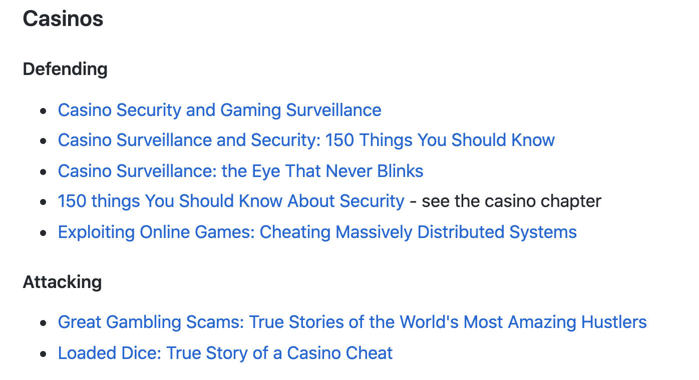
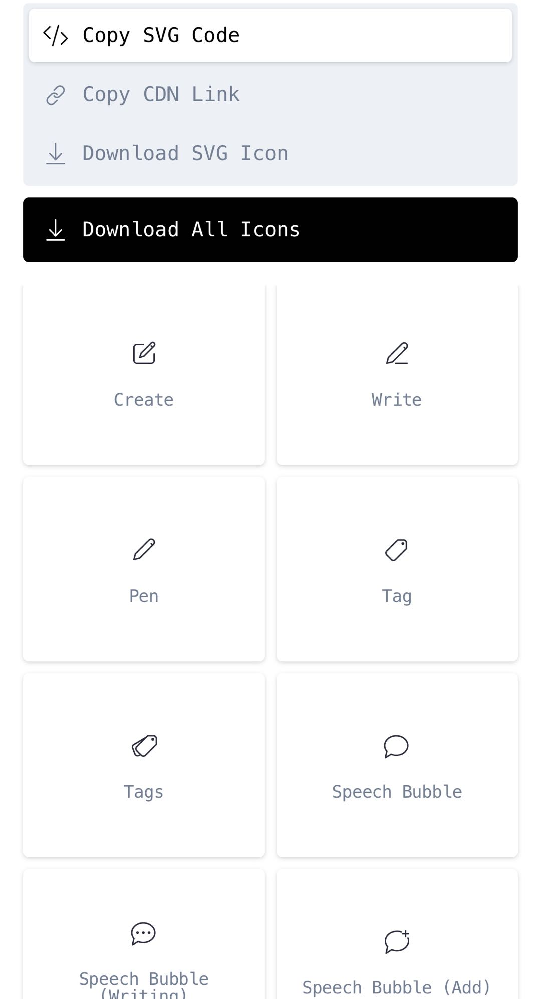

## 【是不是很酷】开源资源 分享 | 第 12 期

【是不是很酷】开源资源分享第 12 期来啦。

如果不了解这个栏目的同学，可以参考[【是不是很酷】开源资源 分享 | 第 1 期](../001/)文章中，对这个栏目的介绍。

简单来说，**在【是不是很酷】的开源分享中，你将看到在其他地方很难见到的资源分享。相信一定能带给你更加广阔的计算机科学视野：）**

这一期内容如下：

 

---

### 1. 吃豆人地图生成算法

迷宫生成真是一个有意思的议题。我在我的《看得见的算法》课程中讲过一个最朴素的迷宫生成算法。在这个公众号的开源分享栏目中，分享过一本专门介绍迷宫生成算法的书；以及一个专门介绍 Diablo 1 游戏中的迷宫生成算法的文章。

这里是一篇介绍如何生成吃豆人（PAC Man）游戏中迷宫的算法。更准确地说，这不是一个迷宫，而是一个路径地图。

**网址：[https://shaunlebron.github.io/pacman-mazegen/](https://shaunlebron.github.io/pacman-mazegen/)**

 

### 2. 学习安全工程

这是一个 github 的代码仓。我最初发现这个代码仓的时候，这个代码仓叫做 Learn Security Engineering（学习安全工程），现在，这个代码仓改成了一个更富有野心的名字，叫 How to Secure Anything（如何让一切都安全）。

这是一个资料整理的代码仓，作者收集整理了大量在安全领域相关的书籍，文章以及论文的推荐。代码仓的目录按照领域划分，而且每个领域还分成攻（Attacking）和防（Defending）两部分，一目了然。

因为后来这个代码仓叫 How to Secure Anything，所以，现在这里还包含很多奇怪的资料。

比如如何保障赌场的安全？如何在在线赌博游戏中盈利？如何设计监狱系统？历史中博物馆盗窃事件的回顾和总结，等等等等。而不仅仅局限在网络安全领域。

当然了，网络安全的占比还是最大的：）

**网址：[https://github.com/veeral-patel/how-to-secure-anything#casinos](https://github.com/veeral-patel/how-to-secure-anything#casinos)**

 

### 3. P vs NP

这个网站很有意思，叫 The P-versus-NP page。

在这个网站中，整理了 100 多篇前人尝试证明 P = NP（或者 P != NP）的相关论文和推导。可惜，这些都是错误的。

到现在为止，P 是不是等于 NP 还没有定论。

**网址：[https://www.win.tue.nl/~gwoegi/P-versus-NP.htm](https://www.win.tue.nl/~gwoegi/P-versus-NP.htm)**

 

关于 P vs NP 的问题，很早之前我就王垠写的一篇博客在我的知识星球聊过一点想法：

 

### 4. 来自 DeepMind 的资源列表

这是一份来自 DeepMind（做 Alpha Go 的那家）的人工智能科学家推荐的学习 AI，关注 AI 领域，可以参考的资源列表。

注意，这不是一份详细的顺序学习路径，而是一份资源整理。很多内容本身是零散的，而不仅仅是一本书籍。

有些内容是一个 Youtube Channel，有些是一个 Newsletters，或者一个博客。有些推荐甚至可能仅仅是一篇博客文章而已。

大家也可以感受一下：大牛们都要关注多少资源和消息渠道。

**专精一个领域，绝不是一两本书的事儿。**

**网址：[https://storage.googleapis.com/deepmind-media/research/New_AtHomeWithAI%20resources.pdf](https://storage.googleapis.com/deepmind-media/research/New_AtHomeWithAI%20resources.pdf)**

 

### 5. 无版权 UI 设计图标

这个网站专门提供了一套 UI 设计的图标（icons），有 220 个之多，风格一致，类别齐全。最关键的是，使用没有版权，大家直接下载使用就好。

如果做 App 开发或者 Web 前端开发对图标使用有需求的话，可以参考。

感谢互联网。

**网址：[https://systemuicons.com](https://systemuicons.com)**

 

---

今天的分享就这么多，我们下一期再见。

关于**【是不是很酷】开源资源分享**栏目，我在 github 上创建了一个代码仓，整理了这些开源分享的内容，方便大家查找，同时，也是这些内容的一个备份。

大家可以在这个代码仓中，直接点击 readme 上的链接，访问相应的资源。也可以通过点击每一期的文章链接，获得每一期内容的文字介绍。

**网址：[https://github.com/liuyubobobo/cool-open-sharings](https://github.com/liuyubobobo/cool-open-sharings)**

 

如果大家有好的其他开源资源，可以在这个代码仓下提 issue，也可以在我的**免费知识星球**中直接分享给大家。

我的这些短内容分享，也是第一时间发表到**【是不是很酷】免费的知识星球**上的。如果感兴趣的同学，不要错过。

 

**大家加油！：）**