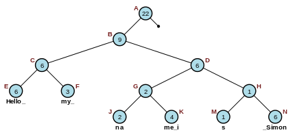
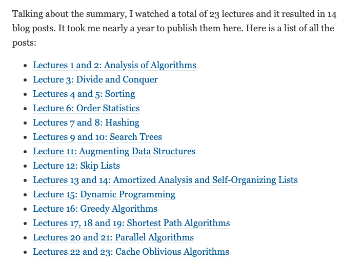
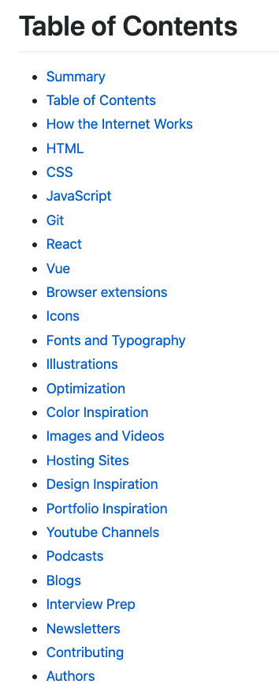

## 【是不是很酷】开源资源 分享 | 第 13 期

【是不是很酷】开源资源分享第 13 期来啦。

如果不了解这个栏目的同学，可以参考[【是不是很酷】开源资源 分享 | 第 1 期](../001/)文章中，对这个栏目的介绍。

简单来说，**在【是不是很酷】的开源分享中，你将看到在其他地方很难见到的资源分享。相信一定能带给你更加广阔的计算机科学视野：）**

这一期内容如下：

 

---

### 1. 浏览器的工作原理​

一本开源电子书，叫<How browsers work>，翻译过来就是《浏览器是如何工作的》，详细阐述了浏览器的工作原理。

从 HTML，CSS 和 JS 的解析，DOM 树的建立；到最终的渲染，布局和动态调整，等等问题，都有介绍。

下图是书中描述的浏览器的主要组件。

 

再来一个 Webkit 内核的浏览器工作流程图：

**网址：[https://taligarsiel.com/Projects/howbrowserswork1.htm](https://taligarsiel.com/Projects/howbrowserswork1.htm)**

 

### 2. 文本编辑器中的算法和数据结构

前一阵子和一个朋友聊一个算法问题，本质是一个高效进行字符串操作的问题，涉及的操作非常多，越聊越复杂。最后，问题本身已经被我们聊成了如何实现一个高效的文本编辑器。

这显然是一个有现成解的问题。我惊讶地发现我上学的时候竟然没有做过文本编辑器这样一个工程。

一个很酷的数据结构，叫 **Rope**，可以作为整个文本编辑器内部文档字符串内容存储的数据结构。wiki 百科连接：

[https://en.m.wikipedia.org/wiki/Rope_(data_structure)](https://en.m.wikipedia.org/wiki/Rope_(data_structure))

另一个可以处理相应问题的数据结构，叫 **Gap Buffer**。维基百科链接：

[https://en.m.wikipedia.org/wiki/Gap_buffer](https://en.m.wikipedia.org/wiki/Gap_buffer)

 

这里还有一本专门介绍文本编辑的开源书籍，叫《The Craft of Text Editing》。基本就是在讲如何实现一个高效的文本编辑器。

虽然年代比较老，是 1999 年的书，但是如果只关注文本编辑器这么一个看似简单的东西，里面到底都涉及什么问题，以及相应的解决思路，足够了。

除了要高效地对文本进行增删改查，对字符串进行各种区间或者非区间的操作以外，还包括渲染，排版，和文件系统的 IO 交互，等等问题。

数据结构与算法在计算机的世界中无处不在。哪怕是文本编辑器这个看起来平凡得不能再平凡的东西：）

**网址：[http://www.finseth.com/craft/](http://www.finseth.com/craft/)**

 

### 3. 《算法导论》笔记

这是一篇博客文章。是作者花了一年时间，完整学习了 MIT 的算法导论课程后，写的总结。

按照作者的说法，就是：

> summarize all the topics that were covered in the lectures and point out some of the most interesting things in them.
> 
> 对课程中涵盖的所有的主题进行了总结，并且重点强调了一些（作者认为）最有意思的内容。

这篇文章可以被看作是《算法导论》这本教材的“更容易阅读版”的目录。

**网址：[https://catonmat.net/summary-of-mit-introduction-to-algorithms](https://catonmat.net/summary-of-mit-introduction-to-algorithms)**

 

### 4. 互联网前端资源汇总

这是 github 上一个前端资源汇总的代码仓。从文档，到课程；从各种书籍推荐，到网站；从工具，到框架；甚至包涵图标，字体，排版，各种优化，应有尽有。

按照代码仓封面图片的说法：All your Dev Resources in one place.

 

来个目录，大家感受一下：

**网址：[https://github.com/developer-resources/frontend-development](https://github.com/developer-resources/frontend-development)**

 

### 5. 安全相关开源项目汇总

这是一个 github 代码仓，总结了和安全相关的方方面面的开源项目。

从漏洞管理，到虚拟网络；从登录保护，到网络监控；从反病毒，到恶意软件扫描，应有尽有。

值得一提的是，去年，Youtube 将很多和安全相关的教学视频删除了。

其实，Youtube 的本意是删除和黑客相关的，教别人如何应用计算机技术做网络犯罪的视频。但是黑客技术和安全技术是相辅相成的。现在，Youtube 上的安全教程数量锐减。

这些开源项目虽然不会像教程一样细致，但仍然是非常重要，并且很直接的学习渠道。

因为一切都直接以代码的形式展现在了你的面前，你可以直接运行它，修改它，用动手的方式真正搞清楚其中的运行机制，而不是停留在书本上。

**这本身就是黑客精神的意思。**

感谢 github。

**网址：[https://github.com/Penetrum-Security/Security-List](https://github.com/Penetrum-Security/Security-List)**

 

---

今天的分享就这么多，我们下一期再见。

关于**【是不是很酷】开源资源分享**栏目，我在 github 上创建了一个代码仓，整理了这些开源分享的内容，方便大家查找，同时，也是这些内容的一个备份。

大家可以在这个代码仓中，直接点击 readme 上的链接，访问相应的资源。也可以通过点击每一期的文章链接，获得每一期内容的文字介绍。

**网址：[https://github.com/liuyubobobo/cool-open-sharings](https://github.com/liuyubobobo/cool-open-sharings)**

 

如果大家有好的其他开源资源，可以在这个代码仓下提 issue，也可以在我的**免费知识星球**中直接分享给大家。

我的这些短内容分享，也是第一时间发表到**【是不是很酷】免费的知识星球**上的。如果感兴趣的同学，不要错过。

 

**大家加油！：）**