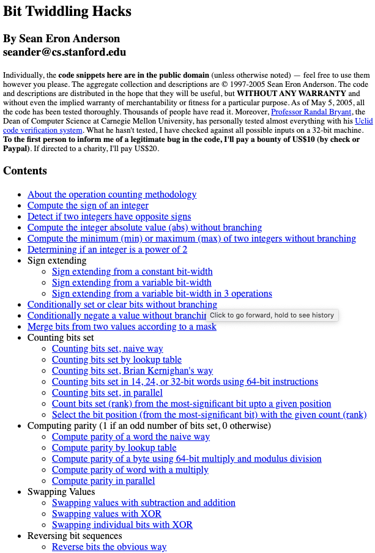
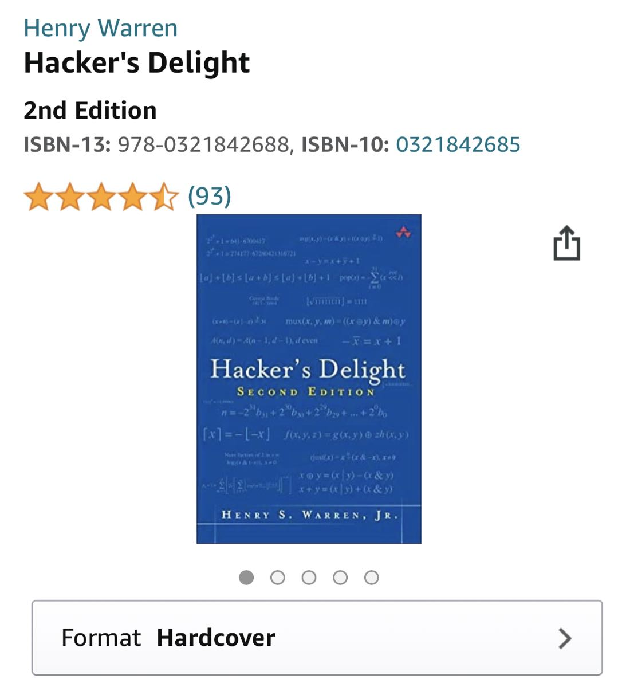
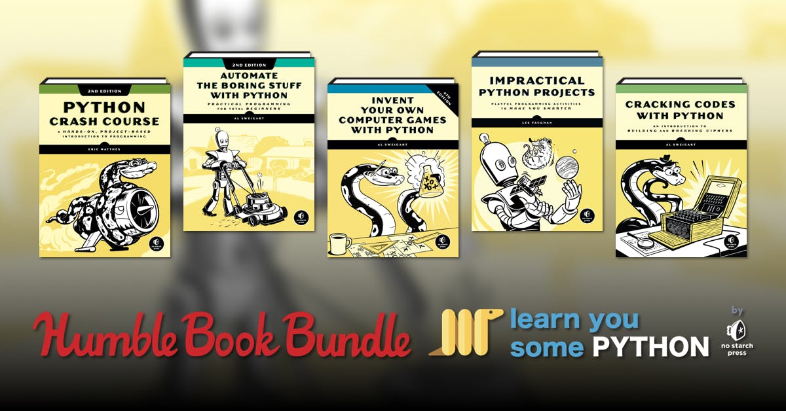
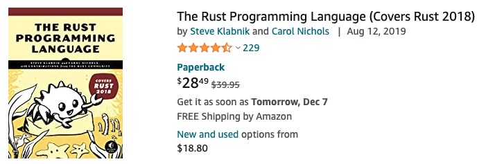
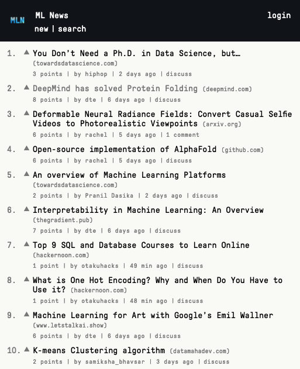
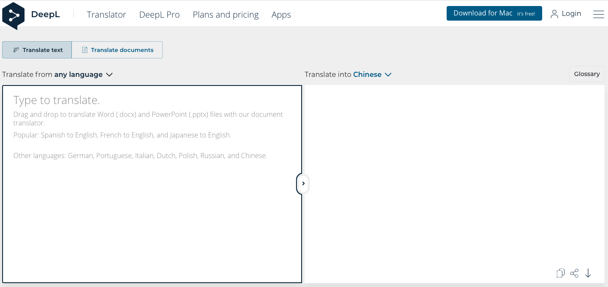
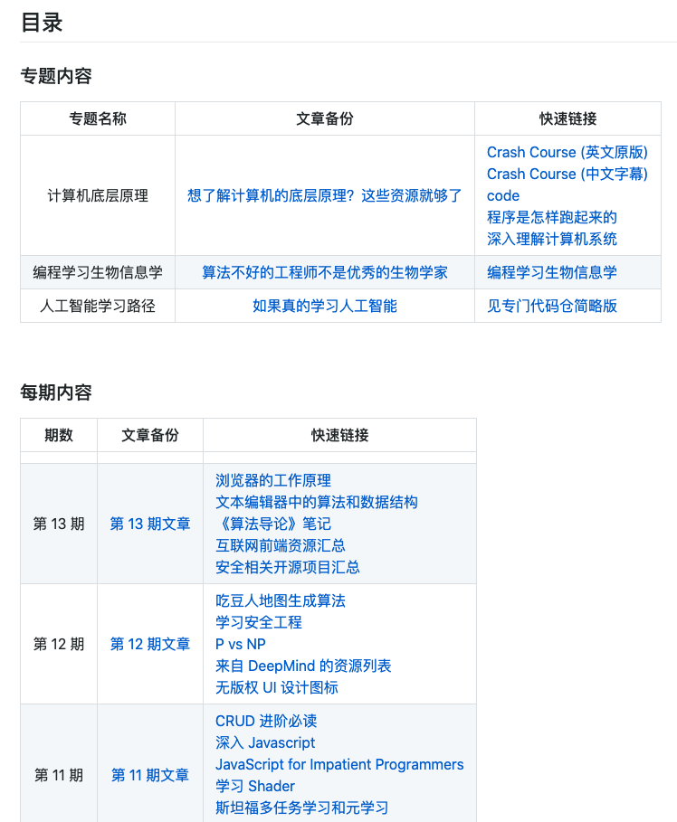

## 【是不是很酷】开源资源 分享 | 第 14 期

【是不是很酷】开源资源分享第 14 期来啦。

如果不了解这个栏目的同学，可以参考[【是不是很酷】开源资源 分享 | 第 1 期](../001/)文章中，对这个栏目的介绍。

简单来说，**在【是不是很酷】的开源分享中，你将看到在其他地方很难见到的资源分享。相信一定能带给你更加广阔的计算机科学视野：）**

这一期内容如下：

 

---

### 1. 位运算技巧

这个网页叫 Bit Twiddling Hacks，可以理解成是一本开源的小册子，专门详细地介绍了很多位运算的技巧。

**网址：[https://graphics.stanford.edu/~seander/bithacks.html](https://graphics.stanford.edu/~seander/bithacks.html)**

 

值得一提的是，有一本书很有名，叫 **Hacker‘s Delight**，其中涉及了大量使用位运算解决问题的技巧。

如果你的工作内容涉及底层开发，比如图形引擎，游戏引擎，编译器，操作系统，嵌入式，等等，会非常非常有帮助；

如果你的工作和这些底层开发无关，但是你对算法和逻辑感兴趣的话，相信也能通过阅读这本书获得愉悦感。

毕竟，这就是这本书名的意思：）

 

### 2. 零基础学习图形学

一本开源的电子书：**Computer Graphics from scratch**。让我翻译就是《**零基础学习图形学**》。

按照作者的解释，这本书不是用来学习如何使用 OpenGL 或者 DirectX 这类图形引擎的；而是学习这些图形引擎的工作原理的。

**网址：[https://www.gabrielgambetta.com/computer-graphics-from-scratch/introduction.html](https://www.gabrielgambetta.com/computer-graphics-from-scratch/introduction.html)**

 

补充两点：

1）

全球最经典的图形学课本，之前在我的[【开源分享第 9 期】](../009/)里向大家介绍过，就是大名鼎鼎的虎书。想好好学习图形学的同学一定不能错过。

但大多数经典教材都有其局限性，比如过于严谨导致阅读起来比较难理解，等等。所以，需要其余“不经典”的内容作补充。

我的经验是：**“不经典”的教材虽然不经典，但是对于个人学习来说，很有可能是非常有用，甚至是真正帮你打开任督二脉，进而可以让你无碍阅读经典的“好资料”。**

可以参考我在[《高效学习的秘密》](https://mp.weixin.qq.com/s?__biz=MzU4NTIxODYwMQ==&mid=2247483836&idx=1&sn=90854aa76507281403e4dd9cd434a12b&chksm=fd8caefacafb27ec78f999fde4f1217c04c6e2ff28cf51fe511d8fa29d484d9281ff91de8c9c&scene=21#wechat_redirect)一文中的阐述。

2)

这本《零基础学习图形学》，明年（2021年）会被 No Starch Press 出版。

No Starch Press 出版社对出版内容的选择和把关，我非常认可的。现在市面上挺多流行的技术书籍，都来自这家出版社。

我在[《如果真的学习人工智能》](https://github.com/liuyubobobo/ai-learning-roadmap)一文中强烈推荐的 Python 学习书籍，就来自这家出版社。他家还有很多其他 Python 书籍，都不错。

这家出版社还有很多技术书籍很经典，比如他们家的 C++ 教程 和 Rust 教程。

在 nostarch 出版社的官网，可以看见他们家出版的所有书籍。

[https://nostarch.com/](https://nostarch.com/) 

 

### 3. ML News

一个专门汇总人工智能界，或者更具体的说，机器学习界，最新新闻的网站。

说是“新闻”，但其实很多文章不是新闻，而是关注机器学习的开发者们喜欢阅读的内容。比如资源分享，职场建议，技术解析，论文分享，等等一类的文章。

大家在微信公众号上看到的很多机器学习界的科技新闻，都能在这里找到其英文版本的源头。

（很多微信公众号的科技新闻或者分享内容，都是国外文章的翻译。）

**网址：[https://mln.dev/top/1](https://mln.dev/top/1)**

 

### 4. 深入字符串算法

对字符串算法感兴趣的同学，推荐一本书：Algorithms on Strings, Trees, and Sequences: Computer Science and Computational Biology

书名单纯的翻译，就是：字符串，树和序列上的算法。副标题是；计算机科学和计算生物学。

如果有同学有需求，想解决高水平的算法竞赛中的字符串问题，进而想系统深入了解字符串算法的方方面面，我强烈推荐这本书。

不过这本书讨论的是经典算法，不包含 NLP 等机器学习类的方法。

对于书名中包含计算生物学，大家完全可以忽略。这就是本算法书，和生物没什么关系。

之前公众号聊过，很多生物学的问题已经被规约成了一个计算问题。而解决这些计算问题，需要算法。

大量生物学的问题，本质可以转换成字符串算法问题，因为 DNA 就可以看作是一个字符串。

这本书是一本字符串算法的高阶教材，我认为是研究生难度的。如果能拿下，我觉得字符串算法方面就很无敌了。

如果单纯从字符串算法这个细分领域去比较的话，算法导论弱爆了。

 

### 5. 比谷歌翻译还好的翻译网站

不知道有没有同学了解 DeepL。这个网站专门做翻译这个功能。

因为传说比 google 翻译好，我很早以前专门做过一次比较，觉得确实好，从此以后，如果比较追求翻译质量，我近乎都用 DeepL 了。

另外，DeepL 还有桌面端的应用，使用体验非常好。

**网址：[https://www.deepl.com/translator](https://www.deepl.com/translator)**

 

---

今天的分享就这么多，我们下一期再见。

关于**【是不是很酷】开源资源分享**栏目，我在 github 上创建了一个代码仓，整理了这些开源分享的内容，方便大家查找，同时，也是这些内容的一个备份。

大家可以在这个代码仓中，直接点击 readme 上的链接，访问相应的资源。也可以通过点击每一期的文章链接，获得每一期内容的文字介绍。

**网址：[https://github.com/liuyubobobo/cool-open-sharings](https://github.com/liuyubobobo/cool-open-sharings)**

 

如果大家有好的其他开源资源，可以在这个代码仓下提 issue，也可以在我的**免费知识星球**中直接分享给大家。

我的这些短内容分享，也是第一时间发表到**【是不是很酷】免费的知识星球**上的。如果感兴趣的同学，不要错过。

 

**大家加油！：）**