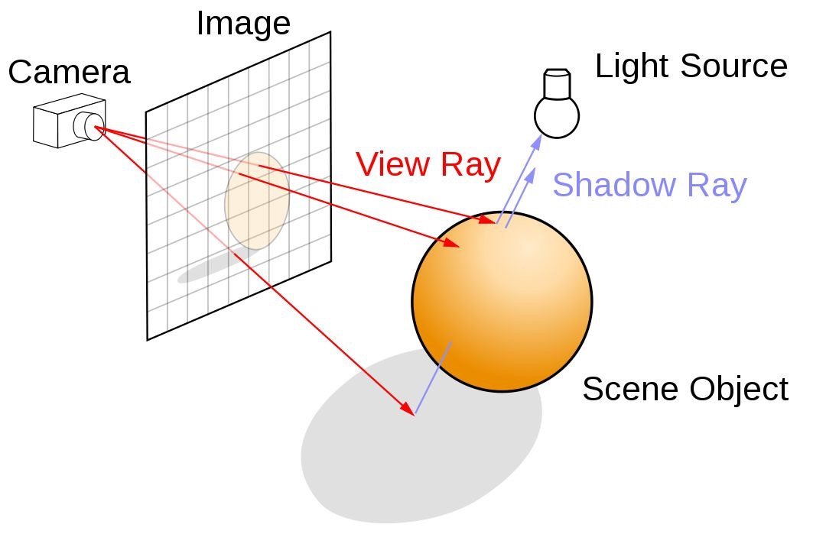
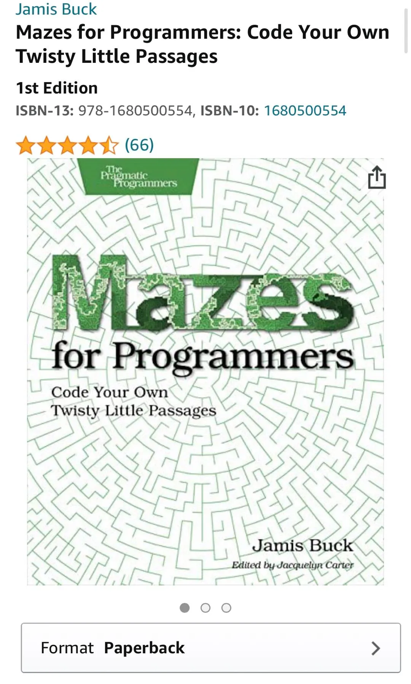
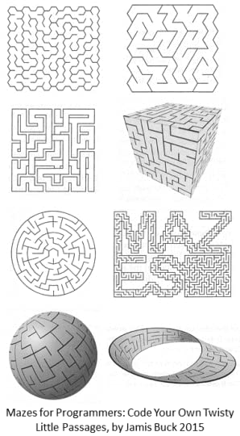
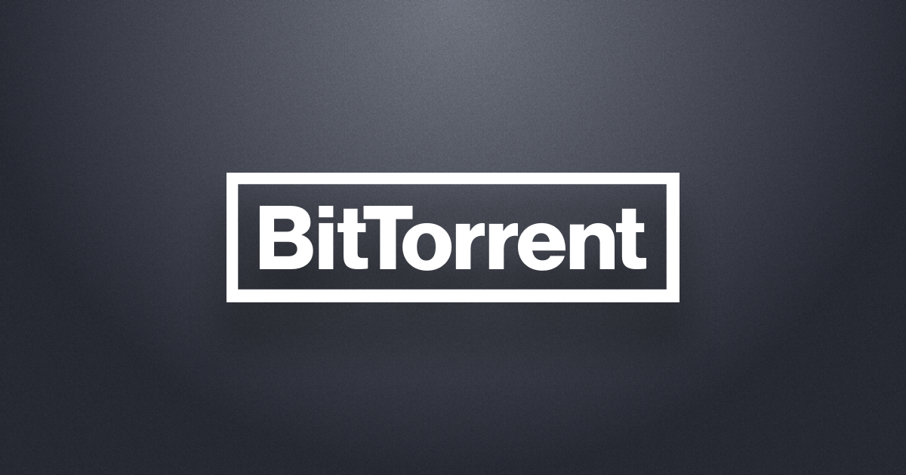
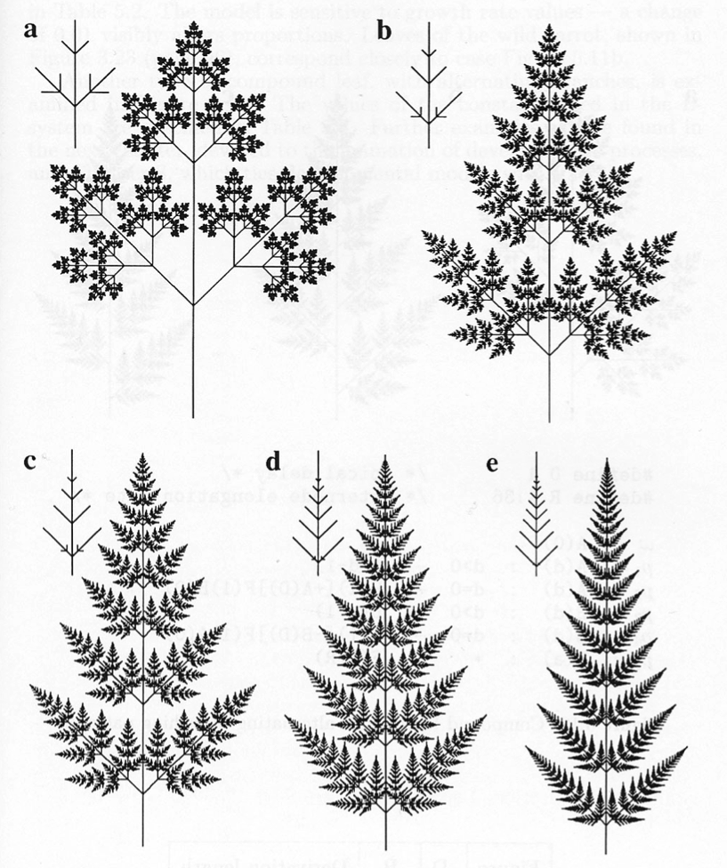
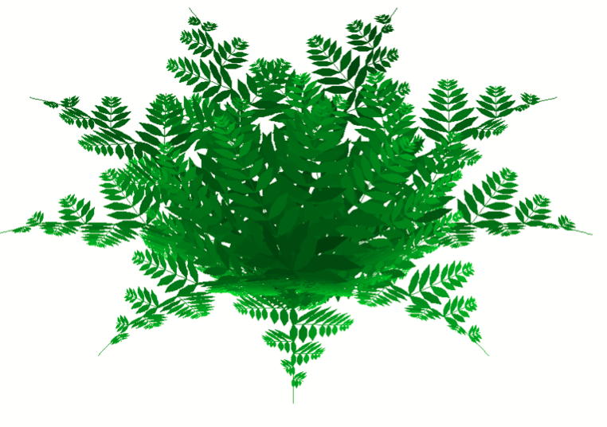
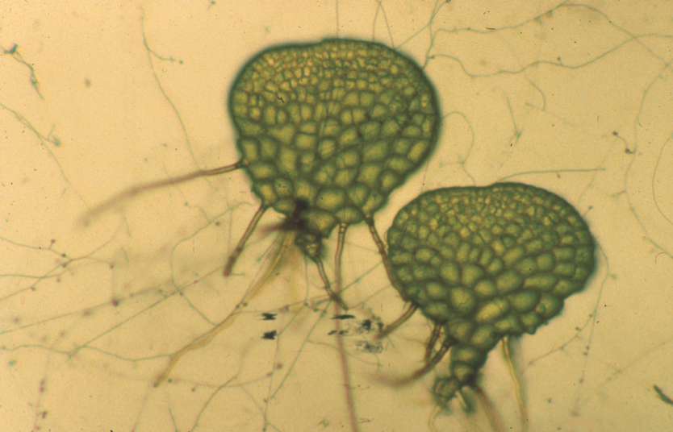

## 【是不是很酷】开源资源 分享 | 第 15 期

说一个感慨，外国计算机专业都学了啥

为什么我觉得中国的计算机教育和外国的计算机教育完全不是一回事儿。

我记得我之前我在知乎看过一个问题，大概就是**给你印象最深的算法是啥？**答案大多数是什么树状数组，并查集，线段树，floodfill，之流。反正整体在算法竞赛的圈子里。

即便个别算法出了算法竞赛的圈子，也大多是诸如遗传算法，FFT，Ray tracing 一类的，我觉得在经典教科书的范畴里。

 

这个问题如果让我回答，我八成会回答迷宫生成算法。

迷宫生成算法确实是本科的时候，让我对计算机更感兴趣的一个算法。除了有很高的实用性，很酷炫的展示性以外，这个算法还非常好地拓展了队列这个概念。也因此，我在我的一个课程中仔细介绍了这个算法。

我在我的公众号上，还分享过很多更高阶的，更真实的迷宫生成算法的资料。

比如 [Diablo 中的迷宫生成算法](https://mp.weixin.qq.com/s?__biz=MzU4NTIxODYwMQ==&mid=2247484784&idx=1&sn=990039bc5d1c38ed097ad6e04407669f&chksm=fd8caa36cafb232094d4cf75b049a8fa5816b9db916b2bd63123a6802d409cbf2a64a46abf43&scene=21#wechat_redirect)；

比如 [吃豆人游戏的地图生成](https://mp.weixin.qq.com/s?__biz=MzU4NTIxODYwMQ==&mid=2247486474&idx=2&sn=5312265bb15e36c9678877f2143228f6&chksm=fd8ca34ccafb2a5af8fc8a7cbf8bc9f2f7538a5bbc602e7f5c4630beb0bf2061c9518cd1e04e&scene=21#wechat_redirect)；

甚至在亚马逊上有一本书，专门介绍迷宫生成算法，生成各种不同风格的迷宫：

但最近参加一个国外的讨论，聊到这个话题：**给你印象最深的算法是啥？**国外的同学回答让我大开眼界。

我感觉我跟他们根本不是一个专业的...

随便列举三个给我印象最深的，如下：

 

**1)**

**Gale-Shapley 算法**。这个算法是用来解决**稳定婚姻问题**的。如果说得更计算机一些，这个算法又被称为是**延迟认可算法**。

说实话，我第一次听说这个问题，也是第一次听说这个算法。我只能说自己见识太短浅了。

在这里，我不详细介绍这个问题了，只是抛砖引玉。

感兴趣的同学，维基百科链接如下：[https://en.m.wikipedia.org/wiki/Stable_marriage_problem#Solution](https://en.m.wikipedia.org/wiki/Stable_marriage_problem#Solution)

另外，国内的大牛 Matrix67 专门写过一篇博客文章，介绍这个算法。传送门：[http://www.matrix67.com/blog/archives/2976](http://www.matrix67.com/blog/archives/2976)

 

**2）**

Diffie–Hellman key exchange。

这是一个秘钥一致性算法，鉴于我在加密算法领域是小白，我也不很确定是不是我孤陋寡闻了。我后来查，发现这其实是在加密算法领域很基础的算法。

这个算法在 1976 年就被 Diffie 和 Hellman 两个人提出来了。他们的论文影响深远，奠定了公钥密码编码学的基础。

维基百科链接如下：[https://en.m.wikipedia.org/wiki/Diffie–Hellman_key_exchange](https://en.m.wikipedia.org/wiki/Diffie–Hellman_key_exchange)

 

**3)**

比特种子的工作原理。注意，是比特种子，bittorrent，下载资源那个；不是比特币。

关于比特种子的工作原理，比特种子官方（bittorrent.org）就有详细的介绍。传送门：[http://www.bittorrent.org/beps/bep_0003.html](http://www.bittorrent.org/beps/bep_0003.html)

不过官方的介绍可能有些晦涩，为此，有一个特别详细的文档，详细介绍了其机制，还包含各种语言的实现。传送门：[https://wiki.theory.org/index.php/BitTorrentSpecification](https://wiki.theory.org/index.php/BitTorrentSpecification)

然后，人家大二自己实现了一个小型的比特种子下载工具...

 

---

之后，大家愉快地聊起了一本书，叫 <The Algorithmic Beauty of Plants>。我的翻译，《植物中的算法美》。

这本书介绍了很多算法，可以用来生成并且绘制出植物。比如这样：

比如这样：

甚至还要探究一下自动生成植物的细胞的算法...

整本书可以在网上免费阅读。传送门：[http://algorithmicbotany.org/papers/#abop](http://algorithmicbotany.org/papers/#abop)

 

感觉自己被虐成狗了 😭

 

**P. S.**

题图是计算机算法生成的艺术作品。

 

**大家加油！：）**