## 【是不是很酷】开源资源 分享 | 第 16 期

【是不是很酷】开源资源分享第 16 期来啦。

如果不了解这个栏目的同学，可以参考[【是不是很酷】开源资源 分享 | 第 1 期](../001/)文章中，对这个栏目的介绍。

简单来说，**在【是不是很酷】的开源分享中，你将看到在其他地方很难见到的资源分享。相信一定能带给你更加广阔的计算机科学视野：）**

这一期内容如下：

 

---

### 1. 打游戏，学 Vim

一个在线学习 Vim 的交互式课程：**vim.so**

[https://www.vim.so](https://www.vim.so)

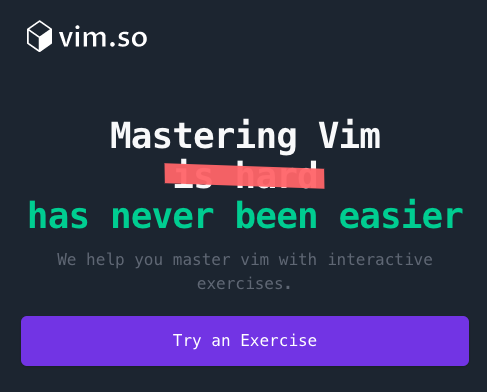

整个网站，通过十个交互式的课程内容，让你能够学习并且熟悉 Vim 的基本命令。

比如在第一个任务中，就是熟悉 Vim 中的光标移动。Vim 中光标的移动是 ``h，j，k，l`` 四个按键，作者将其做成了一个游戏。

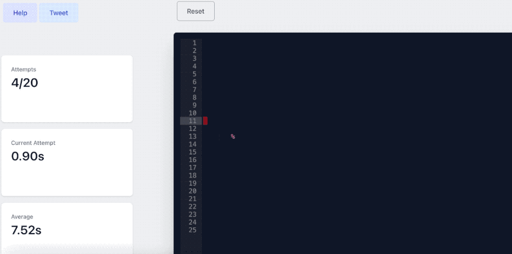

不过，这套交互式课程是收费的，共 **25 美元**。大家可以视情况，看是否适合自己。

这本身也是一个挺好的付费电子产品的例子。我的相关文章推荐：[开发者赚钱方式总结](https://mp.weixin.qq.com/s?__biz=MzU4NTIxODYwMQ==&mid=2247486919&idx=1&sn=2ae7727da16fbb1e242f33914f96f6ce&chksm=fd8ca281cafb2b97b7a9f750a133c037c85eacd9677f34c0daa5c07ef3d8b663bc43e70c12b0&scene=21#wechat_redirect)

 

说到 Vim 的学习，其实 Vim 本身就自带一个很好的教程，可能有些同学不知道。大家直接在命令行输入 **vimtutor** 就好。

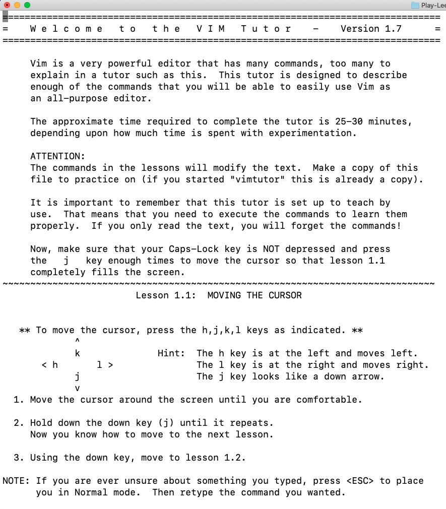

是的，这又是 CLI。再感慨一下，CLI 无所不能。我的相关文章推荐：[做一个命令行工具，是一件挺酷的事儿](https://mp.weixin.qq.com/s?__biz=MzU4NTIxODYwMQ==&mid=2247486996&idx=1&sn=026998be582074946d74abcf256549a4&chksm=fd8ca152cafb2844f80c85bba5295190fe8f0c4e804dcb10320417c06f3b63f40df6f53c1270&token=249700941&lang=zh_CN#rd)

 

### 2. 神书作者的神课

这是**是不是很酷知识星球**的嘉宾 **@鹏程 大佬**分享的神课。来自剑桥大学的**并发与分布式系统**。

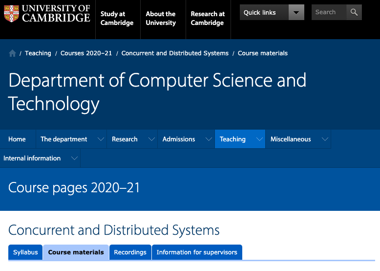

之所以说这是神课，是因为这个课程的第二部分：分布式系统，是大名鼎鼎的神书——DDIA，即《数据密集型应用系统设计》的作者 Martin Kleppmann 亲自讲的。

而这本书，豆瓣评分高达 9.9，已经快成为所有后端工程师必看的书籍了。

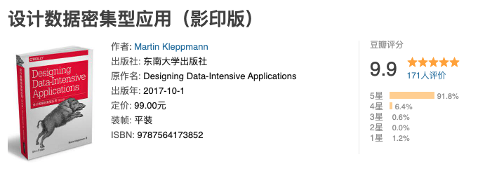

Martin Kleppmann 现在就在剑桥工作，是工业界回归学术届的一股清流。按照 **@鹏程 大佬**的介绍，这门公开课程的分布式系统部分，经典又基础，不用担心看不懂或者看完没用。

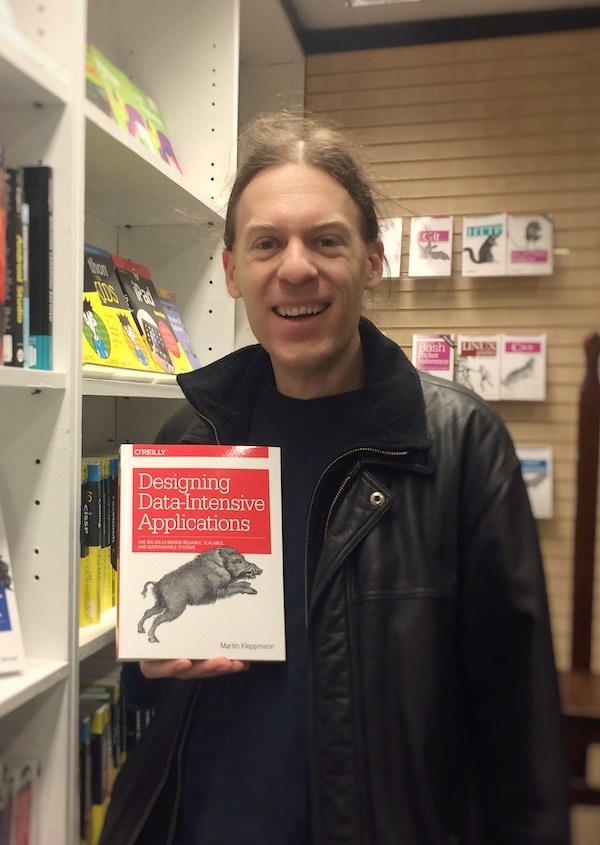

**网址：[https://www.cl.cam.ac.uk/teaching/2021/ConcDisSys/materials.html](https://www.cl.cam.ac.uk/teaching/2021/ConcDisSys/materials.html)**

 

### 3. 纽结理论

什么是**纽结理论，knot theory**？

纽结理论是拓扑学的一个分支，简单来说，就是研究下图中的线条，把它想成是绳子，拉直以后，会不会打结。

甚至有人将这些扭结，做成可展示的艺术形式。

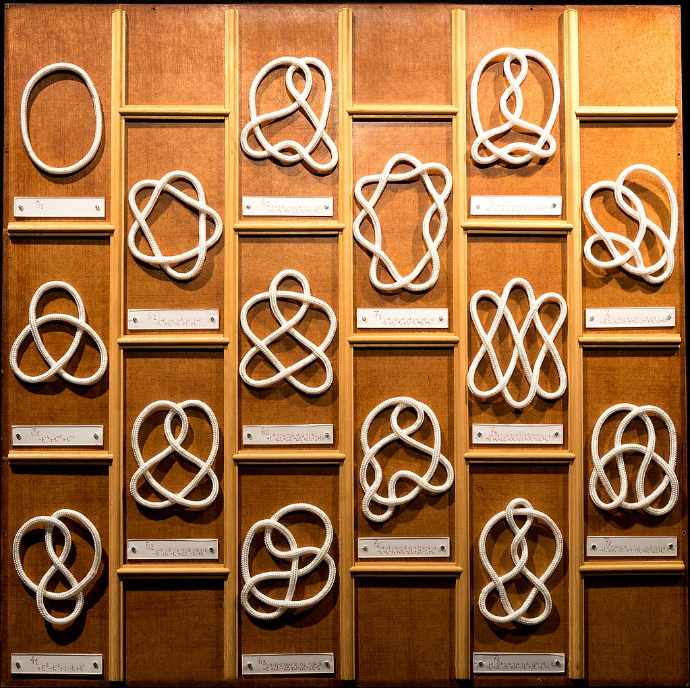

纽结理论有啥用？据说在化学，分子生物学，量子物理学，包括图论等领域，都有巨大的应用。

当然我不是数学专业的，其实不太懂。

偶然间看到了一本免费的开源书籍，专门介绍纽结理论及其应用。感兴趣的同学可以参考。

**网址：[https://www.maths.ed.ac.uk/~v1ranick/papers/murasug3.pdf](https://www.maths.ed.ac.uk/~v1ranick/papers/murasug3.pdf)**

随口提一句，关于拓扑学在图论中的应用，前几天刚看了一个算法，可以把在网格中求无洞的联通分量问题，大大简化成为只有两重循环。而传统的实现方式，需要使用 dfs 或者 bfs。

有时间写篇文章分享一下。但其实，这个算法背后的拓扑学证明，我还没有完全搞明白

 

### 4. musclewiki

一个很有意思的网站，叫 **musclewiki**。翻译过来大概就是：关于肌肉的维基百科。

进入这个网站，是一个人体的肌肉示意图。

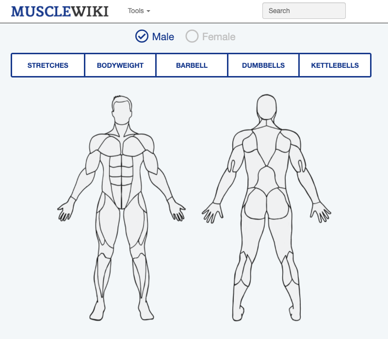

你可以选择一块儿肌肉，就会跳转到相关页面，告诉你如何锻炼这块儿肌肉。

比如锻炼腹肌：

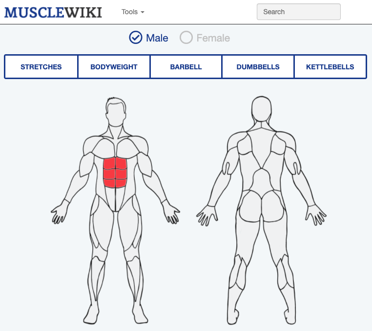

就会有类似这样的推荐：

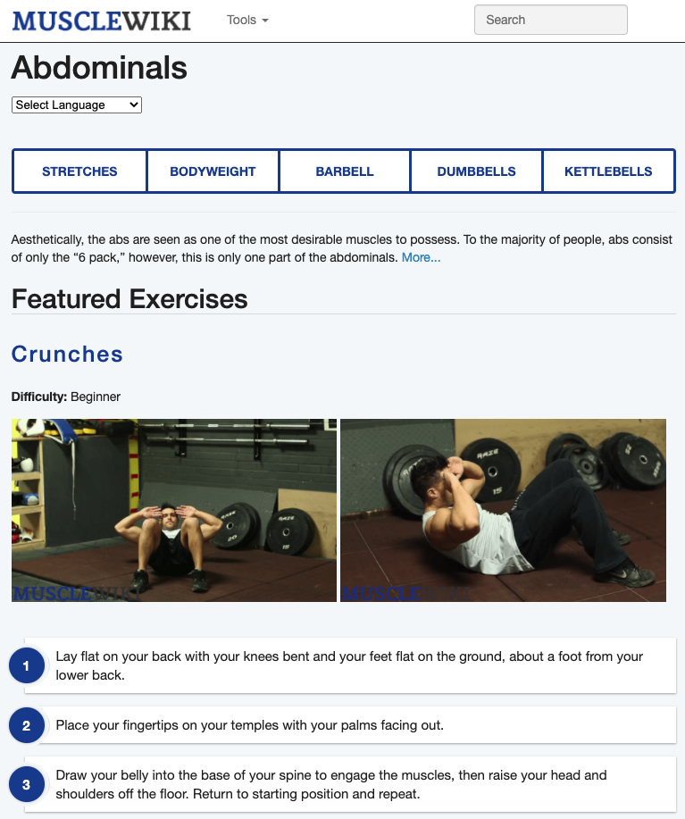

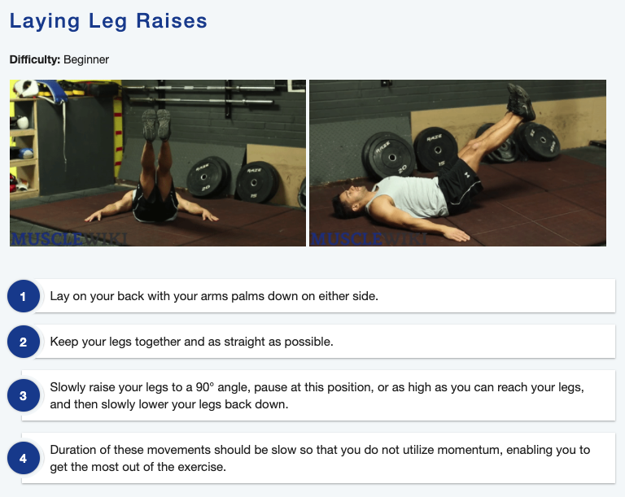

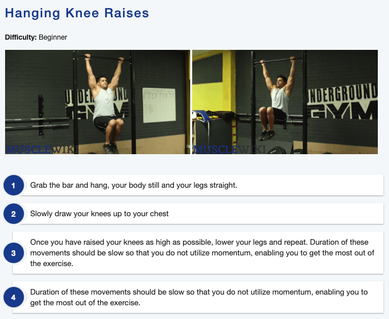

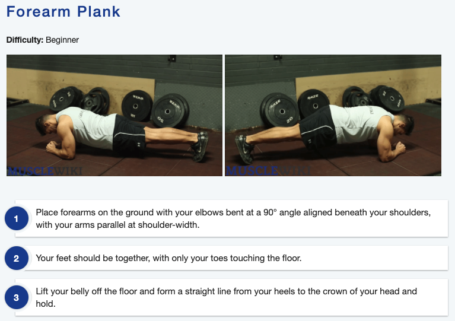

我截的图是静态的，实际上，所有的动作演示都是动图，非常直观。

另外，女同学也可以选择女性教练的动作演示。

**网址：[https://musclewiki.com/](https://musclewiki.com/)**

 

### 5. 微博上有什么

偶然间发现了一个神奇的外国网站：**what’s on weibo**，翻译过来你就是：微博上有什么。

如果你觉得这个网站的内容，只是微博内容的英文翻译，就错了。实际上，这是一个独立的新闻媒体网站，专门向西方读者报道：中国正在发生什么。只不过选题是靠微博的热搜而已。

其中的每篇文章，不能说多有深度，但绝对不是简单的微博 140 字的翻译。文章的长度和内容质量都是有保障的。网站的小编还是在极力希望帮助读者理解：中国正在发生什么？中国人民正在关注什么。

比如现在首页 top 1 的文章，就是郑爽...

反正，我已经打算删掉微博了，以后想看微博，就看看这个网站，还能顺便练练英语。

顺便学个单词吧，代孕的英文是 surrogacy 🤷‍♂️

**网址：[https://www.whatsonweibo.com/](https://www.whatsonweibo.com/)**

 

---

今天的分享就这么多，我们下一期再见。

关于**【是不是很酷】开源资源分享**栏目，我在 github 上创建了一个代码仓，整理了这些开源分享的内容，方便大家查找，同时，也是这些内容的一个备份。

大家可以在这个代码仓中，直接点击 readme 上的链接，访问相应的资源。也可以通过点击每一期的文章链接，获得每一期内容的文字介绍。

**网址：[https://github.com/liuyubobobo/cool-open-sharings](https://github.com/liuyubobobo/cool-open-sharings)**

 

如果大家有好的其他开源资源，可以在这个代码仓下提 issue，也可以在我的**免费知识星球**中直接分享给大家。

我的这些短内容分享，也是第一时间发表到**【是不是很酷】免费的知识星球**上的。如果感兴趣的同学，不要错过。

 

**大家加油！：）**