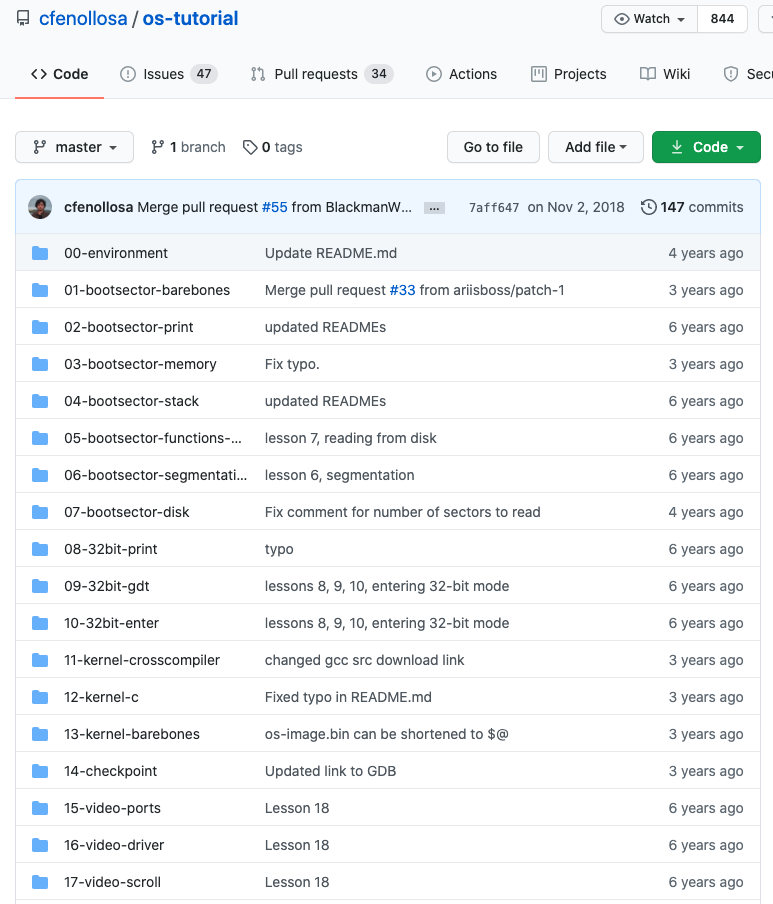
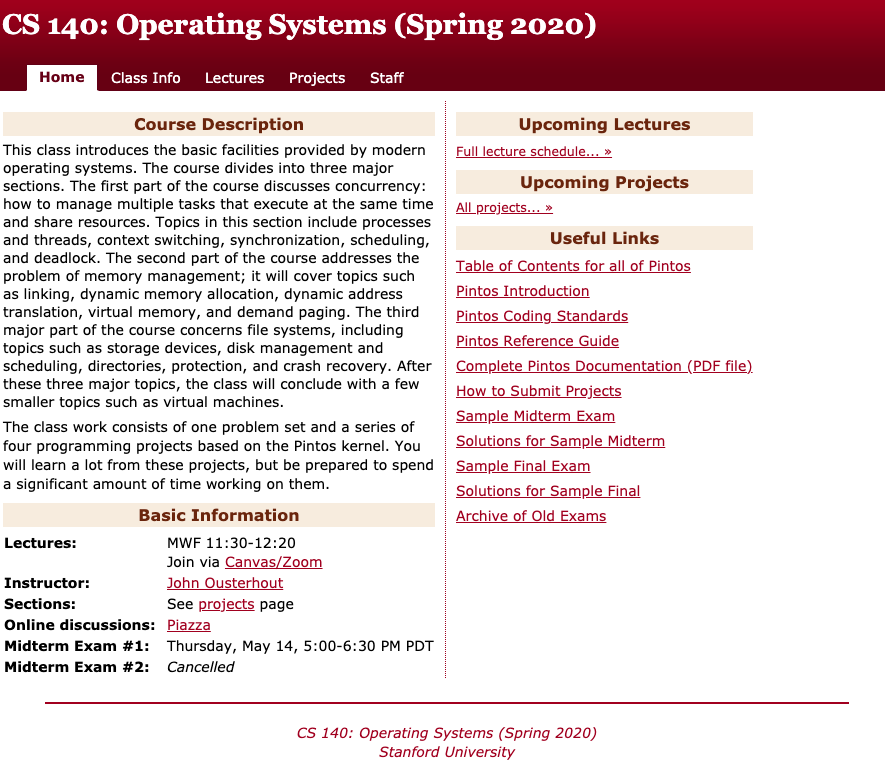
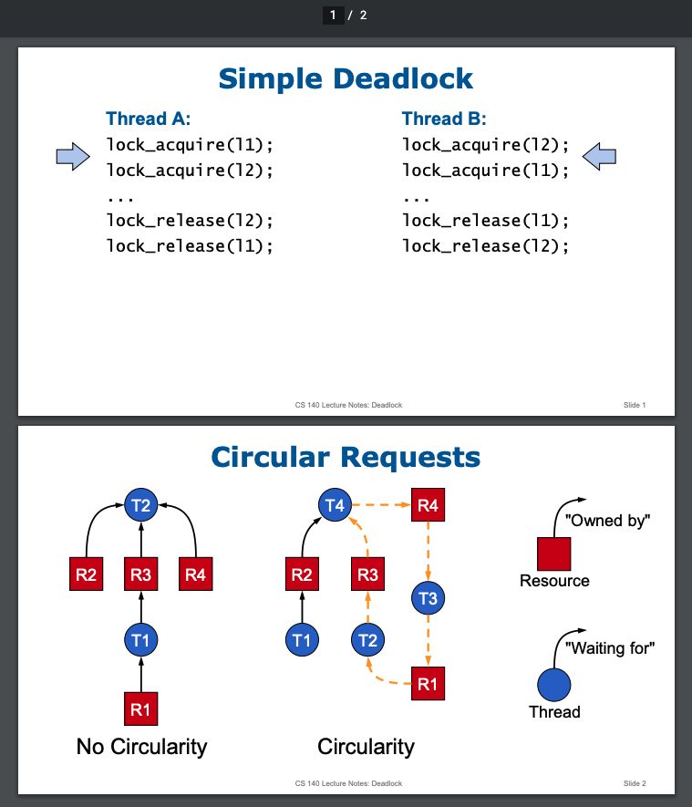
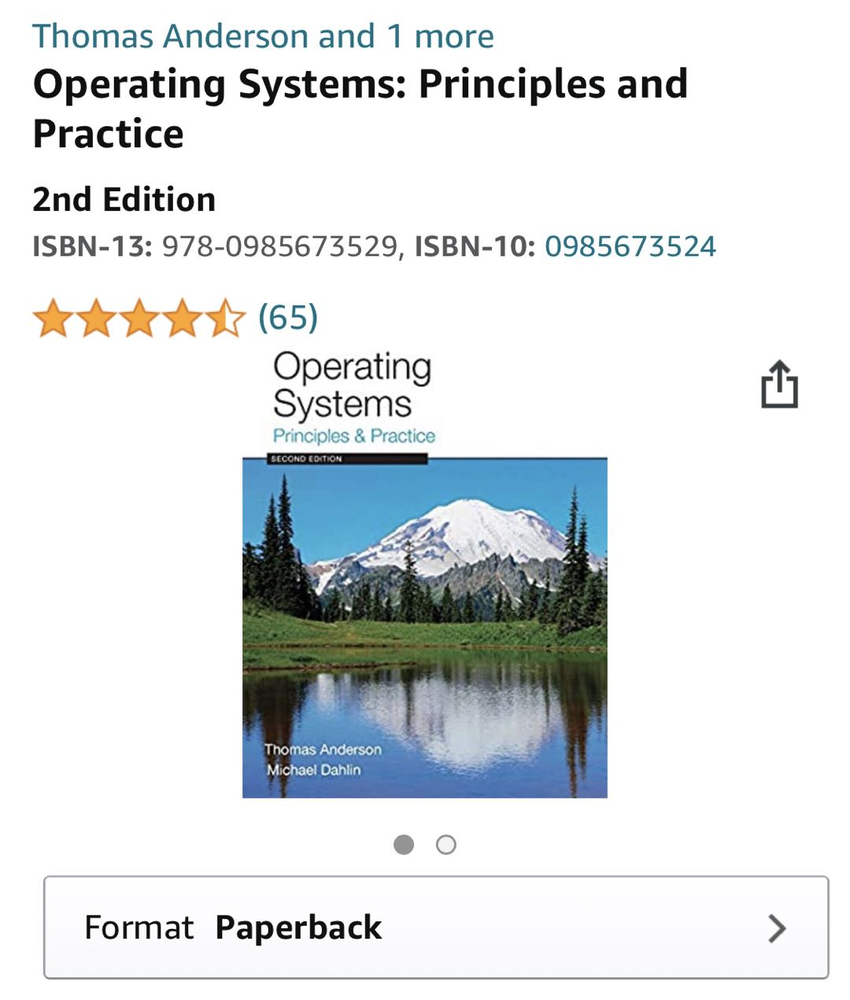
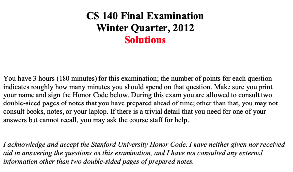
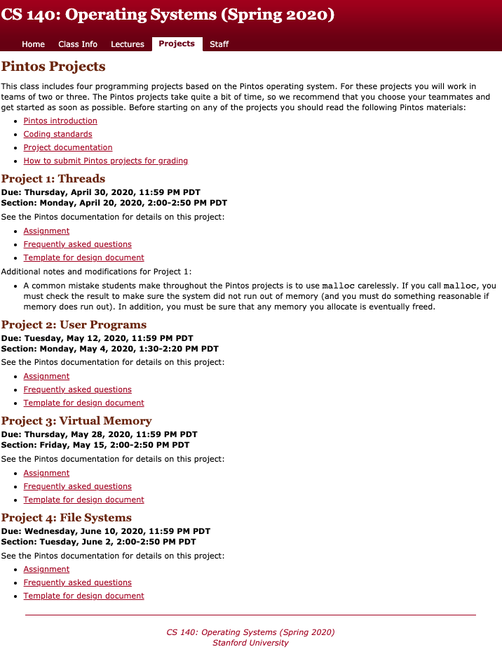
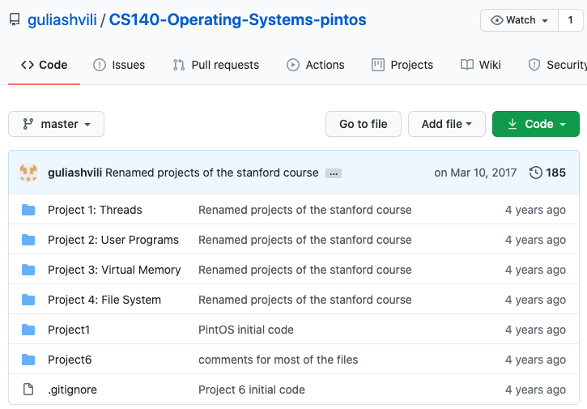
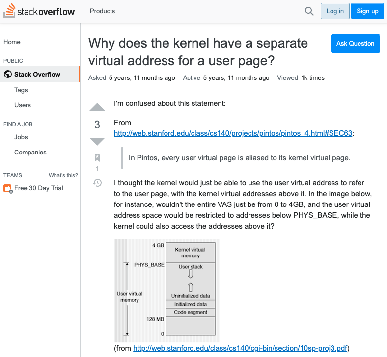
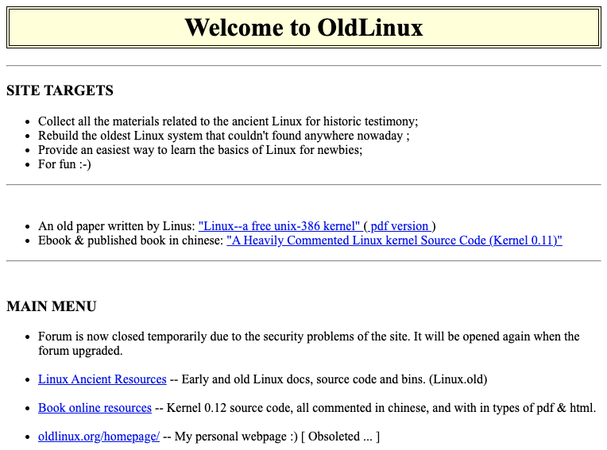

## 如何从零开始实现一个小型 OS 内核

这是在我的知识星球上，一个同学问我的问题。

**请问波波老师，怎么从零开始学习实现一个小型的 OS 内核呢？**

 

---

**bobo 老师的回答：**

如果你真的是要从零开始实现 OS 内核，要处理很多底层的内容，比如 boot 的过程，而不仅仅是操作系统中的算法，比如任务调度一类的。那对你的基础要求还是挺高的（汇编，体系结构，数字逻辑，一类的）。

这方面，国内有一本畅销书：**《Orange'S:一个操作系统的实现》**可以借鉴；

 

日本有一本很有名的书，国内有引进，叫《30天自制操作系统》，也可以借鉴。

 

英文世界里，我知道的比较有名的，是伯明翰大学的这个文档。叫 <Writing a Simple Operating System — from Scratch>。翻译：从零实现一个简单的操作系统。

传送门：[https://www.cs.bham.ac.uk/~exr/lectures/opsys/10_11/lectures/os-dev.pdf](https://www.cs.bham.ac.uk/~exr/lectures/opsys/10_11/lectures/os-dev.pdf)

github 上有一个挺著名的代码仓，基于这个文档，以及一个专门关于 OS 开发的维基百科 [wiki.osdev.org](wiki.osdev.org)，做了更细致的任务分解。

这个代码仓将实现一个小型操作系统内核的过程，分解成了 22 个课程内容，从而形成了一个完整的 OS 内核制作教程，叫 OS-Tutorial。

传送门：[https://github.com/cfenollosa/os-tutorial](https://github.com/cfenollosa/os-tutorial)

应该还有更多资源，大家可以以此为引，再搜索一下。

 

但说实话，我从来没有真正从零玩儿过操作系统。我学习操作系统的时候，以学习操作系统中的经典算法为主（作业调度，进程管理，页面置换，虚拟内存，文件管理，一类的。）

这方面，我强烈推荐斯坦福的操作系统课程 CS140。

传送门：[http://web.stanford.edu/~ouster/cgi-bin/cs140-spring20/index.php](http://web.stanford.edu/~ouster/cgi-bin/cs140-spring20/index.php)

 

这门课程的项目作业非常酷，提供给了你一个非常简单的操作系统内核，叫 **Pintos**。Pintos 的底层已经搭建好了，但是关键的模块儿和算法是缺失的，留好了接口。大家可以直接补全这些接口，从而完善这个操作系统的内核。

我本科的时候就接触了这个 Project，当时做得特兴奋。虽然现在基本忘得差不多了，但是那份兴奋感还能回忆起来。绝对内功大增。

这个课程还有一个进阶课程：cs240，处理一些操作系统中更加高级的话题：

传送门：[http://web.stanford.edu/class/cs240/](http://web.stanford.edu/class/cs240/)

加油！：）

---

 

在这个回答之后，有同学提出了更进一步的问题：

bobo 老师，我在您的星球里看到您前些天回复了一个关于如何制作一个小型的 OS 的问答。

我本科上的普通的二本，专业网络工程，上操作系统课时根本没有实验课，只有国内的一本理论教材和一次期末考试，从没有写过类似操作系统这种底层的软件，一直觉得操作系统是个神秘的存在。

我对您回答中提到的斯坦福大学的 CS140 这门课很有兴趣，但却不知道如何去完成里面的 Project。我看了官方网站，给的东西其实蛮详细的。但是我蒙 B 了，不知道该怎么像斯坦福的学子一样学完这门课以及完成这里面的 Project。

忘说了，我英语阅读没问题、听力可能弱一点。我有 C、C++ 和 Java 基础，也上过您的数据结构算法、机器学习、线性代数，平时也会做一些小项目，就语言基础和算法方面我觉得问题不大。但这是第一次想去挑战国外名校的课程，我还蛮兴奋的：）

能否请波波老师给个更详细的学习规划和意见，麻烦您了：）

 

---

**bobo 老师的回答：**

我的读者这么爱学习，我都被感动啦！

关于学习国外的公开课，随便聊一聊自己的想法。

 

整体，斯坦福的这些课程，严格来说不能叫公开课。因为斯坦福大多数课程是没有视频的。大家只能看到课程大纲是什么样子。如果幸运的话，课程的 PPT 足够详细，比如斯坦福的机器学习或者图像识别，看课件基本就等于读书了。

但是，CS140 这个课程的 PPT 近乎等于没有。他家的 PPT 是这个风格：

以讲解死锁为例，只有这两页纸：

 

从这个角度，其实国外大学的公开课，我更推荐 MIT 的公开课，相应大部分课程都有视频。MIT 大学的公开课，在国内比较有名的，就是《线性代数》和《算法导论》了。

关于 MIT CS 方向所有公开课的网站，我之前也在 [开源分享第 8 期](../008/) 分享过。

传送门：[https://ocw.mit.edu/courses/electrical-engineering-and-computer-science/](https://ocw.mit.edu/courses/electrical-engineering-and-computer-science/)

 

不过，如果你上过 MIT 的公开课，就会明白，**完全指望看这些大学课堂的视频就学会，是不可能的。**至少我的智商没戏。

老师讲得好不好？真的好。但在我看来，老师做的事情更多的是在大家已经有了基础的情况下，给你做总结，把重点提炼出来，把知识间的关系缕清楚。但如果你没有做预习，听起来绝对是云里雾里。

所以看书其实非常重要。**你为了领悟上课那一个小时的精髓，下面要至少先看 5 个小时的书。**当然，对于计算机专业来说，课后还要再来 5 个小时的编程实践，这一个小时课堂的内容才叫真的“圆满”了。

现在，我们没有条件听到斯坦福的老师讲课，但我们有条件读书，有条件实践。说实话，对于理工科的学习来说，认真的这样做，学习质量并不会太差。

那一个小时的课堂内容，你可能需要额外地花一些时间再找一些资料，自己去理顺，甚至要看悟性。但是，如果能踏踏实实把课程指定的教材按照课程大纲一点一点啃下来，相应的 Project 都做了实践，你的收获至少是这门课程的七八成。

这其实已经非常好了。再强调一次：**不要完美主义。**

CS140 指定课本是 **Operating Systems: Principles and Practice。**

我不确定这本书有没有中文翻译版，了解的同学可以在留言区分享一下：）

 

cs 140 的课程大纲在这里：
[http://web.stanford.edu/~ouster/cgi-bin/cs140-spring20/lectures.php](http://web.stanford.edu/~ouster/cgi-bin/cs140-spring20/lectures.php)

你可以根据大纲，找到课本中相应的部分，分段啃下来。

 

课程还设计了模拟考试，关键是模拟考试还有答案，都在课程页面中。

比如这里，就是期末考试的答案，顺便也能感受一下国外的考试是什么鬼

[http://web.stanford.edu/~ouster/cgi-bin/cs140-spring20/downloads/Final%20(Winter%202012)%20Solution.pdf](http://web.stanford.edu/~ouster/cgi-bin/cs140-spring20/downloads/Final%20(Winter%202012)%20Solution.pdf)

 

实践方面，CS140 的 Project 的目录在这里，就是我之前说的 Pintos 内核：[http://web.stanford.edu/~ouster/cgi-bin/cs140-spring20/pintosProjects.php](http://web.stanford.edu/~ouster/cgi-bin/cs140-spring20/pintosProjects.php)

值得一提的是，这个课程的 Project 文档写得极其详细。把这些文档合在一起，基本上又是一本小书了。

 

做 Project 有困难，很正常。不过 CS140 这个课程这么有名，github 上肯定有很多代码仓。

**github 是宝库，一定要善于利用。**我 google 随便一搜就一堆，比如这个：[https://github.com/guliashvili/CS140-Operating-Systems-pintos](https://github.com/guliashvili/CS140-Operating-Systems-pintos)

参考别人的代码，应该一半问题都能解决。另一半，你还可以和代码仓的作者联系，也可以去诸如 stackoverflow 的平台提问。

你看，这里就是问这个课程的 Project 的提问：[https://stackoverflow.com/questions/27814906/why-does-the-kernel-have-a-separate-virtual-address-for-a-user-page](https://stackoverflow.com/questions/27814906/why-does-the-kernel-have-a-separate-virtual-address-for-a-user-page)

 

从这个角度，现代学习真的太方便了。我本科那会儿没有 github 没有 stackoverflow，只能对着文档教材一点儿一点儿硬啃。

我那会儿做这个 Pintos 遇到了问题，自己实在解决不了了，去问了我们操作系统的老师。我们当时操作系统老师超级棒。

说他棒不是因为他能迅速解决我的问题。实际上他也不会，但竟然耐心把我的问题听明白了，然后，直接给当时这个课程的教授还是助教，具体是谁我也不知道，发邮件询问。

是的，这也是国外课程好的地方，课程相关人员全都列在那里。有问题给他们发邮件，很有可能会遇到超 nice 的人，不仅热心回答你的问题，搞不好聊得开心，以后还能要来推荐信。

CS140 的所有教职人员列表就在这里：[http://web.stanford.edu/~ouster/cgi-bin/cs140-spring20/staff.php](http://web.stanford.edu/~ouster/cgi-bin/cs140-spring20/staff.php)

加油！：）

---

 

更酷的是，在这两个回答的后面，炸出了很多大佬，分享了自己学习操作系统内核的资源：

 

来自 @呼呼 大佬：

我今年入学的时候，老师要求我做一下给本科生开设的操作系统课程中的实验。当然我不会做。后来老师催的紧，不得不动手，一点点查。 

大概几天之后，在 github 上发现了下面这个代码仓 
[https://github.com/s-matyukevich/raspberry-pi-os](https://github.com/s-matyukevich/raspberry-pi-os)

这个代码仓是基于 ARM-V8 的指令集，硬件平台基于树莓派的 OS 实验。 不仅有代码，更有教程。写的很详细，目前作者已经出了 cpu_boot 中断处理 ；进程调度； 系统调用；虚拟内存；这几小节。

虽然做完，还不是一个完整的小型 OS，但是对理解很多概念是很有帮助的。起码我这个学渣，抄了一遍，把它读懂，觉得很有收获。代码量也不大，对新手非常友好！

 

来自 @刘振华 大佬：

你可以看看这个网站：[oldlinux.org](oldlinux.org) 

以 Linux 早期版本为核心（0.12）。整个完整的操作系统大约有 2 万行代码。网站的作者对大部分代码做了详细注释，我个人认为是很好的学习项目，对操作系统的理解起到很好的效果。

作者是同济大学的老师，应该有一定的水准。

 

来自 @豆 大佬：

前一段时间沉迷 rust。如果题主不想用 C，可以看看这款用 rust 编写的 OS。作者还写了 blog。地址：[https://os.phil-opp.com](https://os.phil-opp.com)

 

我真为我的读者自豪！

感谢互联网！

**大家加油！：）**

