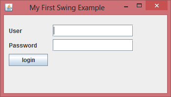
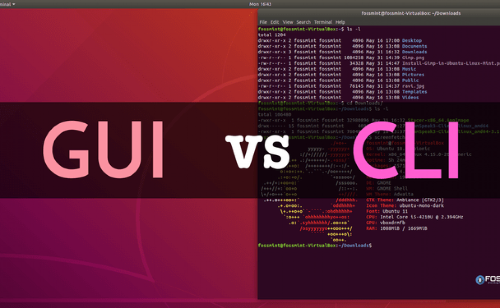
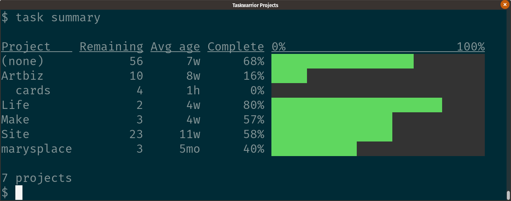
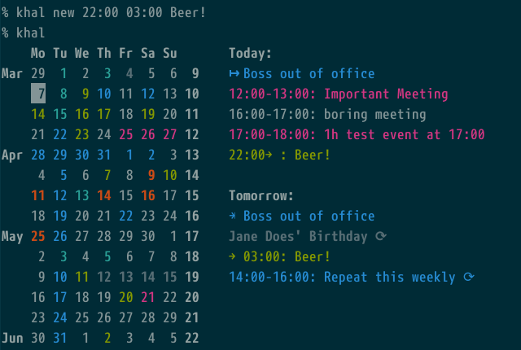
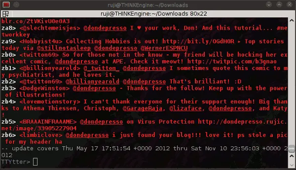
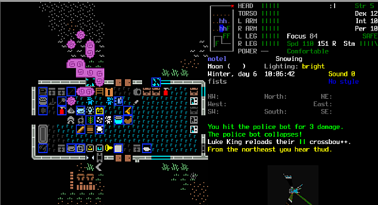

## 做一个命令行工具，是一件挺酷的事儿

很多同学都希望能做一个相对比较完整的，属于自己的“程序作品”。但是，对于大多数后端语言来说，一个完整的“程序作品”的门槛，是交互界面，即 GUI。

这一点，前端同学非常有优势。不管是网络页面，还是 iOS 或者 Android 开发，包括小程序等等，都具有天然的可展示性。这个年代，将自己的网络服务上线，或者开发一个 app 上架，门槛也并不高。

但是，对于很多后端的同学来说，不管是 Java，C++，还是 Python，都需要再单独学习相关的 GUI 库的使用，才能做出拥有界面的程序作品。比如 Java 的 Swing，JavaFx，比如 Python 的 Tkinter，比如 Qt，等等。

当然，很多 GUI 库的学习门槛并不高（但还有一些门槛真的高）。不过，研究过 GUI 编程的同学应该都有感触，GUI 编程的思维方式还是挺不一样的；同时，对于很多后端同学来说，学习 GUI 意义没有那么大，在实际工作中没有用武之地。（当然，感兴趣就是另外一回事儿了。）

更关键的是，我的切身体会，很多时候，后端工程师辛辛苦苦把自己的程序包装在了一个 GUI 下，**别人反而会因为你的界面丑陋，或者界面交互中有一些考虑不周的 bug，或者只是因为不方便，而忽视这个程序的核心功能。**

毕竟，Java Swing 确实不太难，但做出来的界面是这个样子的：

怎么办？

其实在这个时代，后端工程师有一个很好的选择。**做命令行工具，即 CLI！**

 

CLI 是 **Command-line interface** 的简称。相信计算机专业的同学对 CLI 并不会陌生。

比如，大家通常都是在命令行使用 git 的，git 就是一个 CLI 的工具。我们并不需要图形化界面，完全在命令行下，就可以快速使用 ``git``，完成复杂的版本控制的功能。

比如 ``gzip``，就是一个文件压缩的 CLI 工具。输入 ``gzip filename``，我们就将 ``filename`` 对应的文件进行了压缩。砰！一个压缩包就诞生了。

甚至很多 Linux / Unix 的命令，我们可以直接将他们理解成为一个 CLI 工具（而非一个系统命令）。比如 ``grep``，就是一个正则匹配工具；

甚至最最简单的 ``ls``，就可以看做是一个文件查看浏览的工具。

 

---

封装一个 CLI 的工具，门槛比学习 GUI 低了很多。你并不需要学习 GUI 相关的知识，就可以完成，**大家可以把编程的核心，都放在功能逻辑上。**

甚至，在我看来，制作一个 CLI 的工具，可以当做是学习完一个语言后的的练习。你需要综合你学习的很多知识，甚至需要探索更多语言的功能，才能做出一个完整的工具。这个工具也是一个产品向的东西，要想把它做得完善，并不容易。

 

之所以有这个感慨，因为偶然间看到了 github 上的一个 repo，叫 **What Anime CLI**。

传送门：

[https://github.com/irevenko/what-anime-cli](https://github.com/irevenko/what-anime-cli)

这个工具做得是什么事儿呢？它能帮助你查找一张图片，有可能出现在哪个动画片的哪一集中。

``what-anime file anime.jpg``

这个命令用来查找本地的 ``anime.jpg`` 文件，有可能出现在的动画片的名称；

``what-anime link https://anime.com/image.png``

这个命令用来检索网络上的某张图片，有可能出现在的动画片的名称；

如果你认为这个 CLI 工具太难了，背后是不是需要实现一个图像识别或者人工智能的算法，那你就大错特错了。

实际上，这个工具不过是一个网络服务的封装。这个网络服务是 [https://trace.moe/](https://trace.moe/)

这个网络服务的界面也非常简单，以功能为主。把它封装成 CLI，再合适不过了。

这个网络服务并没有提供 API，所以这个 CLI，在模拟登陆这个网站，把用户选择的图片传送给网站，然后将网站返回的页面结果做解析，最终返回给命令行的用户。

做这样一个二次封装服务的 CLI，大家可以学习到：如何封装一个 CLI 工具；如何做网络连接；如何处理图像文件；如何将网页结果做解析；包括各种异常处理，等等等等。是非常综合的。

而在这样一个时代，这样的 CLI 工具也绝非无人问津。程序员辣么多，推上 github，你的 CLI 工具就“上线”了！

 

---

实际上，类似这样有意思的 CLI 工具还有很多，想象空间非常大。

比如，你可以做一个命令行的 todo list，来管理自己的工作任务。**taskwarrior** 就做这件事儿：

[https://taskwarrior.org/](https://taskwarrior.org/)

 

**taskbook** 也做这件事儿：

[https://github.com/klaussinani/taskbook](https://github.com/klaussinani/taskbook)

 

比如，你可以做一个命令行的日历软件，做日程安排。**khal** 就做这件事儿：

[https://github.com/pimutils/khal](https://github.com/pimutils/khal)

 

关注足球比赛的结果？别到网上查了，**football-cli** 搞定：

[https://github.com/ManrajGrover/football-cli](https://github.com/ManrajGrover/football-cli)

 

上班想摸鱼上 Twitte？Twitter 不就是看别人发的 140 个字儿吗？干啥非要到浏览器上看？在命令行下就搞定。**TTYtter** 做的就是这件事儿：

[http://www.floodgap.com/software/ttytter/](http://www.floodgap.com/software/ttytter/)

不仅能浏览，还能发推，还能回复。上班摸鱼上推，不被老板发现，从此以后，命令行就是社交软件了

 

至于各种工具类的 CLI，更是数不胜数了。

比如大名鼎鼎的 **youtube-dl**，帮助你下载 Youtube 视频。把 Youtube 视频链接当参数传给相应的命令就好：

[https://github.com/ytdl-org/youtube-dl](https://github.com/ytdl-org/youtube-dl)

 

比如 **aria2**，是一个基于命令行的下载工具，支持 HTTP，FTP，BitTorrent，Metalink 等多种形式：

[https://github.com/aria2/aria2](https://github.com/aria2/aria2)

 

比如 **wego**，用来查看天气：

[https://github.com/schachmat/wego](https://github.com/schachmat/wego)

**weather-cli** 也作这件事情，更加轻便简单：

[https://github.com/riyadhalnur/weather-cli](https://github.com/riyadhalnur/weather-cli)

 

至于各种网络工具，系统工具，文件工具，相应的 CLI，不要太多。

甚至，我们可以在命令行下打游戏，**Cataclysm: Dark Days Ahead** 就是这样一款在命令行下的游戏：

[https://cataclysmdda.org/](https://cataclysmdda.org/)

 

怎么样，是不是觉得但凡是 GUI 能做的事情，CLI 都能做呢？

而且，不用特别关注显示效果，不但大大减轻了开发负担，还有一种不一样的极客感呢！

毕竟，就用简单的字符，也可以创建出不一样的艺术风格呀！

不多说了，我先去研究一下，搞一个**是不是很酷-CLI**，大家以后在命令行，直接输入命令：``liuyubobobo cool``，就能看到来自**是不是很酷**的最新最酷的文章 图片

**大家加油！**

 

P.S.

一个 github 代码仓，总结了很多有意思的 CLI-Apps：

[https://github.com/agarrharr/awesome-cli-apps](https://github.com/agarrharr/awesome-cli-apps)