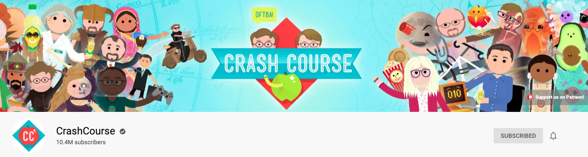
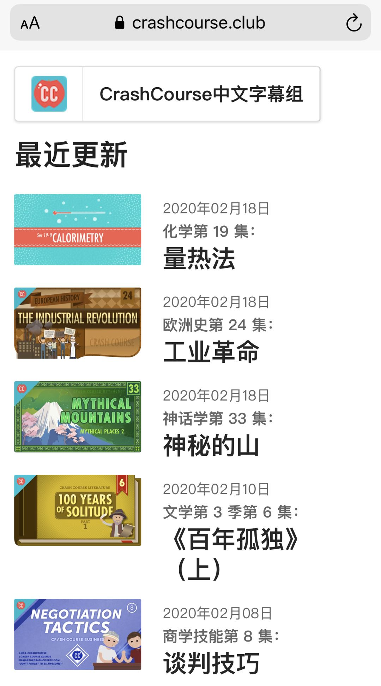
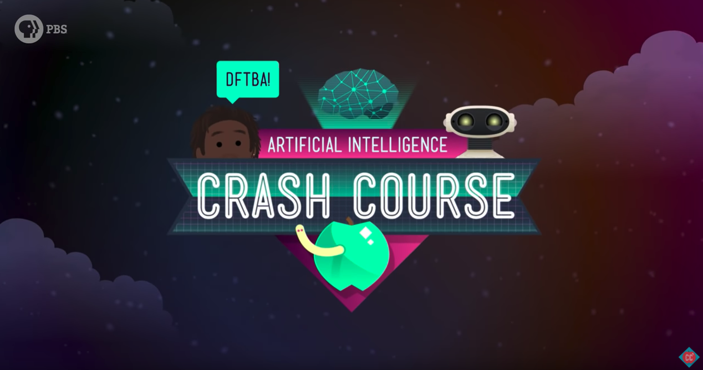
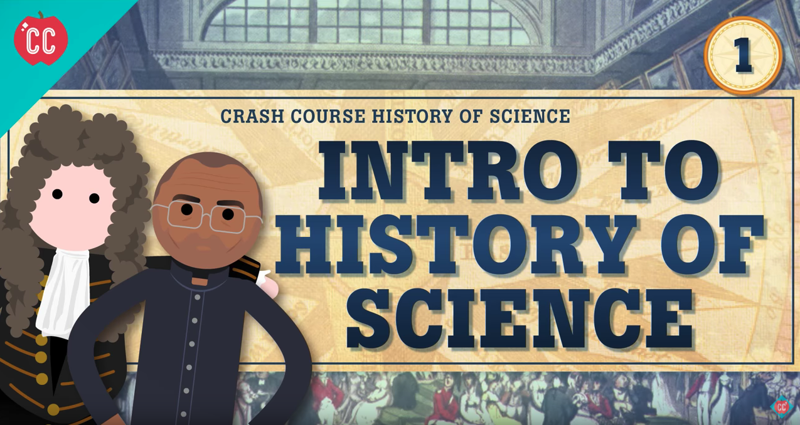
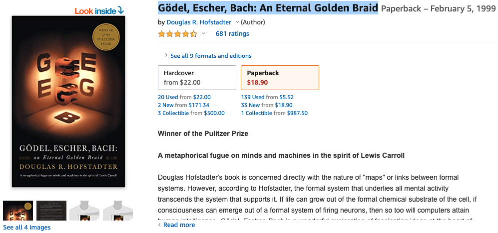
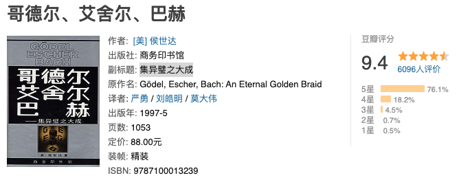
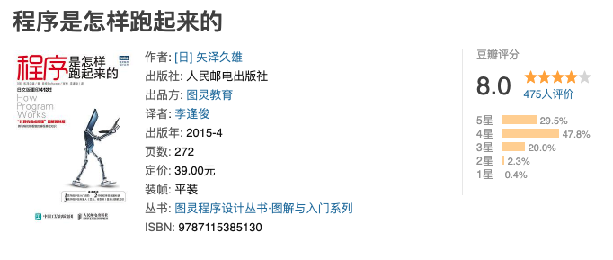

## 想了解计算机的底层原理？这些资源通俗易懂又有趣

我在我的公众号文章[《学编程，学化学和学开车》](https://mp.weixin.qq.com/s?__biz=MzU4NTIxODYwMQ==&mid=2247485169&idx=1&sn=53094839890ed17a8050714f92fbf70c&chksm=fd8ca9b7cafb20a16a4ab58a65efb7c7517f59b0fc979d6249fccc27009c8e318f4af91ae080&token=1378791152&lang=zh_CN#rd)中，向大家介绍了和计算机底层运行原理相关的诸多学科。

关于这些学科要不要学？什么时候学？应该怎么学？我在这篇文章中都有一定的介绍。

不过，因为对于大多数非科班同学来说，很难有一两年完整的学习时间，系统学习这么多的科目；

与此同时，即使是科班同学，大多数在学校学习的时候，因为没有实际的项目工程经验，所以对这些课程真正的用处也没有深刻理解，导致学得非常粗浅。很多同学在工作以后，都希望能够快速高效地“回炉”这些课程的精华内容。

在这篇文章中，我就向大家推荐一系列学习计算机底层原理的资源。

这篇文章中推荐的很多资源，都结合了在我知识星球上大家的讨论内容。在这里，也感谢大家的分享：）

 

---

### 1. Crash Course

首先，推荐一个视频资源，来自国外著名的 Youtube 频道：Crash Course。

Crash Course 自 2011 年 12 月 2 日建立，至今已经 8 年多的时间了，在 Youtube 上的订阅量达到了 1000 万级别，当然，我也是其中之一。

他家视频的观看量更是高达 12 亿之多，可以说是 Youtube 上最火的教育频道之一。

Crash Course 涵盖的主题极其广泛：哲学，经济学，历史，文学，心理学，数学，化学，近乎无所不包。当然，还包括在这篇文章中，我想向大家推荐的：计算机科学。

Crash Course 的这套计算机科学视频一共 41 集，平均每集 10 分钟。整体课程主要关注计算机底层原理，属于科普性的讲解。

实际上，Crash Course 成立之初的定位，就是让那些想学点儿东西，但是又没有大块儿时间的人，每天不用找 1-2 个小时，只用 10-20 分钟，就能学习一些知识。

虽然平均每集只有 10 分钟，但是 Crash Course 的视频信息量还是很大的，语速也很快。尽管如此，因为只是科普性的讲解，所以大家不需要真正地记忆理解什么，当做纪录片看就好了。

精心设计的内容，精致的动画，以及通俗的讲解，相信适合大多数同学：）

CrashCourse 的 Youtube 官方频道地址：[https://www.youtube.com/user/crashcourse](https://www.youtube.com/user/crashcourse)

国内的同学如果想看中文字幕版本，在 B 站就能直接看到。这套计算机科普视频被国内翻译为【计算机科学速成课】。

传送门：[https://www.bilibili.com/video/av21376839?from=search&seid=46761191568656985](https://www.bilibili.com/video/av21376839?from=search&seid=46761191568656985)

另外，Crash Course 在国内有专门的中文字幕组，同步更新国外视频的中文字幕版本。虽然进度肯定还是稍微落后于官方速度的，但是因为 Crash Course 已出的视频量也很大，所以肯定能满足同学们学习的需求。

CrashCourse 中文字幕组的网址在上面的截图上已经有了：[crashcourse.club](https://crashcourse.club/)。很好记：）

对了，其实不用去 B 站，直接在这个中文字幕组网站，就能看到全部有中文字幕的视频。

 

另外，值得一提的是，现在 Crash Course 上除了这套 Computer Science 介绍计算机的底层原理，还有很多视频系列也和计算机有关。我简单总结如下：

21 集的人工智能科普。

 

45 集的统计学科普。

 

46 集的科技史。

 

30 集专门介绍游戏。

是不是很酷？

 

### 2. 一本书，名叫 code

第二个推荐，是一本书，名字就叫《Code》，副标题是 The Hidden Language of Computer Hardware and Software。

这本书有中译本，翻译成《编码：隐匿在计算机软硬件背后的语言》，在豆瓣上评分 9.2。

我直接把豆瓣上的内容简介摘抄下来，如下：

> 本书讲述的是计算机工作原理。作者用丰富的想象和清晰的笔墨将看似繁杂的理论阐述得通俗易懂，你丝毫不会感到枯燥和生硬。更重要的是，你会因此而获得对计算机工作原理较深刻的理解。这种理解不是抽象层面上的，而是具有一定深度的。

这本书在美国 Amazon 上，在 Machine Theory（机器理论） 类别中，常年位居第一名。

顺便一提的是，在 Machine Theory（机器理论） 类别中，常年位居第二名的图书，这个公众号也介绍过，就是 Advances in Financial Machine Learning。大家可以参考在 [【是不是很酷】开源资源 分享 | 第 1 期](../001/) 的内容。

 

在 Machine Theory（机器理论） 类别中，常年位居第四名的图书，我也极其推荐。这是一本来自 1999 年的书，叫 Gödel, Escher, Bach: An Eternal Golden Braid。

这本书有中文版，中文翻译为《哥德尔、艾舍尔、巴赫：集异璧之大成》。豆瓣评分高达 9.4。

这本书曾获普利策文学奖。别看获得的是文学奖，但是它描述的，切切实实是理工世界的事情。整本书结合了数理逻辑学、可计算理论、人工智能学、语言学、遗传学、音乐、绘画等等多个领域的理论，绝对是一本奇书。

 

当然，亚马逊的计算机相关的图书不仅仅有 Machine Theory（机器理论）这一个类别，还有非常多的类别，篇幅原因，我就不过多介绍了。以后有机会，再和大家介绍更多我觉得非常有意义的书：）

不过，根据各大排行榜去寻找优质的图书，是我寻找优质图书的一种主要方式。大家也可以试试看：）

 

### 3. 程序是怎样跑起来的

这是一本日本作者的图书，名字是《程序是怎样跑起来的》。豆瓣评分 8.0。

这本书我没有看过。不过既然有同学推荐，我就摆在这里。

值得一提的是，这本书在国内被图灵教育放在了一个《图灵程序设计丛书，图解与入门系列》这样的一个系列图书中。

我简单看了看，这个系列图书的作者都是日本人，包含《图解 HTTP》，《网络是怎样连接的》，《图解 TCP/IP》，《图解密码技术》，等等等等。

如果对这个风格比较接受的同学，都可以参考。

 

### 4. 深入学习计算机系统

这本书大名鼎鼎，相信学习计算机的同学都听过。

Computer Systems: A Programmer's Perspective。中文翻译：《深入学习计算机系统》，最新版是第三版。

这本书豆瓣评分高达 9.8。

这本书整体编写更像课本，而不是科普读物。

这本书的作者，是卡内基梅隆大学（CMU）的计算机系主任。是卡内基梅隆大学（CMU）ICS 课程的御用课本。ICS 的全称是：Introduction to Computer Systems，翻译过来就是：计算机系统导论。

由于这本书太过经典，我知道很多同学读过中文版以后，都会想再读一遍英文版收藏。所幸，这本书在国内有官方引进的英文版，非常适合收藏。

 

**大家加油！**