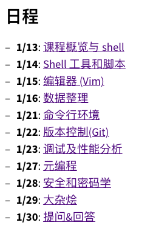
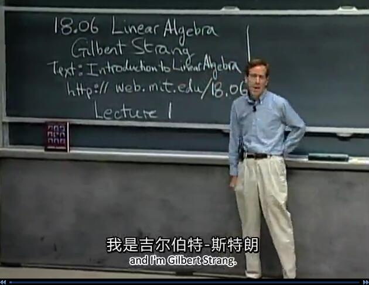
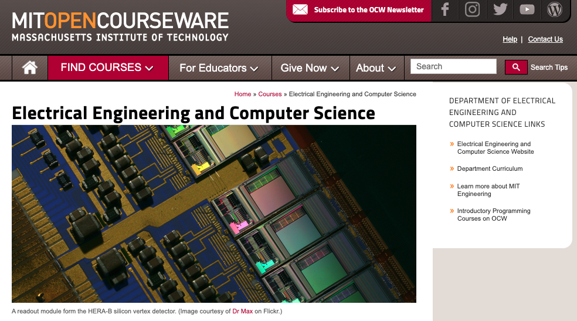

## 国外公开课都没视频，怎么学？

熟悉这个公众号和我的知识星球的同学都知道，我推荐过很多海外的公开课的资料。

比如在 [如果真的学习人工智能](https://mp.weixin.qq.com/s?__biz=MzU4NTIxODYwMQ==&mid=2247485792&idx=1&sn=d60b5c9b1a505b96abb283a95871a9ae&chksm=fd8ca626cafb2f30494c235cb84ef7b2d251f6fc590457790135cd460fb43a574042d5b167dd&scene=21#wechat_redirect) 中，我推荐了大量的书籍资料和公开课。其中近乎所有公开课，都来自斯坦福大学。但斯坦福大学的这些公开课，都是没有视频的。

比如在 [如何从零开始实现一个小型 OS 内核](https://mp.weixin.qq.com/s?__biz=MzU4NTIxODYwMQ==&mid=2247486783&idx=1&sn=a7293a390f7f2c045de3c51c00e08f39&chksm=fd8ca279cafb2b6ff2f2d4050dbdc5a53fb6e803d6e6393b67bd00b05db8fb52436240664d5e&scene=21#wechat_redirect) 中，我又海吹了一通斯坦福大学的 CS140 操作系统课程的课设内容。但是这个课程，也是没有视频的。

在这个公众号下，有一个子栏目，叫 **是不是很酷开源分享**，其中的很多内容，也是国外大学的公开课资料。但是，很多公开课，都只有课程大纲，讲义，习题，作业，考试，等等内容，没有视频。

所以，很多同学的问题就是：**没有视频，那怎么学？**

---

 

实际上，严格意义上讲，这些没有视频的“公开课”，并不是真正的公开课。他们只是课程主页而已。

这些课程主页的作用，是方便校内的同学下载课程的讲义，查看课程的通知，浏览课程的作业的；而不是让校外的同学来学习用的。

我记得我上学的时候，网络还没那么发达，每次课程结束以后，一帮人围着老师的电脑用 U 盘拷课件。所以各种电脑病毒横行。

在那个年代，使用电子邮件的方式传课件，已经属于现代化手段了。但这也需要老师统计所有同学的电子邮件，还会不时发生某个同学的邮件拼写错了一类的问题。

现在，大家可以直接在网上随时查阅下载课程资料，方便了不知道多少倍。

 

但是，我依然倾向于管这些没有视频内容的课程，叫公开课。

为什么？因为这些学校完全可以做到使用技术手段，让这些资料只限于本校同学访问。但是现在，所有的这些内容是公开的，全世界任何地方的任何人，都能看到。

于是，即使我们考不上斯坦福，考不上 MIT，考不上普林斯顿，我们也可以看到，在这些顶尖学府：

* 各个专业都在教什么东西，怎么教；
* 用什么教材，推荐什么参考阅读材料；
* 侧重点是什么，时间安排是怎样的；
* 学习顺序是怎样的；
* 作业是什么样子的，项目实践是什么样子的；
* 甚至考试是什么样子的；

等等等等。

**在我看来，这些东西，比具体的知识，重要得多。**

 

其实，在现在这个时代，对于大多数普通人学习的内容来说，找到一个具体知识的资料，是简单的。哪怕是相对高级的内容。

比如一旦你知道你要学习的是 xx 算法，在大多数情况下，网上关于这个算法的内容和讨论不会少。

比如上次，有一个同学问我 Myers Diff 算法。这是 ``git diff`` 命令背后的算法。在传统的算法教材上，很难见到对这个算法的描述。想必在互联网上，和这个算法相关的资料也不多吧。

结果我一搜，对这个算法相关详细解读的内容，不要太多。无论是中文还是英文；从论文解读到详细图解；各种语言的代码实现；问答社区对于细节的讨论，一应俱全。

所以，在这个信息爆炸的年代，很多时候，**真正难的，不是某个具体的知识，而是形成知识的脉络。**

而这些大学的课程主页，在我看来，就是最好的“知识脉络”的材料。

 

比如之前，我在知识星球分享过一个普林斯顿大学的高级算法设计课程：**CS521 Advanced Algorithm Design**。

传送门：[https://www.cs.princeton.edu/courses/archive/fall13/cos521/](https://www.cs.princeton.edu/courses/archive/fall13/cos521/)

如果我问你，算法领域，如果你已经了解那些最基本的算法，比如排序，查找，各种基础数据结构，和基本算法设计思想，回溯，贪心，分治，动态规划，什么的。

在算法领域，更进一步，应该学习什么内容？

这个课程的简介，就回答了这个问题：**随机类算法，近似算法，高维几何，和其他专有领域。**

更具体的，如果你翻开这个课程的目录，就会看到24 个章节左右的详实的学习计划。涵盖：

* 通过 Karger's 最小割，负载均衡等算法，看随机算法的设计与应用；
* 大规模哈希问题；
* 线性规划和相应的建模问题；
* 非确定性决策，如马尔科夫决策过程（MDP）；
* 博弈算法；
* 高维几何；计算几何；
* 半正定规划（SDP）；凸优化等相关优化算法；
* 计数，采样，蒙特卡洛，染色等算法；
* 信息论，编码论相关算法；加密算法；
* 启发式算法及分析；

等等等等。

这样的课程安排，为大家指明了方向。如果你想更进一步去研究算法设计，还有哪些领域是值得关注的，值得学习的。

在这个课程主页，每一讲都有相应的讲义。这些讲义不是简单的 PPT，而是一个大概五页左右的简略介绍。

当然，用五页纸彻底学懂这些知识并不现实。但是，这些可以让我们快速了解，这些算法都在解决什么问题，适用于什么场景，大体的思路是怎样的，等等。

如果你对某一个具体算法感兴趣，再去找相关资料就好了；这种脉络性的知识介绍，在我看来，才更加珍贵。

 

再比如，MIT 有一个很火的公开课，叫 **The Missing Semester of Your CS Education**，翻译过来就是：**计算机教育中缺失的一课。**

这门课程现在已经有了完整的中文翻译。

传送门：[https://missing-semester-cn.github.io/](https://missing-semester-cn.github.io/)

这门课程成立的初衷，是学院派的计算机课程，通常过于重视理论学习，而对于一些计算机工具的使用并不重视，也不会在课堂上涉及。

（而这样一门课程，是被非常学院派的 MIT 率先提出来的，也是很值得玩味的一件事情）

但是，在大家做开发者的过程中，很多工具的使用，不但是必要的，更会一直伴随大家的职业生涯。能否熟练使用这些工具，甚至是解决很多专业问题的关键。

这个理念是不是一点儿也不新鲜？大家感同身受？

但如果要问大家，在计算机领域，这样的工具都包含什么？可能大家只能有一些零零散散的见解。

这门课程，系统地帮助大家总结了 8 个大致的方向，让大家更系统地看到，普遍意义下，这些重要的计算机工具是什么。

包括：

* Shell 脚本；
* 编辑器，如 Vim；
* 数据整理相关工具；
* 命令行；
* 版本控制，如 git；
* 调试及性能分析工具；
* 元编程；
* 安全相关

具体，这样一门课程，能让大家都精通各个工具，涵盖各个工具使用上的方方面面吗？

当然不能。

但是，这样一个课程大纲，在我看来就足够有意义了。**它让大家高屋建瓴地了解一个方向**：我们在从事计算机行业的过程中，可能应该关注哪些工具的学习和使用。

它比一本单独介绍 Shell 编程或者 git 使用的书籍，有意义得多。

 

最后，值得一提的是，这门计算机教育中缺失的一课，是包含视频的，同时，每一个视频还包含非常详细的讲义。

实际上，MIT 的大部分公开课，都是真正的公开课。最著名的当属《算法导论》和《线性代数》，可能很多同学都看过。

MIT 有一个专门的网站，涵盖所有计算机方向的公开课，大部分都包含视频内容。这个网站，在这个公众号之前的 #开源分享 栏目中分享过。再吐血推荐一次：

传送门：[https://ocw.mit.edu/courses/electrical-engineering-and-computer-science/](https://ocw.mit.edu/courses/electrical-engineering-and-computer-science/)

如果大家仔细挖掘这个网站，不仅能挖掘出很多有意思的公开课，根据这些公开课提供的参考资料，还能找到很多有意思的课本，教材，和书籍资源。

在我看来，这才是真正的“淘宝”啊！

**大家加油！：）**