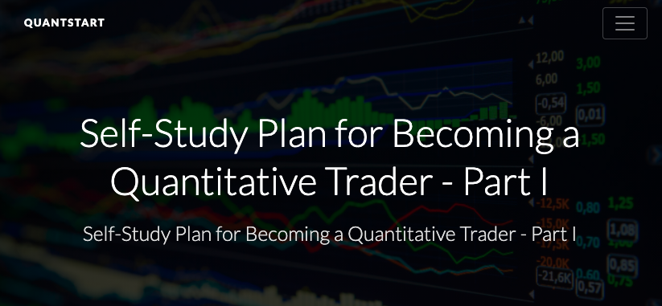
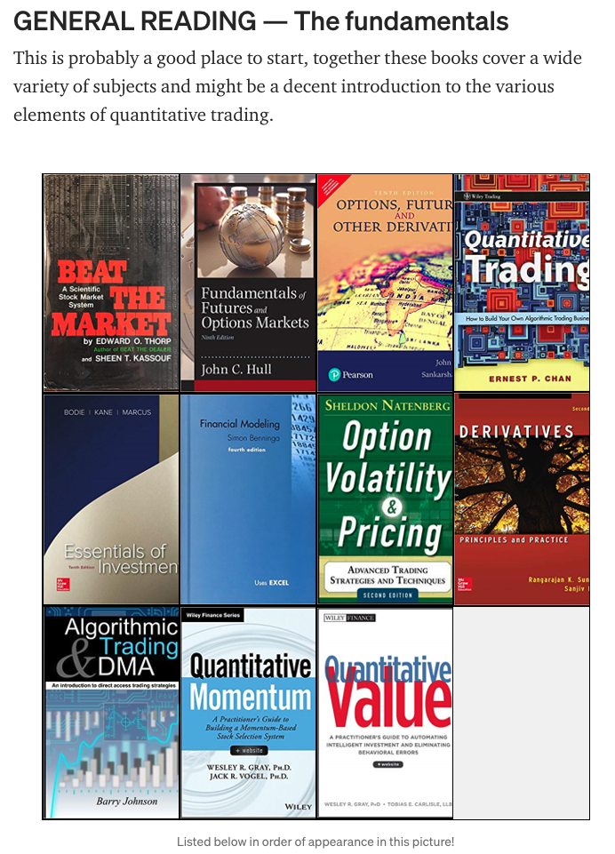
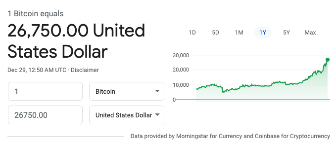

## 不能赚钱，搞不好还赔钱的量化交易

这是在我的免费知识星球上，一个同学问我的问题。

bobo 老师，最近毕设准备研究量化交易，但自己对这方面了解很少，向您请教一下，有哪些研究量化交易方面的资料吗？

---

 

因为我在慕课网上有一门机器学习的课程，所以，这几年陆陆续续和我探讨量化交易的同学还不少。我也或多或少对这个领域有一些接触，虽然不是专家，但借这个问题，我来分享一下我的看法。

 

首先，回答这位同学的问题。

我不确定你是什么专业的，如果是金融相关专业，这个毕设题目或许还可以；但如果是计算机专业的，我个人是不建议毕设做量化交易的。

当然，毕业设计定题目这种事儿，和自己的导师探讨最有意义，如果你的导师觉得问题不大，那肯定可以。但如果我是你的导师，我不建议做这个题目。

我简单说说我的理由。

**因为你说不清楚你的这篇论文的贡献是什么，或者说解决了一个什么问题。**

 

你说你研究出了一个可以稳定赚钱的量化交易模式？我可以很肯定地告诉你，不可能。否则你应该退学，拿你的模型去赚钱，而不是写毕业论文；

当然，如果你非说自己研究出的模型就是稳定赚钱，跑赢通胀，跑赢大盘，其实别人也不会信的。不过在这种情况下，别人信不信已经无所谓了，你应该退学，而不是写毕业论文；

那你说你严谨证明出了靠量化交易稳定赚钱不靠谱？这个是有可能的。

但是在学术界，通常这不叫贡献。爱迪生尝试出了上千种材料不适合做灯丝，是不能发表上千篇论文的；他尝试出了一种材料可以做灯丝，才能写一篇论文；你研究出若干的药物或者治疗手段对治疗癌症无效，这是不能发论文的，你找到一种治疗方案是有效的，才能发论文。

你可能说了，老师，你怎么这么俗？总是聊赚钱？我在做量化交易模型的过程中，解决了一个计算机问题可不可以？比如实时的市场跟踪检测？海量数据快速存储？交易过程的网络安全？市场数据同步一致性？市场的情绪识别？金融指标的快速计算？等等等等？

你要是这么想，那可太好了。但是，你大可以大大方方地把你关注的这个计算机问题作为论文题目，而没必要把它掩盖在“量化交易”下。量化交易不过是这个研究课题的一个应用而已。

如果有一个同学的毕业论文是《一个量化交易系统的实现》，另一个同学的毕业论文是《一个高效存储结构的实现》，哪怕后者就是 redis 的超级简化版，从计算机专业的角度，我会天然地认为后者更好。

这就是“量化交易”这个题目的问题。**量化交易的目的是赚钱，所以，大家会天然地关注其赚钱属性。**

 

顺便一提，如果你去专门研究量化交易，也会遇到这样一个“偏见”。

我就认识一个朋友，几年前加密币行情爆好的时候，靠买加密币赚了点儿钱，于是决定辞职，专心研究量化交易，撬动 AI 的力量，争取赚更多的钱。

但是，随后，加密币的行情急转直下，整体大跌，他研究的量化交易系统是打不过大盘的，最终没有赚到钱。

于是，他决定回归大厂工作。面试的过程中，别人问他辞职的这两年做什么了？听说是量化交易以后，第一个问题就是：**你赚到钱了吗？**

其实不用问，就知道答案是没有，不然人家不会重新找工作的。但是，让他感慨最深的是：**大家对于量化交易系统，只关心有没有赚到钱。具体这个系统中有没有什么技术亮点，大多数人是不关心的。**

所以后来，他把自己这两年的经历包装成了：尝试自己创业，做**金融数据服务**，开发了一个系统，高效地获取金融市场数据，并且进行数据的存储，整理；不同市场的数据分析和校正；金融指标的计算，并提供一定的预测参考。不过这个创业项目整体效果不够好，所以决定再来大厂历练一下。

当然，通过这个项目，也实践了很多重要的甚至是前沿的技术，比如 blah blah blah ...

他把说辞改成这样一套东西以后，大家才开始把关注点放到他做的技术中来。

---

 

上面的文字似乎是在打击你，在说不要做量化交易。但其实我主要在说，作为毕业设计的课题，我不建议做量化交易这个题目。

如果你对量化交易感兴趣，我是充分地理解的。如果你想在这个领域学习，我也不认为有什么问题。因为量化交易确实是一个正经的领域，市面上也有很多资料。

正经回答你的问题，哪里有研究量化交易方面的资料？

 

**Quantstart** 是美国的一个量化交易相关的教育平台，其中总结过做量化交易相关的书籍推荐。这里是相关的五本入门书，整体偏技术。

Quantitative Trading, by Ernest Chan

Inside the Black Box, by Rishi K. Narang

Algorithmic Trading & DMA, by Barry Johnson

Algorithmic Trading, by Ernest Chan

Trading and Exchanges, by Larry Harris

传送门：[https://www.quantstart.com/articles/Top-5-Essential-Beginner-Books-for-Algorithmic-Trading/](https://www.quantstart.com/articles/Top-5-Essential-Beginner-Books-for-Algorithmic-Trading/)

 

Quantstart 上有一份更详细的，和量化交易相关的学习路径说明，叫：Self-Study Plan for Becoming a Quantitative Trade。我的翻译：成为一名量化交易员的自学计划。

这篇文章对学习量化交易所需要的基础，需要学习的内容，从基本的编程，算法；到计量经济学，时序数据分析，机器学习，统计学，都有涉及。

传送门：[https://www.quantstart.com/articles/Self-Study-Plan-for-Becoming-a-Quantitative-Trader-Part-I/](https://www.quantstart.com/articles/Self-Study-Plan-for-Becoming-a-Quantitative-Trader-Part-I/)

 

如果你觉得这些还不过瘾，这里有一篇文章，总结了一份更全面的，做量化交易的阅读书单，一共 108 本。

传送门：[https://link.medium.com/nDgfDgd0wcb](https://link.medium.com/nDgfDgd0wcb)

我简单查了一下，这些书籍有些有中文版，有些没有。你可以自己再看一看哪些适合自己。

更关键的是，有这些资料作为索引，你已经可以通过这些关键字，或者具体的内容，自己来找，还有哪些资料，哪些书籍，可能是对你有用的，更适合你的。

---

 

如果你仔细审视这些材料，会发现，其中很多书并不是计算机书籍，而是金融或者经济领域的书籍。

有些书虽然听起来很计算机，比如叫“算法交易”一类的，翻开你也会看到大量的金融术语。

为什么？

因为**量化分析是在处理金融市场，那么你就应该首先了解金融市场**。如果不了解金融市场，单单靠计算机就能做好投资的话，金融领域的人早就都失业了。

在我看来，现阶段，量化交易更多的是金融市场从业者使用的一个工具。

这就像程序员使用 IDE 更快的编码；使用测试工具更全面地测试；使用调试工具更好的排错；使用各种框架更快地完成业务。但是，**所有这些工具都不能代替程序员。**

同理，**量化交易也是这样一个工具。这个工具无法替代金融从业者，也不能让对金融一窍不通的程序员成为投资专家。**

这就是为什么，我说如果你是金融专业的，做量化交易相关的毕业论文，反而可能更合适的原因。因为通过对金融市场的量化分析，金融从业者是可能提出对金融行业有意义的结论的。

 

据我所知，大多数同学，想研究量化交易，就是梦想用计算机算法的力量，源源不断在市场投资，给自己赚钱。

我并没有批评这个想法，这是很正常的想法，我也有过。更重要的是，投资本身并不是投机，我对投资毫无偏见。

只是，我认为，**与其研究量化交易投资，不如踏踏实实去学习金融知识，学习投资理念。**可能对大多数人来说，学习这些，比去研究量化交易更靠谱。**至少应该在有了这些金融知识的基础上，再去思考如何利用量化交易这个工具。**

市面上确实有一些量化交易的课程。比如前些年加密币如火如荼的时候，我就见过很多量化交易课程的广告。大多数都表示：学了这个课程，在加密币市场上能大赚。

实际上，**那个时候，不用量化交易，闭着眼睛买加密币，可能赚得更多。**

这几年，这些课程的声音明显小了。一方面是国家对加密币的管制，另一方面是加密币后来整体进入熊市。不过现在比特币价格再创新高，似乎我最近看到一些这种课程的宣传又多了一些。

这样的宣传，当然是有吸引力的。但是，我从来没听说有谁学这么一个课程，就能辞职去做量化交易，从此过上衣食无忧的生活。

要真能如此，做课程的老师才不会来讲课呢。

如果量化交易技术真的能做到稳定赚钱，显然大家都应该辞职去做量化交易。所以，学习量化交易，做量化交易，并不能保证赚钱，甚至一不慎，还会赔钱。

这些课程的宣传是不实的，利用了人们的贪欲。

 

但就像之前我说的，我并不反对有同学感兴趣去研究量化交易。

因为量化交易本身是一个实打实的领域。学界有很多和量化交易相关的论文，来研究市场，或者研究智能算法和市场之间可能的关系。

我也读过一些，有些结论很有意思，也很有启发，有机会我可能会找一些有趣的内容写一写。

但我的体会是，**如果你真真切切，认认真真地去研究量化交易，研究得越深入，你可能越会深刻地理解市场的不可预测，越会敬畏市场。**

很多时候，我都在设想，假设我开设一个量化交易的课程。通过这门课程，大家能学到实打实的量化交易领域的技术，概念，相关策略，它们背后的原理和演化，了解这个领域的发展现状和最新进展。

但是，但是，

**通过这个课程，大家就是赚不到钱。**甚至，大家学了这个课程，有所实践以后，还会赔钱。

或许，学这个课程以后，最大的收获是，深刻地理解：个人做量化交易，没有那么靠谱；能单单靠量化交易稳定赚到钱的概率，真的很低。

我管它叫**《不能让你赚钱，搞不好还会赔钱的量化交易》**。

还会有人学吗？

 

**大家加油！：）**

