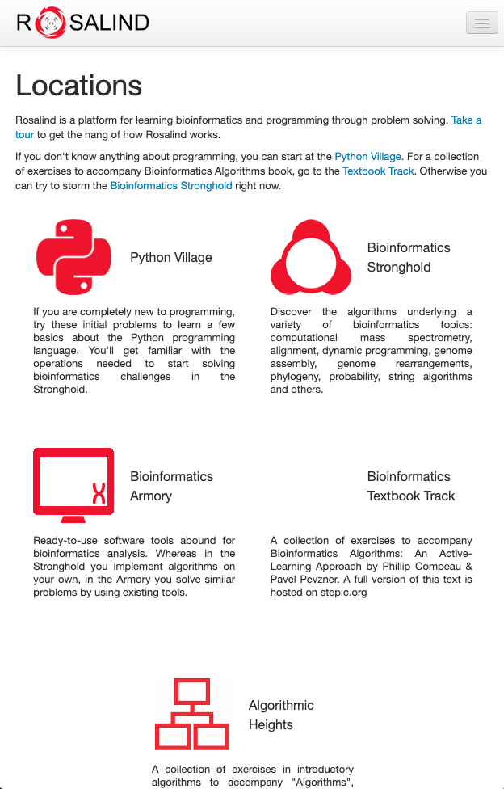
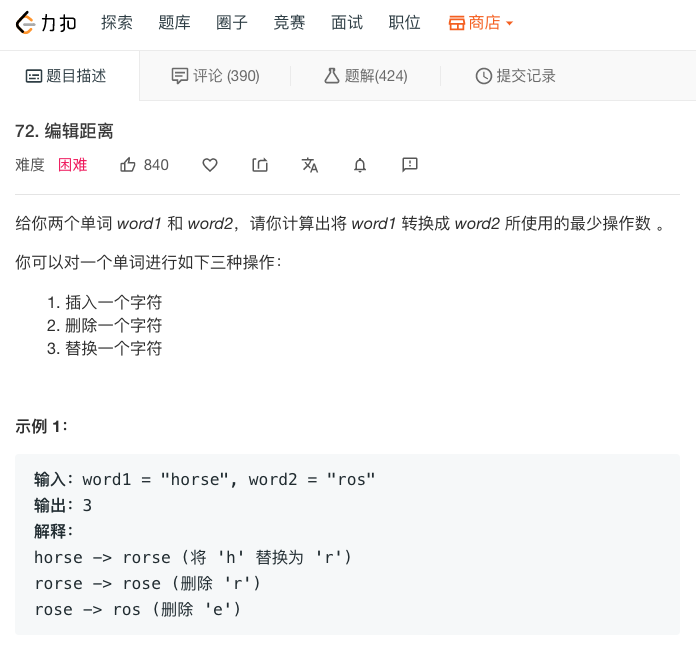

## 算法不好的工程师不是优秀的生物学家

之前，在我的公众号文章中，我曾向大家介绍过：其实，现在很多生物学研究，归根到底，是一个计算问题。

但凡是计算问题，计算机专业的童鞋就能大显身手。

偶然间，我看到一个网站，非常完美地诠释了这一点。

这个网站名字叫：**Rosalind**。



<br/>

Rosalind 是什么意思？

其实，这是一个人名，全名是 Rosalind Elsie Franklin，通常中文译作罗莎琳德·埃尔西·富兰克林。罗莎琳德是一名英国的物理化学家与晶体学家。


<br/>

物理化学家？晶体学家？和生物学有什么关系？

在那个年代，生物学还不发达，相应的，物理，化学等基础学科更发达。但是，很多物理化学家，已经将触角伸向了生物领域，开始研究生物世界的微观结构了。比如 DNA。

而罗莎琳德的很多研究，就是和 DNA 与病毒相关的。罗莎琳德最著名的研究之一，就是拍摄出了 DNA 的晶体衍射图片，被称为“照片51号”。


上图为在生物学历史上大名鼎鼎的照片 51 号

<br/>

我们在高中的生物学课本上会看到：1953 年，沃森和克里克发现了 DNA 的双螺旋结构。但是，罗莎琳德的研究，为沃森和克里克的发现，提供了非常重要的线索。

说起来，沃森和克里克，也是站在了罗莎琳德这名巨人的肩膀上。

欧洲和俄罗斯携手研制了一台火星漫游车，用于在火星寻找生命的迹象。这台火星漫游车，就被命名为“罗莎琳德·富兰克林”。可见她在生物学界的影响力。

<br/>

那么，这个以罗莎琳德·富兰克林命名的网站 [rosalind.info](http://rosalind.info)，在做什么事情呢？答案是：**通过解决算法问题，来学习生物信息学（Bioinformatics）。**

猛地看这个网站，很像是一个普通的 OJ，甚至很多功能还不如 OJ。网站最显眼的一个标签，就是 Problems，点开就是一堆题目而已。


<br/>

不过，这些题目，全部和生物信息学相关。都是将生物学家解决的问题，规约成为了一个计算问题以后，展现在了你的面前。

比如，我们来看网站上最简单的一个问题，叫 Counting DNA Nucleotides，翻译过来，就是计算 DNA 的核苷酸数量。


问题本身很简单：给你一个字符串，代表一个 DNA 片段。字符串中包含 A, G, C, T 四种字符，让你分别统计这四种字符的个数。

比如对于字符串：

```
AGCTTTTCATTCTGACTGCAACGGGCAATATGTCTCTGTGTGGATTAAAAAAAGAGTGTCTGATAGCAGC
```

其中，包含 20 个 A，12 个 C，17 个 G 和 21 个 T。那么你的算法返回结果就应该是：

```
20 12 17 21
```

<br/>

相信，对于会编程的读者来说，这是一个再简单不过的程序了。学编程一个月的小朋友都能写出来。

如果这个网站都是这种“算法题”，那就太没意思了。更关键是，编写这样的一个程序，也没有学到生物学啊？！

下面，就是这个网站的精髓了。每一个问题，都有一个“click to expand”的按钮。点击以后，你就会看到一个详细的页面，来向你解释，这样一个问题，和生物学之间的关系到底是怎样的。

比如，对于上面这个简单的问题，就会出现这样一个页面：


这个页面详细地向大家介绍了：什么是细胞？什么是 DNA？什么是核苷酸？什么是染色体？为什么一个字符串就可以代表一个 DNA 片段？为什么这个字符串中只有 A，C，G，T 这四种字符？这四种字符对应的生物学上的意义是什么？我们为什么要计算一段 DNA 片段上这四种字符的数量？

这个过程，就是在通过这样一个简单的编程问题，学习生物学了。

<br/>

不仅如此，网站上的所有问题并非是零散的，而是有一个树结构的。通过点击网站上的 Tree View 这样一个选项，可以看到这些问题所对应的树状结构。


这样的一个树状结构图，向大家展示出了：每一个问题背后的生物学概念之间的前后关系，相当于是一个“生物学知识结构导引”。大家可以根据这个导引，依次完成这些问题，逐渐深入了解生物学领域的诸多概念，并且一点一点理解：计算机科学是如何应用在这些概念上，进而来解决生物学的问题的。

比如，编辑距离就是计算机科学上的一个经典问题。Leetcode 上就有这个问题。前一阵子，刚刚有童鞋在面试字节跳动的过程中，被问到这个问题呢。



简单来说，编辑距离就是求解：使用插入字符，删除字符，替换字符，这三种方式，最少需要多少步，可以将一个字符串变成另外一个字符串？

编辑距离是动态规划领域的一个极其经典的问题。很多同学都问过我，编辑距离有什么用？

Rosalind 这个网站上就有完全一样的一个编辑距离的问题，只不过赋予了生物学背景，完美诠释了编辑距离这一经典算法，到底有什么用。

（其实，编辑距离在非生物学领域也有很重要的作用，这篇文章按下不表。）

原来，DNA 或者  RNA，在复制过程中，是有可能进行变异的。研究 DNA 或者 RNA 的变异，是生物学领域的一个很重要的工作。

DNA 或者 RNA 的变异，有三种形式：某一个碱基变化；DNA 多了一个碱基；或者 DNA 少了一个碱基。

如果我们把 DNA 看做是一个字符串的话，那么一段 DNA 的变异，就对应了上面说的字符串的三种操作：替换一个字符，添加一个字符，和删除一个字符。

这样一来，编辑距离的算法就可以用来计算，对于一段 DNA，最少经过多少步，变异成为了另外一段 DNA。

这有什么用呢？在生物学领域，这可以用来度量“进化的远近关系”。两个物种之间 DNA 的编辑距离越近，两个物种的关系越近，这也意味着在进化时间上，二者离得更近。据此，可以帮助我们溯源这个星球上大多数生物的进化历史。

另外一方面，以病毒为例，我们也可以通过对病毒的 RNA 进行分析，溯源出病毒的变异过程。

比如现在的新冠病毒，大家可能经常看到一些媒体报道说第一代病毒，第二代病毒，第三代病毒。这些病毒的代际关系是怎么被推演出来的？编辑距离就是一个重要的参考。

你看，**听起来复杂的生物学问题，其实可以归约成为一个算法问题。**

<br/>

这样的例子，在这个网站中还有很多。

比如在一个蛋白质中寻找某种模式，而这种模式本身，很有可能和某类疾病，或者某种功能，有着紧密的结合；

或者给定一个蛋白分子的结构，让你来计算这个蛋白质的质量；

或者给出两段 DNA 片段，看这两段 DNA 片段能够以什么形式交织在一起？交织的结果会不会可能产生某种疾病？甚至据此计算可能产生某种疾病的概率。

怎么样，是不是很酷？

<br/>

下次，再有同学问我算法有什么用，我就把这篇文章扔给他，告诉他：**别说在计算机领域了，就算是生物领域，都离不开算法。**

算法不好的工程师，不是优秀的生物学家。

**大家加油！：）**

<br/>

**P.S.**

这个网站的网址是 [http://rosalind.info](http://rosalind.info)。
